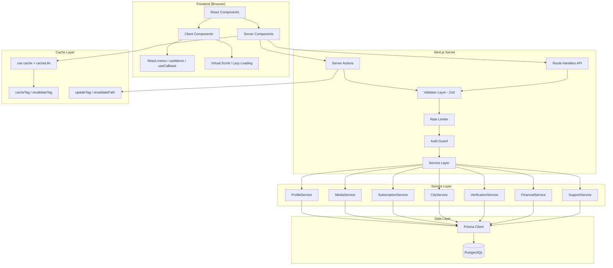
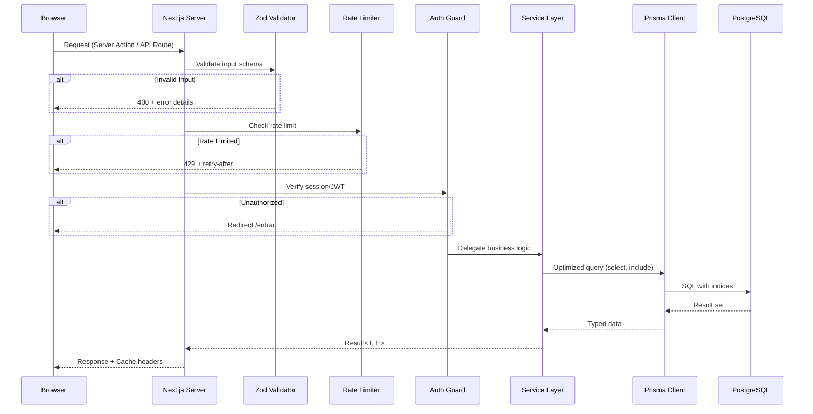

# Design Document — Backend Performance Phase 5

## Overview

Este documento descreve o design técnico para a Fase 5 de otimização de performance da plataforma Privello. O objetivo é eliminar gargalos de banco de dados, implementar cache inteligente, validação tipada, rate limiting, separação de responsabilidades em camada de serviços, e otimizações de frontend (lazy loading, memoização, Suspense/streaming, bundle optimization).

A plataforma utiliza **Next.js 16.2.6** com o novo modelo de Cache Components (`use cache` + `cacheLife` + `cacheTag`/`revalidateTag`/`updateTag`), **Prisma 5.22**, **React 19.2**, **TypeScript 5** com `strict: true`, e **Zod** para validação de schemas.

### Decisões Arquiteturais Chave

1. **Cache Model**: Adotar o novo modelo de Cache Components do Next.js 16 (`use cache` directive + `cacheLife` profiles) em vez do antigo `revalidate` export. Isso permite cache granular por função/componente.
2. **Validation Library**: Zod para schemas tipados com inferência de tipos TypeScript.
3. **Rate Limiting**: Implementação in-memory com `Map` + sliding window (adequado para single-instance; migrar para Redis em produção multi-instance).
4. **Service Layer**: Padrão Result<T, E> para retornos de serviço, injeção de dependência via parâmetro opcional do PrismaClient.
5. **Property-Based Testing**: fast-check para validação de propriedades universais.

---

## Architecture

### Diagrama de Camadas



### Diagrama de Fluxo de Request



---

## Components and Interfaces

### 1. Validator Layer (`src/lib/validators/`)

```typescript
// src/lib/validators/index.ts
export { profileCreateSchema, type ProfileCreateInput } from './profile.schema'
export { profileUpdateSchema, type ProfileUpdateInput } from './profile.schema'
export { userRegisterSchema, type UserRegisterInput } from './user.schema'
export { reviewCreateSchema, type ReviewCreateInput } from './review.schema'
export { mediaUploadSchema, type MediaUploadInput } from './media.schema'
export { financialRecordSchema, type FinancialRecordInput } from './financial.schema'

// src/lib/validators/profile.schema.ts
import { z } from 'zod'

export const profileCreateSchema = z.object({
  displayName: z.string().min(1).max(100),
  slug: z.string().regex(/^[a-z0-9-]+$/).max(60),
  age: z.number().int().min(18).max(99),
  bio: z.string().max(2000),
  tagline: z.string().max(100).optional(),
  cityId: z.string().cuid(),
  districtId: z.string().cuid(),
  priceHour: z.number().int().min(1).max(99999900),
  whatsappPhone: z.string().regex(/^\+\d{10,15}$/).optional(),
  // ... remaining fields
})

export type ProfileCreateInput = z.infer<typeof profileCreateSchema>

// src/lib/validators/validate.ts
import { z } from 'zod'

export type ValidationError = {
  field: string
  rule: string
  expected: string
}

export type ValidationResult<T> =
  | { success: true; data: T }
  | { success: false; errors: ValidationError[] }

export function validate<T>(schema: z.ZodSchema<T>, data: unknown): ValidationResult<T> {
  const result = schema.safeParse(data)
  if (result.success) {
    return { success: true, data: result.data }
  }
  const errors: ValidationError[] = result.error.issues.map((issue) => ({
    field: issue.path.join('.'),
    rule: issue.code,
    expected: issue.message,
  }))
  return { success: false, errors }
}
```

### 2. Rate Limiter (`src/lib/rate-limiter.ts`)

```typescript
// src/lib/rate-limiter.ts
export interface RateLimitConfig {
  maxRequests: number
  windowMs: number
}

export interface RateLimitResult {
  allowed: boolean
  remaining: number
  retryAfterMs: number | null
}

export interface RateLimiter {
  check(key: string): RateLimitResult
  reset(key: string): void
}

export function createRateLimiter(config: RateLimitConfig): RateLimiter

// Pre-configured limiters
export const loginLimiter: RateLimiter    // 5 req / 15 min per IP
export const uploadLimiter: RateLimiter   // 20 req / 1 hour per userId
export const waClickLimiter: RateLimiter  // 10 req / 1 hour per profileId+IP
```

### 3. Service Layer (`src/lib/services/`)

```typescript
// src/lib/services/types.ts
export type ServiceResult<T> =
  | { ok: true; data: T }
  | { ok: false; error: ServiceError }

export type ServiceError = {
  code: 'NOT_FOUND' | 'VALIDATION' | 'FORBIDDEN' | 'CONFLICT' | 'INTERNAL'
  message: string
  field?: string
}

// src/lib/services/profile.service.ts
import type { PrismaClient } from '@prisma/client'
import type { ServiceResult } from './types'
import { prisma as defaultPrisma } from '@/lib/prisma'

export interface ProfileListOptions {
  cityId: string
  filters: DiscoverFilters
  sort: ProfileSort
  offset?: number
  limit?: number
}

export interface ProfileService {
  getBySlug(slug: string, options?: { mediaOffset?: number; userId?: string }): Promise<ServiceResult<ProfileDetail>>
  listForCity(options: ProfileListOptions): Promise<ServiceResult<PaginatedResult<ProfileCard>>>
  getSectionProfiles(type: 'hot' | 'boosted', offset?: number, limit?: number): Promise<ServiceResult<PaginatedResult<ProfileCard>>>
  update(profileId: string, data: ProfileUpdateInput): Promise<ServiceResult<Profile>>
}

export function createProfileService(db: PrismaClient = defaultPrisma): ProfileService
```

### 4. Auth Guard (`src/lib/auth-guard.ts`)

```typescript
// src/lib/auth-guard.ts
import { redirect } from 'next/navigation'
import { auth } from '@/lib/auth'

export async function requireAuth(): Promise<Session> {
  const session = await auth()
  if (!session?.user) redirect('/entrar')
  return session
}

export async function requireAdmin(): Promise<Session> {
  const session = await requireAuth()
  if (session.user.role !== 'ADMIN' && session.user.role !== 'MODERATOR') {
    redirect('/')
  }
  return session
}
```

### 5. Cache Layer (Next.js 16 `use cache` pattern)

```typescript
// src/lib/queries/cached.ts
import { cacheLife, cacheTag } from 'next/cache'

export async function getCachedProfileBySlug(slug: string) {
  'use cache'
  cacheLife({ stale: 60, revalidate: 120, expire: 300 })
  cacheTag(`profile:${slug}`)
  return getProfileBySlugFromService(slug)
}

export async function getCachedDiscoverProfiles(citySlug: string) {
  'use cache'
  cacheLife({ stale: 120, revalidate: 300, expire: 600 })
  cacheTag(`discover:${citySlug}`)
  return listProfilesForCityFromService(citySlug)
}

export async function getCachedHomeSections() {
  'use cache'
  cacheLife({ stale: 30, revalidate: 60, expire: 180 })
  cacheTag('home-sections')
  return getHomeSectionsFromService()
}
```

### 6. Skeleton Components (`src/components/skeletons/`)

```typescript
// src/components/skeletons/ProfileCardSkeleton.tsx
export function ProfileCardSkeleton(): JSX.Element

// src/components/skeletons/StoryBarSkeleton.tsx
export function StoryBarSkeleton(): JSX.Element

// src/components/skeletons/MediaGallerySkeleton.tsx
export function MediaGallerySkeleton(): JSX.Element

// src/components/skeletons/ReviewSkeleton.tsx
export function ReviewSkeleton(): JSX.Element
```

---

## Data Models

### Novos Índices Compostos (Prisma Schema)

```prisma
model Profile {
  // ... existing fields

  @@index([cityId, servesMen, isSuspended])
  @@index([cityId, servesWomen, isSuspended])
  @@index([cityId, servesCouples, isSuspended])
  @@index([featuredUntil, isSuspended, planTier])
}
```

### Tipos de Resultado de Serviço

```typescript
// Pagination types
export interface PaginatedResult<T> {
  items: T[]
  hasMore: boolean
  nextCursor: string | null
  total?: number
}

// Profile card (optimized select)
export interface ProfileCard {
  id: string
  slug: string
  displayName: string
  age: number
  priceHour: number
  planTier: PlanTier
  featuredUntil: Date | null
  ratingAvg: number
  ratingCount: number
  isVerified: boolean
  isOnline: boolean
  viewsCurrentPeriod: number
  city: { name: string; slug: string }
  district: { name: string; slug: string }
  media: { url: string; isCover: boolean }[]  // max 4
}

// Profile detail (full page)
export interface ProfileDetail {
  id: string
  slug: string
  displayName: string
  age: number
  bio: string
  tagline: string | null
  priceHour: number
  priceTwoHours: number | null
  priceOvernight: number | null
  priceTravelDay: number | null
  paymentMethods: string | null
  heightCm: number | null
  dressSize: string | null
  hair: string | null
  eyes: string | null
  languages: string | null
  // ... service flags
  city: { id: string; name: string; slug: string }
  district: { id: string; name: string; slug: string }
  media: MediaItem[]  // paginated, max 12 per page
  reviews: ReviewItem[]  // max 12
  availabilityRules: AvailabilityRule[]
  durationOptions: DurationOption[]
  mediaTotal: number  // total count for pagination
}

// Rate limit store entry
interface RateLimitEntry {
  timestamps: number[]  // sliding window of request timestamps
}
```

### Zod Schema Constraints Summary

| Domain | Field | Type | Min | Max | Format |
|--------|-------|------|-----|-----|--------|
| Profile | displayName | string | 1 | 100 | - |
| Profile | slug | string | 1 | 60 | `^[a-z0-9-]+$` |
| Profile | age | int | 18 | 99 | - |
| Profile | bio | text | 0 | 2000 | - |
| Profile | priceHour | int | 1 | 99999900 | centavos |
| User | email | string | - | - | RFC 5322 |
| User | phone | string | - | - | `^\+\d{10,15}$` |
| Review | rating | int | 1 | 5 | - |
| Media | caption | string | 0 | 500 | - |
| Financial | amountBrl | int | 1 | 99999900 | centavos |
| Financial | clientLabel | string | 1 | 100 | - |

---

## Correctness Properties

*A property is a characteristic or behavior that should hold true across all valid executions of a system — essentially, a formal statement about what the system should do. Properties serve as the bridge between human-readable specifications and machine-verifiable correctness guarantees.*

### Property 1: Media Pagination Invariant

*For any* profile with N media items and any `mediaOffset` value (including negatives), `getProfileBySlug` SHALL return at most 12 media items, and if `mediaOffset < 0` the result SHALL be identical to `mediaOffset = 0`.

**Validates: Requirements 1.1, 1.7**

### Property 2: Profile Ordering Correctness

*For any* set of profiles returned by `listProfilesForCity`, the result SHALL be ordered such that profiles with `featuredUntil > now` appear before non-featured profiles, and within each group profiles are ordered by `planTier` weight (PREMIUM > DESTAQUE > ESSENCIAL) then by `ratingAvg` descending. No in-memory sort of the full array is performed — the ordering comes from Prisma `orderBy`.

**Validates: Requirements 1.2, 1.3**

### Property 3: Stories Distinct by Profile

*For any* city with active stories, `listStoriesForCity` SHALL return a list where each `profileId` appears at most once, and the total number of groups equals the number of distinct profiles that have at least one non-expired story in that city.

**Validates: Requirements 1.4**

### Property 4: Query Field Selection Limit

*For any* query that includes related models (city, district, media, user), the returned relation objects SHALL contain no more than 10 fields each.

**Validates: Requirements 1.6**

### Property 5: Input Validation Before Processing

*For any* Server Action or API Route that accepts user input, if the input does not conform to the registered Zod schema, the system SHALL reject the request with a structured error response before any database write operation executes.

**Validates: Requirements 3.1, 3.4**

### Property 6: Validation Error Completeness

*For any* request with N invalid fields, the validation response SHALL contain exactly N error entries, each including the field path, the violated rule code, and the expected constraint value. The response status SHALL be 400.

**Validates: Requirements 3.2, 3.6, 3.8**

### Property 7: Schema Constraint Enforcement

*For any* field defined in a Zod schema, values exceeding the maximum length (strings), outside the numeric range, or violating the format regex SHALL be rejected, and values within bounds SHALL be accepted.

**Validates: Requirements 3.3**

### Property 8: Rate Limiting Enforcement

*For any* rate-limited endpoint with configuration (maxRequests=M, windowMs=W), the (M+1)th request from the same key within window W SHALL be rejected with status 429, and the first M requests SHALL be allowed.

**Validates: Requirements 4.1, 4.2, 4.3**

### Property 9: Authorization Enforcement

*For any* Server Action that modifies data, calling it without a valid authenticated session SHALL result in a redirect to `/entrar` without executing any write operation. For admin actions, calling with a non-ADMIN/MODERATOR role SHALL redirect to `/`.

**Validates: Requirements 4.4, 4.5**

### Property 10: Service Result Pattern

*For any* service method that encounters a business error (not found, validation failure, forbidden), it SHALL return a `ServiceResult` with `ok: false` and a typed `ServiceError` object, never throwing an exception. The calling Server Action SHALL be able to pattern-match on the error code.

**Validates: Requirements 5.5, 5.7**

### Property 11: External API Response Validation

*For any* response received from an external API (MercadoPago, NextAuth), if the response structure does not match the expected TypeScript type, the system SHALL reject the data without processing and log which field diverged.

**Validates: Requirements 6.5**

### Property 12: Request Deduplication via React.cache

*For any* data-fetching function wrapped in `React.cache()`, calling it N times with identical parameters within the same server request SHALL result in exactly 1 database query execution.

**Validates: Requirements 10.1**

### Property 13: Partial Failure Resilience

*For any* page that executes K parallel queries via `Promise.allSettled`, if 1 query fails, the page SHALL render successfully with data from the K-1 successful queries and display an error state only in the section corresponding to the failed query.

**Validates: Requirements 10.3**

### Property 14: Cursor Pagination Correctness

*For any* list endpoint using cursor-based pagination, following the `nextCursor` from response N SHALL produce response N+1 with no overlapping items, and `hasMore: false` SHALL indicate no further pages exist.

**Validates: Requirements 10.4**

### Property 15: Maximum Records Per Page

*For any* list query, regardless of the `limit` parameter provided by the client (including values > 60), the system SHALL return at most 60 records.

**Validates: Requirements 10.7**

### Property 16: Metadata Generation Correctness

*For any* profile (complete or incomplete), the generated metadata SHALL have `title` with at most 60 characters and `description` with at most 160 characters, and neither field SHALL be empty. Incomplete profiles SHALL use fallback values derived from profile name and city.

**Validates: Requirements 12.1, 12.7**

### Property 17: Sitemap Validity

*For any* set of active public profiles and cities, the generated `/sitemap.xml` SHALL be valid XML conforming to the Sitemaps protocol, containing one `<url>` entry per active profile and per city page.

**Validates: Requirements 12.2**

### Property 18: JSON-LD Structured Data

*For any* public profile page, the rendered JSON-LD SHALL contain a valid `schema.org/LocalBusiness` object with at minimum the fields: `name`, `address`, and `url`, all non-empty.

**Validates: Requirements 12.6**

---

## Error Handling

### Strategy por Camada

| Camada | Estratégia | Exemplo |
|--------|-----------|---------|
| Validator | Retorna `ValidationResult<T>` com lista de erros | `{ success: false, errors: [...] }` |
| Rate Limiter | Retorna HTTP 429 com `Retry-After` header | `{ error: "Rate limited", retryAfterMs: 45000 }` |
| Auth Guard | `redirect()` para `/entrar` ou `/` | Sem exposição de detalhes técnicos |
| Service Layer | Retorna `ServiceResult<T>` com `ServiceError` | `{ ok: false, error: { code: 'NOT_FOUND', message: '...' } }` |
| Server Action | Mapeia `ServiceError` para resposta ao cliente | `{ error: 'Perfil não encontrado' }` |
| API Route | Mapeia para HTTP status codes | 400, 401, 403, 404, 429, 415, 500 |
| Suspense Boundary | `ErrorBoundary` com retry button | Seção isolada com fallback |
| External API | Validação runtime + log + rejeição | Log com campo divergente |

### Padrão de Error Boundary

```typescript
// src/components/ErrorBoundaryWithRetry.tsx
'use client'
import { Component, type ReactNode } from 'react'

interface Props {
  children: ReactNode
  fallback: (retry: () => void) => ReactNode
}

interface State {
  hasError: boolean
}

export class ErrorBoundaryWithRetry extends Component<Props, State> {
  state: State = { hasError: false }

  static getDerivedStateFromError(): State {
    return { hasError: true }
  }

  retry = () => this.setState({ hasError: false })

  render() {
    if (this.state.hasError) {
      return this.props.fallback(this.retry)
    }
    return this.props.children
  }
}
```

### Padrão de Fetch com AbortController

```typescript
// Pattern for useEffect fetches
useEffect(() => {
  const controller = new AbortController()

  async function fetchData() {
    try {
      const res = await fetch(url, { signal: controller.signal })
      if (!controller.signal.aborted) {
        setData(await res.json())
      }
    } catch (err) {
      if (err instanceof DOMException && err.name === 'AbortError') return
      // handle real error
    }
  }

  fetchData()
  return () => controller.abort()
}, [url])
```

---

## Testing Strategy

### Abordagem Dual

A estratégia de testes combina:

1. **Property-Based Tests (fast-check)**: Validam propriedades universais com 100+ iterações por propriedade
2. **Unit Tests (Vitest)**: Exemplos específicos, edge cases, integração entre componentes
3. **Integration Tests**: Endpoints completos com banco de teste
4. **Performance Tests**: Lighthouse CI para Core Web Vitals

### Property-Based Testing

**Library**: `fast-check` (TypeScript-native, integra com Vitest)

**Configuração**:
- Mínimo 100 iterações por propriedade
- Cada teste referencia a propriedade do design document
- Tag format: `Feature: backend-performance-phase5, Property {N}: {title}`

**Propriedades a implementar**:

| # | Propriedade | Módulo Testado |
|---|-------------|----------------|
| 1 | Media Pagination Invariant | `ProfileService.getBySlug` |
| 2 | Profile Ordering Correctness | `ProfileService.listForCity` |
| 3 | Stories Distinct by Profile | `StoryService.listForCity` |
| 4 | Query Field Selection Limit | All query functions |
| 5 | Input Validation Before Processing | Validator + Server Actions |
| 6 | Validation Error Completeness | Validator |
| 7 | Schema Constraint Enforcement | Zod schemas |
| 8 | Rate Limiting Enforcement | RateLimiter |
| 9 | Authorization Enforcement | Auth Guard |
| 10 | Service Result Pattern | All services |
| 11 | External API Response Validation | External API types |
| 12 | Request Deduplication | React.cache wrapper |
| 13 | Partial Failure Resilience | Page-level queries |
| 14 | Cursor Pagination Correctness | List endpoints |
| 15 | Maximum Records Per Page | Query Layer |
| 16 | Metadata Generation Correctness | Metadata generators |
| 17 | Sitemap Validity | Sitemap generator |
| 18 | JSON-LD Structured Data | JSON-LD generator |

### Unit Tests (Vitest)

- Exemplos específicos para cada schema Zod (valores limítrofes)
- Edge cases: mediaOffset negativo, slug com caracteres especiais
- Integração: Server Action → Validator → Service → mock Prisma
- Cleanup de useEffect (timers, event listeners, AbortController)

### Performance Tests

- Lighthouse CI com thresholds: LCP < 2500ms, CLS < 0.1, INP < 200ms
- Bundle size analysis via `next build` output
- Query timing com Prisma logging em ambiente de teste

### Estrutura de Diretórios de Teste

```
src/
├── __tests__/
│   ├── properties/           # Property-based tests
│   │   ├── validation.prop.test.ts
│   │   ├── rate-limiter.prop.test.ts
│   │   ├── pagination.prop.test.ts
│   │   ├── profile-ordering.prop.test.ts
│   │   ├── metadata.prop.test.ts
│   │   └── services.prop.test.ts
│   ├── unit/                 # Unit tests
│   │   ├── validators/
│   │   ├── services/
│   │   └── components/
│   └── integration/          # Integration tests
│       ├── api/
│       └── actions/
```

### Exemplo de Property Test

```typescript
// src/__tests__/properties/rate-limiter.prop.test.ts
import { fc } from 'fast-check'
import { describe, it, expect } from 'vitest'
import { createRateLimiter } from '@/lib/rate-limiter'

describe('Feature: backend-performance-phase5, Property 8: Rate Limiting Enforcement', () => {
  it('rejects the (M+1)th request within window W', () => {
    fc.assert(
      fc.property(
        fc.integer({ min: 1, max: 100 }),  // maxRequests
        fc.integer({ min: 1000, max: 3600000 }),  // windowMs
        fc.string({ minLength: 1, maxLength: 50 }),  // key
        (maxRequests, windowMs, key) => {
          const limiter = createRateLimiter({ maxRequests, windowMs })

          // First M requests should be allowed
          for (let i = 0; i < maxRequests; i++) {
            const result = limiter.check(key)
            expect(result.allowed).toBe(true)
          }

          // (M+1)th request should be rejected
          const rejected = limiter.check(key)
          expect(rejected.allowed).toBe(false)
          expect(rejected.retryAfterMs).not.toBeNull()
        }
      ),
      { numRuns: 100 }
    )
  })
})
```

### Exemplo de Property Test para Validação

```typescript
// src/__tests__/properties/validation.prop.test.ts
import { fc } from 'fast-check'
import { describe, it, expect } from 'vitest'
import { validate, profileCreateSchema } from '@/lib/validators'

describe('Feature: backend-performance-phase5, Property 7: Schema Constraint Enforcement', () => {
  it('rejects strings exceeding max length for displayName', () => {
    fc.assert(
      fc.property(
        fc.string({ minLength: 101, maxLength: 500 }),
        (longName) => {
          const result = validate(profileCreateSchema, {
            displayName: longName,
            slug: 'valid-slug',
            age: 25,
            bio: 'Valid bio',
            cityId: 'clxxxxxxxxxxxxxxxxx',
            districtId: 'clxxxxxxxxxxxxxxxxx',
            priceHour: 10000,
          })
          expect(result.success).toBe(false)
          if (!result.success) {
            expect(result.errors.some(e => e.field === 'displayName')).toBe(true)
          }
        }
      ),
      { numRuns: 100 }
    )
  })

  it('accepts valid ages within range [18, 99]', () => {
    fc.assert(
      fc.property(
        fc.integer({ min: 18, max: 99 }),
        (validAge) => {
          const result = validate(profileCreateSchema, {
            displayName: 'Test',
            slug: 'test-slug',
            age: validAge,
            bio: 'Bio',
            cityId: 'clxxxxxxxxxxxxxxxxx',
            districtId: 'clxxxxxxxxxxxxxxxxx',
            priceHour: 10000,
          })
          // Age field specifically should not produce an error
          if (!result.success) {
            expect(result.errors.every(e => e.field !== 'age')).toBe(true)
          }
        }
      ),
      { numRuns: 100 }
    )
  })
})
```
