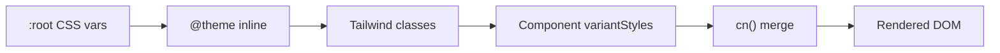

# Design Document: Design System

## Overview

O Design System da Privello é uma camada de padronização que centraliza tokens de design e componentes React reutilizáveis para garantir consistência visual em toda a plataforma. A arquitetura segue uma abordagem de **tokens → componentes → padrões**, onde:

1. **Design Tokens** são definidos como CSS custom properties em `globals.css` e expostos via `@theme inline` do Tailwind v4
2. **Componentes UI** em `src/components/ui/` consomem esses tokens exclusivamente via classes Tailwind semânticas
3. **Padrões de Interação** (animações, transições, estados) são definidos como classes utilitárias e keyframes CSS

O sistema já possui uma base implementada com 12 componentes e tokens parciais. Este design formaliza a arquitetura, preenche lacunas (Dropdown, tokens de warning/danger/blue, opacity variants, documentação), e estabelece contratos claros para cada componente.

### Princípios de Design

- **macOS Aesthetic**: `font-semibold` sobre bold, sombras sutis multicamada, cantos arredondados hierárquicos, transições com easing spring
- **Token-first**: Nenhum valor hardcoded em componentes — tudo referencia tokens semânticos
- **Composição**: Componentes pequenos e composáveis (Card + CardHeader + CardTitle)
- **Acessibilidade**: WCAG AA compliance, focus rings visíveis, ARIA attributes, keyboard navigation

## Architecture

```mermaid
graph TD
    subgraph "Design Tokens Layer"
        CSS[globals.css :root variables]
        TW[@theme inline - Tailwind v4]
        CSS --> TW
    end

    subgraph "Component Library"
        BTN[Button]
        INP[Input / Textarea / Select]
        CRD[Card]
        MDL[Modal]
        DRP[Dropdown]
        BDG[Badge]
        AVT[Avatar]
        TST[Toast]
        SWT[Switch]
        TGC[ToggleChip]
    end

    subgraph "Utilities"
        CN[cn() - clsx + twMerge]
        HK[Hooks: useScrollLock, useEscapeKey, useFocusTrap]
    end

    TW --> BTN
    TW --> INP
    TW --> CRD
    TW --> MDL
    TW --> DRP
    TW --> BDG
    TW --> AVT
    TW --> TST
    TW --> SWT
    TW --> TGC

    CN --> BTN
    CN --> INP
    CN --> CRD
    HK --> MDL
    HK --> DRP
```

### Token Resolution Flow

```
:root CSS variable → @theme inline mapping → Tailwind utility class → Component
```

Exemplo: `--privello-coral` → `--color-coral` → `bg-coral` / `text-coral` → `<Button variant="coral">`

### File Structure

```
src/
├── app/
│   └── globals.css              # Design tokens (:root + @theme inline)
├── components/
│   └── ui/
│       ├── avatar.tsx
│       ├── badge.tsx
│       ├── button.tsx
│       ├── card.tsx
│       ├── dropdown.tsx         # NEW
│       ├── input.tsx
│       ├── modal.tsx
│       ├── select.tsx
│       ├── stat-card.tsx
│       ├── switch.tsx
│       ├── textarea.tsx
│       ├── toast.tsx
│       └── toggle-chip.tsx
├── lib/
│   ├── utils.ts                 # cn() utility
│   └── hooks/
│       ├── use-scroll-lock.ts
│       ├── use-escape-key.ts
│       └── use-focus-trap.ts    # NEW
└── docs/
    └── design-system.md         # Documentation file
```

## Components and Interfaces

### Design Tokens (globals.css)

```typescript
// Token categories exposed via @theme inline
interface DesignTokens {
  // Colors
  colors: {
    background: string;    // #f5f5f7
    foreground: string;    // #1d1d1f
    muted: string;         // #86868b
    line: string;          // #d2d2d7
    coral: string;         // #ff375f
    success: string;       // #30d158
    warning: string;       // #ff9f0a (NEW)
    danger: string;        // #ff3b30 (NEW)
    blue: string;          // #0a84ff (NEW)
    sidebar: string;       // #1d1d1f
  };

  // Typography scale
  fontSize: {
    xs: '11px';
    sm: '12px';
    base: '13px';
    md: '14px';
    lg: '15px';
    xl: '16px';
    '2xl': '18px';
    '3xl': '22px';
    '4xl': '28px';
  };

  // Spacing (4px base)
  spacing: {
    'card-padding': '20px';
    'section-gap': '24px';
    'form-gap': '6px';
    'page-padding-mobile': '16px';
    'page-padding-tablet': '24px';
    'page-padding-desktop': '32px';
  };

  // Shadows
  shadows: {
    xs: 'inset 0 0.5px 2px rgba(0,0,0,0.04)';
    sm: '0 0.5px 1px rgba(0,0,0,0.03), 0 4px 16px rgba(0,0,0,0.04)';
    md: '0 2px 8px rgba(0,0,0,0.06), 0 8px 24px rgba(0,0,0,0.06)';
    lg: '0 4px 16px rgba(0,0,0,0.08), 0 16px 48px rgba(0,0,0,0.12)';
  };

  // Border radius
  radius: {
    sm: '6px';   // inputs, small buttons
    md: '8px';   // buttons, form elements
    lg: '12px';  // smaller cards, toasts
    xl: '16px';  // main cards, modals
    full: '9999px'; // avatars, badges, pills
  };

  // Transitions
  transitions: {
    fast: '150ms';
    normal: '200ms';
    slow: '300ms';
    easing: 'cubic-bezier(0.16, 1, 0.3, 1)';
  };
}
```

### Button Component

```typescript
interface ButtonProps extends ButtonHTMLAttributes<HTMLButtonElement> {
  variant?: 'primary' | 'coral' | 'secondary' | 'ghost' | 'danger';
  size?: 'sm' | 'md' | 'lg';
  loading?: boolean;
  ref?: React.Ref<HTMLButtonElement>;
}
```

**Variant mapping:**
| Variant | Background | Text | Border |
|---------|-----------|------|--------|
| primary | bg-blue | white | none |
| coral | bg-coral | white | none |
| secondary | bg-white | foreground | border-black/10 |
| ghost | transparent | muted | none |
| danger | bg-danger | white | none |

### Input / Textarea / Select Components

```typescript
interface InputProps extends InputHTMLAttributes<HTMLInputElement> {
  label?: string;
  hint?: string;
  error?: string;
  prefix?: string;
}

interface TextareaProps extends TextareaHTMLAttributes<HTMLTextAreaElement> {
  label?: string;
  hint?: string;
  error?: string;
}

interface SelectProps extends SelectHTMLAttributes<HTMLSelectElement> {
  label?: string;
  hint?: string;
  error?: string;
  options: { value: string; label: string }[];
  placeholder?: string;
}
```

**Shared styling contract:**
- Border: `border-black/10`
- Shadow: `shadow-xs` (inset)
- Radius: `rounded-lg` (8px)
- Text: `text-[14px]` (md)
- Focus: blue border + `0 0 0 3px rgba(10,132,255,0.25)`
- Error: red border + red focus ring + error message below
- Disabled: `bg-black/[0.03]` + muted text

### Card Component

```typescript
interface CardProps extends HTMLAttributes<HTMLDivElement> {
  variant?: 'default' | 'solid' | 'dark';
  padding?: 'none' | 'sm' | 'md' | 'lg';
}
```

Sub-components: `CardHeader`, `CardTitle`, `CardDescription`

### Modal Component

```typescript
interface ModalProps {
  open: boolean;
  onClose: () => void;
  children: ReactNode;
  className?: string;
  persistent?: boolean;
  position?: 'center' | 'bottom' | 'fullscreen';
}
```

**Accessibility contract:**
- `role="dialog"` + `aria-modal="true"`
- Focus trap when open (NEW — requires `useFocusTrap` hook)
- Focus return on close
- Escape key dismissal
- Scroll lock

### Dropdown Component (NEW)

```typescript
interface DropdownProps {
  children: ReactNode;
}

interface DropdownTriggerProps {
  children: ReactNode;
  asChild?: boolean;
}

interface DropdownContentProps {
  children: ReactNode;
  className?: string;
  align?: 'start' | 'center' | 'end';
}

interface DropdownItemProps extends ButtonHTMLAttributes<HTMLButtonElement> {
  variant?: 'default' | 'danger' | 'disabled';
}
```

**Behavior:**
- Compound component pattern: `<Dropdown>`, `<DropdownTrigger>`, `<DropdownContent>`, `<DropdownItem>`
- Positioned below trigger with `shadow-lg` and `rounded-xl`
- Closes on outside click, Escape key
- Arrow key navigation between items
- Focus management

### Badge Component

```typescript
interface BadgeProps extends HTMLAttributes<HTMLSpanElement> {
  variant?: 'default' | 'coral' | 'success' | 'warning' | 'muted' | 'dark';
}
```

### Avatar Component

```typescript
interface AvatarProps {
  src?: string | null;
  alt?: string;
  size?: 'xs' | 'sm' | 'md' | 'lg' | 'xl';
  fallback?: string;
  className?: string;
  ring?: boolean;
  ringColor?: 'coral' | 'success' | 'foreground' | 'muted';
}
```

**Initials logic:** Extracts first letter of first and last name from fallback/alt string.

### Toast System

```typescript
interface ToastContext {
  toast: (message: string, type?: 'success' | 'error') => void;
}
```

**Behavior:** Context provider pattern, auto-dismiss at 3500ms, bottom-right positioning, slide-in animation.

### Switch Component

```typescript
interface SwitchProps {
  checked: boolean;
  onChange: (checked: boolean) => void;
  disabled?: boolean;
  size?: 'sm' | 'md';
  label?: string;
  className?: string;
}
```

### ToggleChip Component

```typescript
interface ToggleChipProps {
  active: boolean;
  onClick: () => void;
  children: ReactNode;
  className?: string;
}
```

## Data Models

This feature does not introduce database models. The design system operates entirely at the presentation layer with:

1. **CSS Custom Properties** (`:root` variables) — runtime token values
2. **Tailwind Theme Configuration** (`@theme inline`) — build-time class generation
3. **TypeScript Interfaces** — component prop contracts (defined above)
4. **Variant Maps** — `Record<Variant, string>` objects mapping variant names to Tailwind class strings

### Token Data Flow



### Component State Model

Components manage minimal internal state:
- **Modal**: `open` (controlled), scroll lock, focus trap
- **Dropdown**: `open` (internal), active item index (keyboard nav)
- **Toast**: toast queue array `{ id, message, type }[]`
- **Switch**: `checked` (controlled)

## Correctness Properties

*A property is a characteristic or behavior that should hold true across all valid executions of a system — essentially, a formal statement about what the system should do. Properties serve as the bridge between human-readable specifications and machine-verifiable correctness guarantees.*

### Property 1: Form component base styling consistency

*For any* form component (Input, Textarea, Select), the rendered class string SHALL include the shared base styling contract: `border-black/10`, inset shadow, `rounded-lg`, and `text-[14px]`.

**Validates: Requirements 8.1**

### Property 2: Form component focus ring pattern

*For any* form component (Input, Textarea, Select), the rendered class string SHALL include `focus:border-[#0a84ff]` and a blue focus ring shadow with 25% opacity.

**Validates: Requirements 8.2, 15.1**

### Property 3: Form component error state completeness

*For any* form component (Input, Textarea, Select) with an `error` prop provided, the component SHALL render with a red border class, a red focus ring, an error message element containing the error text, `aria-invalid="true"` on the input element, and `aria-describedby` referencing the error message element.

**Validates: Requirements 8.3, 15.5**

### Property 4: Form component optional props rendering

*For any* form component (Input, Textarea, Select) with `label`, `hint`, or `error` props provided, the component SHALL render corresponding DOM elements containing those text values.

**Validates: Requirements 8.4**

### Property 5: Form component disabled styling

*For any* form component (Input, Textarea, Select) with `disabled` set to true, the rendered class string SHALL include a subtle background tint (`bg-black/[0.03]`) and muted text color, and the element SHALL have `disabled` attribute.

**Validates: Requirements 8.5**

### Property 6: Form component label-input association

*For any* form component (Input, Textarea, Select) with a `label` prop provided, the rendered label element's `htmlFor` attribute SHALL match the input element's `id` attribute.

**Validates: Requirements 8.6, 15.4**

### Property 7: Badge semantic variant opacity pattern

*For any* semantic Badge variant (coral, success, warning), the rendered class string SHALL apply a background color with reduced opacity (10-12%) and a text color at full strength.

**Validates: Requirements 11.3**

### Property 8: Avatar initials derivation

*For any* non-empty name string, the `getInitials` function SHALL return 1-2 uppercase alphabetic characters where: single-word names produce the first character, and multi-word names produce the first character of the first word and the first character of the last word.

**Validates: Requirements 13.2**

### Property 9: Color contrast WCAG AA compliance

*For any* defined text/background color pairing in the design token system (foreground on background, muted on background, white on coral, white on blue, white on danger, white on success), the computed contrast ratio SHALL meet WCAG AA minimum of 4.5:1 for normal text.

**Validates: Requirements 15.3**

## Error Handling

### Component Error States

| Component | Error Trigger | Visual Feedback | Accessibility |
|-----------|--------------|-----------------|---------------|
| Input/Textarea/Select | `error` prop | Red border, red focus ring, error message below | `aria-invalid="true"`, `aria-describedby` |
| Button | `disabled` prop | 40% opacity, no pointer events | `disabled` attribute |
| Button | `loading` prop | Spinner icon, no pointer events | `disabled` attribute |
| Avatar | Missing `src` | Initials fallback on neutral background | `alt` text preserved |
| Toast | Error variant | Red left border, XCircle icon | Role implicit via content |
| Modal | Escape key | Closes modal | Focus returned to trigger |

### Graceful Degradation

- **Missing image in Avatar**: Falls back to initials derived from `fallback` or `alt` prop. If both are empty, displays "?"
- **Invalid variant prop**: TypeScript enforces valid variants at compile time. At runtime, `cn()` handles undefined gracefully (no crash, just missing styles)
- **Missing label on form fields**: Component renders without label element. Developers should provide `aria-label` as alternative
- **Toast overflow**: Toast queue renders all active toasts stacked. No maximum limit enforced (auto-dismiss at 3500ms prevents accumulation)

### Token Fallback Strategy

```css
/* If a CSS variable is undefined, the component still renders */
color: var(--privello-coral, #ff375f); /* fallback value */
```

All `:root` variables include inline fallback values to prevent rendering failures if the CSS file loads partially.

## Testing Strategy

### Unit Tests (Example-Based)

Unit tests cover specific component behaviors, edge cases, and integration points:

- **Button**: Loading state renders spinner, disabled state applies opacity, each variant renders correct classes, ref forwarding works
- **Modal**: Escape key calls onClose, backdrop click calls onClose (not when persistent), ARIA attributes present, position variants apply correct classes
- **Dropdown**: Outside click closes, Escape closes, arrow key navigation, item variants render correctly
- **Card**: Each variant/padding combination renders correctly, sub-components render
- **Toast**: Auto-dismiss timing (mock timers), dismiss button works, variants render correct icons
- **Switch**: Checked/unchecked states, disabled state, aria-checked attribute
- **Avatar**: Ring variants, size classes, image vs fallback rendering

### Property-Based Tests

Property tests verify universal contracts across all valid inputs using `fast-check`:

- **Minimum 100 iterations** per property test
- Each test tagged with: `Feature: design-system, Property {N}: {title}`
- Library: `fast-check` (TypeScript PBT library)

Properties to implement:
1. Form component styling consistency (Properties 1-6) — generate random form component types and prop combinations
2. Badge opacity pattern (Property 7) — generate random semantic variants
3. Avatar initials (Property 8) — generate random name strings with varying word counts, whitespace, special characters
4. Color contrast (Property 9) — enumerate all defined color pairings and compute contrast ratios

### Integration Tests

- **Focus trap in Modal**: Open modal, verify Tab cycles within modal content
- **Dropdown keyboard flow**: Open dropdown, navigate with arrows, select with Enter
- **Toast lifecycle**: Trigger toast, verify appears, verify auto-dismisses
- **Responsive Modal**: Verify bottom position on mobile viewport

### Static Analysis

- **Lint rule**: Flag hardcoded hex values in `src/components/` files (Requirements 1.3, 1.5)
- **Lint rule**: Flag `font-bold` usage outside of 4xl+ contexts (Requirement 2.5)
- **TypeScript**: Strict prop types enforce valid variant/size values at compile time

### Test Configuration

```json
{
  "testFramework": "vitest",
  "pbtLibrary": "fast-check",
  "pbtIterations": 100,
  "testLocation": "src/components/ui/__tests__/"
}
```

