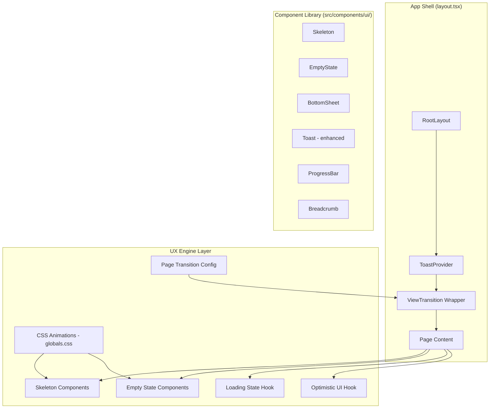

# Design Document: UX Premium Phase 4

## Overview

A Fase 4 de UX Premium implementa uma camada de experiência do usuário de nível nativo (macOS-like) para a plataforma Privello. O objetivo é transformar a percepção de velocidade, fluidez e qualidade da interface através de skeleton loaders contextuais, transições de página com View Transitions API, microinterações com spring physics, feedback visual imediato, empty states informativos, e otimizações específicas para mobile e desktop.

A implementação se baseia no design system já existente (tokens, componentes `src/components/ui/`) e utiliza as APIs nativas do Next.js 16 (View Transitions, prefetching, Suspense streaming, `loading.tsx`) combinadas com CSS animations e uma camada leve de client-side state para optimistic UI.

### Decisões Arquiteturais Chave

1. **View Transitions API nativa** (via `experimental.viewTransition` no Next.js 16) em vez de bibliotecas de animação externas — menor bundle, melhor performance, degradação graceful em browsers sem suporte.
2. **CSS-first animations** — todas as animações são definidas em `globals.css` com keyframes e classes utilitárias, evitando runtime JS para animações.
3. **Componentes composáveis** — skeleton loaders, empty states e loading states são componentes reutilizáveis no design system (`src/components/ui/`).
4. **Optimistic UI via hooks** — um hook `useOptimistic` customizado gerencia updates otimistas com rollback automático.
5. **Respeito a `prefers-reduced-motion`** — todas as animações são desabilitadas via media query quando o usuário prefere movimento reduzido.

## Architecture



### Camadas da Arquitetura

1. **CSS Layer** (`globals.css`) — keyframes, classes utilitárias de animação, variáveis de timing, media queries para reduced-motion
2. **Component Layer** (`src/components/ui/`) — componentes reutilizáveis (Skeleton, EmptyState, BottomSheet, ProgressBar, Breadcrumb)
3. **Hook Layer** (`src/lib/hooks/`) — hooks para loading states (`useAsyncAction`), optimistic UI (`useOptimisticToggle`), intersection observer (`useLazyLoad`)
4. **Page Layer** (`src/app/**/loading.tsx`) — skeleton loaders contextuais por rota usando os componentes do design system
5. **Config Layer** (`next.config.ts`) — habilitação de View Transitions experimental

## Components and Interfaces

### 1. Skeleton Component

```typescript
// src/components/ui/skeleton.tsx
interface SkeletonProps {
  className?: string;
  /** Variante do skeleton */
  variant?: "text" | "circular" | "rectangular" | "card";
  /** Largura (CSS value) */
  width?: string | number;
  /** Altura (CSS value) */
  height?: string | number;
  /** Número de linhas para variant="text" */
  lines?: number;
  /** Mostrar texto "Carregando..." após 4s */
  showFallbackText?: boolean;
  /** Mostrar erro após 15s */
  showErrorAfterTimeout?: boolean;
  /** Callback de retry quando timeout */
  onRetry?: () => void;
}
```

### 2. Skeleton Variants (Compostos)

```typescript
// src/components/ui/skeleton-variants.tsx

/** Grid de cards (discover/search) */
interface SkeletonCardGridProps {
  columns?: 2 | 3 | 4;
  rows?: number;
  showFilters?: boolean;
}

/** Perfil detalhado */
interface SkeletonProfileProps {
  showGallery?: boolean;
  showStats?: boolean;
}

/** Dashboard stats */
interface SkeletonDashboardProps {
  statCards?: number;
  showChart?: boolean;
}

/** Tabela de dados */
interface SkeletonTableProps {
  columns?: number;
  rows?: number;
}

/** Galeria de mídia */
interface SkeletonGalleryProps {
  items?: number;
  aspect?: "square" | "portrait" | "landscape";
}

/** Seção de formulário */
interface SkeletonFormProps {
  fields?: number;
}
```

### 3. EmptyState Component

```typescript
// src/components/ui/empty-state.tsx
interface EmptyStateProps {
  /** Variante contextual */
  variant:
    | "favoritos"
    | "solicitacoes"
    | "midias"
    | "avaliacoes"
    | "busca"
    | "transacoes"
    | "suporte"
    | "generic";
  /** Título (max 60 chars) */
  title: string;
  /** Subtítulo/descrição (max 120 chars) */
  subtitle?: string;
  /** Texto do CTA */
  ctaLabel?: string;
  /** Href do CTA */
  ctaHref?: string;
  /** Callback do CTA (alternativa a href) */
  onCtaClick?: () => void;
  /** Sugestões clicáveis (para busca sem resultados) */
  suggestions?: Array<{ label: string; href?: string; onClick?: () => void }>;
  /** Ícone customizado (Lucide icon component) */
  icon?: React.ComponentType<{ className?: string }>;
}
```

### 4. BottomSheet Component (Mobile)

```typescript
// src/components/ui/bottom-sheet.tsx
interface BottomSheetProps {
  open: boolean;
  onClose: () => void;
  children: React.ReactNode;
  /** Altura máxima (% da viewport) */
  maxHeight?: number;
  /** Mostrar drag handle */
  showHandle?: boolean;
  /** Título do sheet */
  title?: string;
}
```

### 5. ProgressBar Component

```typescript
// src/components/ui/progress-bar.tsx
interface ProgressBarProps {
  /** Progresso 0-100 */
  value: number;
  /** Mostrar porcentagem */
  showPercentage?: boolean;
  /** Variante visual */
  variant?: "default" | "success" | "coral";
  /** Tamanho */
  size?: "sm" | "md" | "lg";
  /** Animação de indeterminate */
  indeterminate?: boolean;
}
```

### 6. Breadcrumb Component

```typescript
// src/components/ui/breadcrumb.tsx
interface BreadcrumbItem {
  label: string;
  href?: string;
}

interface BreadcrumbProps {
  items: BreadcrumbItem[];
  /** Máximo de itens visíveis (trunca com ellipsis) */
  maxItems?: number;
}
```

### 7. useAsyncAction Hook

```typescript
// src/lib/hooks/use-async-action.ts
interface UseAsyncActionOptions<T> {
  /** Ação assíncrona a executar */
  action: () => Promise<T>;
  /** Callback de sucesso */
  onSuccess?: (result: T) => void;
  /** Callback de erro */
  onError?: (error: Error) => void;
  /** Timeout em ms (default: 15000) */
  timeout?: number;
  /** Mensagem de status após 3s */
  statusMessage?: string;
}

interface UseAsyncActionReturn<T> {
  execute: () => Promise<void>;
  isLoading: boolean;
  isTimeout: boolean;
  error: Error | null;
  result: T | null;
  statusMessage: string | null;
  retry: () => void;
  reset: () => void;
}
```

### 8. useOptimisticToggle Hook

```typescript
// src/lib/hooks/use-optimistic-toggle.ts
interface UseOptimisticToggleOptions {
  /** Estado inicial */
  initialValue: boolean;
  /** Server action para persistir */
  action: (newValue: boolean) => Promise<void>;
  /** Timeout para rollback (default: 5000ms) */
  timeout?: number;
  /** Callback de erro */
  onError?: () => void;
}

interface UseOptimisticToggleReturn {
  value: boolean;
  toggle: () => void;
  isPending: boolean;
}
```

### 9. Enhanced Toast System

```typescript
// Extensão do toast existente
interface ToastOptions {
  message: string;
  type: "success" | "error" | "info";
  /** Duração em ms (default: 4000 success, persistent error) */
  duration?: number;
  /** Auto-dismiss (default: true para success, false para error) */
  autoDismiss?: boolean;
  /** Ação inline */
  action?: { label: string; onClick: () => void };
}
```

### 10. View Transition Configuration

```typescript
// next.config.ts - adição
experimental: {
  viewTransition: true;
}
```

## Data Models

Esta feature não introduz novos modelos de dados no banco. Os dados relevantes são:

### Client-Side State

```typescript
// Estado do toast stack
interface ToastState {
  toasts: Array<{
    id: string;
    message: string;
    type: "success" | "error" | "info";
    timestamp: number;
    autoDismiss: boolean;
    duration: number;
  }>;
  maxVisible: 3;
}

// Estado de loading assíncrono
interface AsyncActionState {
  isLoading: boolean;
  startedAt: number | null;
  error: Error | null;
  isTimeout: boolean;
}

// Estado de optimistic UI
interface OptimisticState<T> {
  displayValue: T;
  serverValue: T;
  isPending: boolean;
  rollbackTimer: NodeJS.Timeout | null;
}
```

### CSS Custom Properties (Animation Tokens)

```css
:root {
  /* Durations */
  --duration-fast: 150ms;
  --duration-normal: 200ms;
  --duration-slow: 300ms;
  --duration-enter: 250ms;

  /* Easings */
  --ease-spring: cubic-bezier(0.16, 1, 0.3, 1);
  --ease-out: cubic-bezier(0, 0, 0.2, 1);
  --ease-in: cubic-bezier(0.4, 0, 1, 1);

  /* Skeleton */
  --skeleton-shimmer-duration: 1.5s;
  --skeleton-bg: rgba(0, 0, 0, 0.04);
  --skeleton-highlight: rgba(0, 0, 0, 0.08);
}
```

## Correctness Properties

*A property is a characteristic or behavior that should hold true across all valid executions of a system — essentially, a formal statement about what the system should do. Properties serve as the bridge between human-readable specifications and machine-verifiable correctness guarantees.*

### Property 1: Reduced motion disables all animations

*For any* UI component that defines animations (skeleton shimmer, page transitions, button press, card hover, list stagger, dropdown open/close, toast slide-in, badge pulse), if the user's operating system has `prefers-reduced-motion: reduce` enabled, then all animation durations SHALL be 0ms and state changes SHALL be applied instantaneously.

**Validates: Requirements 3.7, 12.6**

### Property 2: Disabled elements suppress all microinteractions

*For any* interactive element (button, card, link, toggle, form field) in a disabled state, triggering hover, press, or focus events SHALL produce no visual change beyond the base disabled appearance (opacity 40%, pointer-events none).

**Validates: Requirements 3.8**

### Property 3: Toast ARIA live region announces messages

*For any* toast notification with message M and type T, the ARIA live region SHALL contain the text M, with `aria-live="polite"` when T is "success" or "info", and `aria-live="assertive"` when T is "error".

**Validates: Requirements 4.8**

### Property 4: Toast stack maximum visibility

*For any* number N of simultaneous toast events (where N ≥ 1), the number of visible toasts SHALL be min(N, 3), and the remaining (N - 3) toasts SHALL be queued and displayed as visible toasts are dismissed.

**Validates: Requirements 4.9**

### Property 5: EmptyState variant completeness

*For any* EmptyState variant V from the set {favoritos, solicitacoes, midias, avaliacoes, busca, transacoes, suporte}, the rendered output SHALL contain: an SVG illustration (max 120x120px), a title string of at most 60 characters, a subtitle string of at most 120 characters, and a primary CTA button with a valid navigation target.

**Validates: Requirements 5.1**

### Property 6: Error state prevents EmptyState display

*For any* data fetch that results in an error (network failure, server error, timeout), the system SHALL render an error state with retry action and SHALL NOT render the EmptyState component.

**Validates: Requirements 5.6**

### Property 7: Onboarding progress calculation

*For any* onboarding step S (where S ∈ {1, 2, 3, 4}), the progress indicator SHALL display step S of 4 total, and the completion percentage SHALL equal `(S - 1) * 25` when the step is in progress, or `S * 25` when the step is completed.

**Validates: Requirements 7.1**

### Property 8: Onboarding data persistence across step navigation

*For any* sequence of onboarding steps visited and form data entered, navigating to a previously completed step SHALL display the previously saved data intact without loss.

**Validates: Requirements 7.7**

### Property 9: Async action duplicate submission prevention

*For any* asynchronous action in progress (isLoading = true), the trigger element SHALL be disabled and any additional activation attempts SHALL not fire the action again until the current action completes or times out.

**Validates: Requirements 8.3**

### Property 10: Error recovery preserves form state

*For any* form with user-entered data that encounters a non-timeout error during submission, all form elements SHALL be re-enabled and all user-entered values SHALL be preserved exactly as they were before submission.

**Validates: Requirements 8.6**

### Property 11: List stagger animation delay calculation

*For any* list of N items loading simultaneously, item at index I (0-based) SHALL have an entry animation delay of `I * 50ms` for I < 20, and 0ms delay (immediate appearance) for I ≥ 20.

**Validates: Requirements 12.1**

### Property 12: Optimistic toggle with rollback

*For any* toggle action (favorite, online status, switch), the UI SHALL reflect the new state within 100ms of user action. If the server request fails or does not respond within 5000ms, the UI SHALL revert to the previous state and display a non-blocking error notification.

**Validates: Requirements 14.1**

### Property 13: Image blur placeholder presence

*For any* image displayed in the application, a blurred placeholder (max 20px intrinsic width, scaled to target dimensions) SHALL be visible while the full-resolution image is loading, and SHALL transition to the full image within 300ms once loaded.

**Validates: Requirements 14.4**

## Error Handling

### Loading Errors

| Scenario | Behavior |
|----------|----------|
| Skeleton timeout (>15s) | Replace skeleton with error state + "Tentar novamente" button |
| Page transition timeout (>3s) | Complete transition showing loading state of new page |
| Async action timeout (>15s) | Cancel request, show timeout message + retry/cancel buttons |
| Network failure | Show error toast (persistent) + shake animation + retry button |
| Server error (5xx) | Show error toast with generic message + retry |
| Validation error (4xx) | Show inline field errors + form shake |

### Optimistic UI Rollback

| Scenario | Behavior |
|----------|----------|
| Server rejects toggle | Revert UI to previous state + show non-blocking notification |
| Server timeout (>5s) | Revert UI + show "Ação não concluída" notification |
| Network offline | Revert immediately + show "Sem conexão" notification |

### Toast Error Handling

- Error toasts persist until manually dismissed (no auto-dismiss)
- Maximum 3 toasts visible simultaneously; additional queued
- Toast container uses `aria-live` for screen reader announcements
- Toasts stack vertically with 8px gap

### Graceful Degradation

- **No View Transitions support**: Pages swap instantly without animation (native browser behavior)
- **No IntersectionObserver**: All content loads eagerly (no lazy loading)
- **JavaScript disabled**: Server-rendered content displays without animations
- **Slow connection**: Skeleton loaders provide perceived performance; optimistic UI prevents blocking

## Testing Strategy

### Unit Tests (Example-Based)

Unit tests cover specific behaviors and edge cases:

- Skeleton component renders correct structure for each variant
- EmptyState renders all required elements per variant
- Toast auto-dismiss timing (4s success, persistent error)
- BottomSheet drag-to-dismiss threshold (40% height)
- Breadcrumb truncation with ellipsis at maxItems
- Header hide/show at scroll thresholds (50px down, 30px up)
- Keyboard shortcuts fire correct actions (Ctrl+S, Escape)
- Progressive disclosure expand/collapse with icon rotation
- Mobile gallery snap points and position indicator

### Property-Based Tests

Property tests verify universal behaviors using **fast-check** (TypeScript PBT library):

- Each property test runs minimum 100 iterations
- Tests reference design document properties via tag comments
- Tag format: `Feature: ux-premium-phase4, Property {N}: {title}`

Properties to implement:
1. Reduced motion disables animations (Property 1)
2. Disabled elements suppress interactions (Property 2)
3. Toast ARIA announcements correctness (Property 3)
4. Toast stack max visibility (Property 4)
5. EmptyState variant completeness (Property 5)
6. Error prevents EmptyState (Property 6)
7. Onboarding progress calculation (Property 7)
8. Onboarding data persistence (Property 8)
9. Duplicate submission prevention (Property 9)
10. Error recovery preserves state (Property 10)
11. Stagger delay calculation (Property 11)
12. Optimistic toggle rollback (Property 12)
13. Image blur placeholder (Property 13)

### Integration Tests

- View Transitions configuration is enabled in next.config.ts
- Prefetching works for navigation links
- `loading.tsx` files use contextual skeletons (not generic spinners)
- Toast provider wraps all interactive areas
- Bottom navigation renders on mobile viewports

### Visual Regression Tests

- Skeleton shimmer animation renders correctly
- Page transitions animate smoothly
- Card hover elevation works
- Empty state illustrations display at correct opacity
- Mobile bottom sheet renders with drag handle

### Accessibility Tests

- All skeletons have `aria-busy="true"` and `aria-label`
- Toast live regions announce with correct politeness
- Focus trap works in modals and bottom sheets
- Keyboard navigation works for all interactive elements
- Touch targets meet 44x44px minimum on mobile

