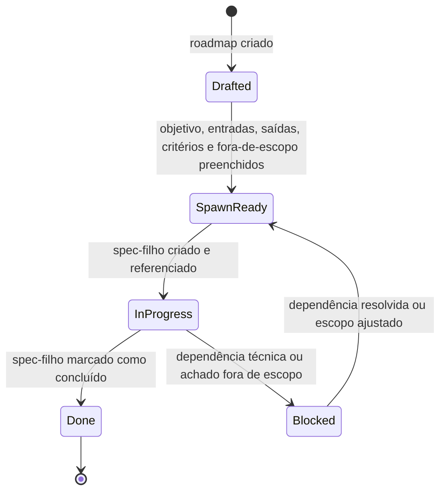
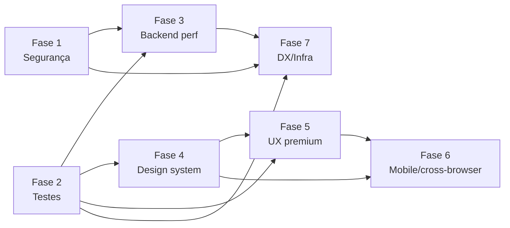

# Guia de Promoção de Fase — Auditoria Geral

> Manual operacional para promover uma fase do master spec `auditoria-geral` a um spec-filho independente em `.kiro/specs/{phase-id}/`.

Documentos de referência (todos em `c:\Users\edulanzarin\Documents\Dev\privello\.kiro\specs\auditoria-geral\`):

- `requirements.md` — define as 7 fases, seus Phase Cards e os critérios de aceite (EARS) que serão herdados por cada spec-filho.
- `design.md` — define `PhaseState`, `Spawn-Readiness Gate`, `Child Spec Bridge`, protocolo de `OutOfScopeFinding` e o tratamento de erros E1–E6.
- `_template-spec-filho.md` — template a ser copiado para o `requirements.md` do spec-filho recém-criado (produzido pela tarefa 3.1 deste plano).

---

## 1. Visão geral

Promover uma fase significa transitá-la de `SpawnReady` para `InProgress` no master spec, materializando-a como um spec-filho próprio em `.kiro/specs/{phase-id}/` com `requirements.md`, `design.md` e `tasks.md` independentes. A partir desse momento, a execução real da fase mora no spec-filho; o master spec passa a referenciar o filho pelo campo `child_spec_path` do Phase Card e fica congelado para essa fase até a conclusão.

A promoção só faz sentido quando:

- O master spec já passou pelo saneamento descrito em `design.md > Saída deste spec` (todos os 7 checks de validação verdes).
- A fase está em `SpawnReady` (ver §2).
- As fases das quais ela depende estão em `Done` (ver §5).
- Há banda para tocar essa fase isoladamente, sem competir por arquivos com outra fase em `InProgress`.

Promoção **não** envolve implementação de código de aplicação. O spec-filho começa em sua própria fase de requisitos e só descerá para tarefas concretas quando passar pelo workflow padrão de specs do Kiro.

---

## 2. Pré-condições

Antes de criar `.kiro/specs/{phase-id}/`, valide manualmente cada item abaixo. Se qualquer um falhar, **não promova**: corrija a causa no master spec primeiro.

1. **Estado da fase é `SpawnReady`.** Em `Drafted` falta preenchimento; em `Blocked` há dependência ou achado pendente; em `InProgress`/`Done` a promoção já aconteceu.
2. **Phase Card completo e não-ambíguo.** Aplique mentalmente o `Spawn-Readiness Gate` definido em `design.md > Components and Interfaces > 2. Spawn-Readiness Gate`:
   - `id`, `title`, `objective`, `inputs`, `outputs`, `acceptance` (EARS), `out_of_scope` preenchidos sem ambiguidade.
   - `agents_rule_areas` preenchido se a fase toca APIs do Next.js.
3. **Dependências atendidas.** Todas as fases listadas em "Fases predecessoras" do Phase Card e no grafo da §5 deste guia estão em `Done`. Sem exceções: se a dependência ainda está em `InProgress`, espere ou registre o motivo da exceção como `OutOfScopeFinding` no master.
4. **AGENTS_Rule planejada.** Para fases com `agents_rule_areas` não vazio (Fase 1: `images-config`, `headers`; Fase 3: `cache-components`, `route-segment-config`, `server-actions`; Fase 5: `view-transitions`), o template já reserva a seção "Consultas a `node_modules/next/dist/docs/`". A evidência precisa ser planejada como tarefa antes da primeira decisão técnica do filho — sem consulta registrada, qualquer adoção dessas APIs é rejeitada (regra dura E5 de `design.md > Error Handling`).
5. **Sem regressão pendente entre fases.** Nenhuma fase já em `Done` foi alterada de modo a quebrar premissas desta. Se houver, trate primeiro como E6 (ver §6).

---

## 3. Procedimento passo a passo

Os comandos abaixo usam PowerShell (Windows) e caminhos absolutos a partir da raiz do repositório `c:\Users\edulanzarin\Documents\Dev\privello\`. Substitua `{phase-id}` pelo identificador estável da fase (ex.: `fase-2-testes`).

### 3.1. Verificar o Spawn-Readiness Gate

Releia o Phase Card da fase no `requirements.md` e confirme que todos os campos do `Spawn-Readiness Gate` (`design.md > Components and Interfaces > 2. Spawn-Readiness Gate`) estão preenchidos. Em caso de dúvida, rebaixe a fase para `Drafted` via comentário no master e pare aqui.

### 3.2. Confirmar dependências do grafo

Cruze o `dependsOn` da fase com a tabela e o grafo da §5. Toda predecessora precisa estar em `Done` no master spec antes de seguir.

### 3.3. Criar o diretório do spec-filho

```powershell
New-Item -ItemType Directory -Path "c:\Users\edulanzarin\Documents\Dev\privello\.kiro\specs\{phase-id}"
```

O diretório precisa estar vazio. Se já existir conteúdo, é sinal de promoção parcial anterior — investigue antes de prosseguir.

### 3.4. Copiar o template como `requirements.md` do filho

```powershell
Copy-Item `
  "c:\Users\edulanzarin\Documents\Dev\privello\.kiro\specs\auditoria-geral\_template-spec-filho.md" `
  "c:\Users\edulanzarin\Documents\Dev\privello\.kiro\specs\{phase-id}\requirements.md"
```

O template traz, no mínimo: cabeçalho de proveniência, lista de critérios herdados, seção "Revalidação" (Confirmado/Resolvido/Reescopado), seção "Achados fora de escopo" e, quando aplicável, seção "Consultas a `node_modules/next/dist/docs/`".

### 3.5. Preencher o cabeçalho de proveniência

No `requirements.md` recém-copiado:

- Caminho absoluto do master spec: `c:\Users\edulanzarin\Documents\Dev\privello\.kiro\specs\auditoria-geral\requirements.md`.
- `phase_id`: o identificador estável da fase (`fase-1-seguranca`, `fase-2-testes`, …, `fase-7-dx-infra`).
- Critérios herdados (EARS) copiados literalmente do Phase Card correspondente no master.
- `historical_refs` da fase (caminhos absolutos para `.kiro/specs/_archive/*`) replicados.
- Áreas `agents_rule_areas` listadas, se aplicável, sinalizando que a evidência de consulta a `node_modules/next/dist/docs/` é obrigatória antes da primeira decisão técnica.

### 3.6. Atualizar o Phase Card no master

Edite `c:\Users\edulanzarin\Documents\Dev\privello\.kiro\specs\auditoria-geral\requirements.md`:

- `state`: `SpawnReady` → `InProgress`.
- `child_spec_path`: `.kiro/specs/{phase-id}/`.
- (Se o Phase Card hoje não traz esses campos explicitamente, registre-os como bullets adicionais ou comentário Markdown junto ao Phase Card.)

A partir desse commit, o master spec é a única fonte de verdade sobre o estado da fase; o spec-filho cuida da execução.

### 3.7. (Opcional) Criar `design.md` e `tasks.md` do filho

Quando o spec-filho avançar no workflow padrão de specs do Kiro, ele ganhará `design.md` e `tasks.md` próprios. Esses arquivos **não** precisam existir no momento da promoção — só o `requirements.md` é exigido para que a fase seja considerada `InProgress`. Crie-os conforme a fase saia da etapa de requisitos para a etapa de design.

---

## 4. Transições de `PhaseState`

Espelha fielmente `design.md > Architecture > Modelo conceitual`.



Enumeração equivalente:

- `[*] → Drafted` — fase nasce no roadmap mestre com algum campo do Phase Card ainda vago.
- `Drafted → SpawnReady` — todos os campos obrigatórios do Phase Card foram preenchidos sem ambiguidade.
- `SpawnReady → InProgress` — `.kiro/specs/{phase-id}/` foi criado, `child_spec_path` aponta para ele e o cabeçalho de proveniência do filho está preenchido. Esta é a transição executada pelo §3.
- `InProgress → Done` — o spec-filho concluiu suas próprias tarefas e foi marcado como done; ver §7.
- `InProgress → Blocked` — surgiu dependência técnica não resolvida ou `OutOfScopeFinding` que impede o avanço. A execução do filho pausa.
- `Blocked → SpawnReady` — a dependência foi resolvida ou o escopo do filho foi ajustado no master spec; a fase volta ao pool de promoção (mesmo que o `.kiro/specs/{phase-id}/` já exista, ele é tratado como rascunho até o desbloqueio).
- `Done → [*]` — fase encerrada, sem retorno (regressões viram E6, ver §6).

Todas as transições são manuais e ficam visíveis em commits no master spec.

---

## 5. Grafo de dependências entre fases

Pré-condição obrigatória: para promover uma fase, **todas as fases listadas em "Depends on" precisam estar em `Done`**. O grafo abaixo é fonte única; em conflito com outros documentos, este guia e `design.md > Architecture > Grafo de dependências entre fases` prevalecem.

| Phase                          | Depends on                                                |
|--------------------------------|-----------------------------------------------------------|
| `fase-1-seguranca`             | —                                                          |
| `fase-2-testes`                | —                                                          |
| `fase-3-backend`               | `fase-1-seguranca`, `fase-2-testes`                        |
| `fase-4-design-system`         | `fase-2-testes`                                            |
| `fase-5-ux`                    | `fase-2-testes`, `fase-4-design-system`                    |
| `fase-6-mobile-cross-browser`  | `fase-4-design-system`, `fase-5-ux`                        |
| `fase-7-dx-infra`              | `fase-1-seguranca`, `fase-2-testes`, `fase-3-backend`      |

Visão em grafo (espelho de `design.md > Architecture`):



Resumo das janelas de promoção possíveis a partir do estado inicial (todas as fases em `SpawnReady`):

- **Onda 1 (paralelizáveis):** `fase-1-seguranca`, `fase-2-testes`.
- **Onda 2 (após Onda 1):** `fase-3-backend` (precisa F1 e F2), `fase-4-design-system` (precisa F2).
- **Onda 3 (após Onda 2):** `fase-5-ux` (precisa F2 e F4), `fase-7-dx-infra` (precisa F1, F2 e F3).
- **Onda 4 (após Onda 3):** `fase-6-mobile-cross-browser` (precisa F4 e F5).

---

## 6. Regras de retorno ao master

Há dois cenários em que o spec-filho **devolve** algo ao master spec em vez de absorvê-lo. Em ambos, o achado vira commit no master, nunca é absorvido pelo spec-filho. Mapeiam respectivamente E4 e E6 de `design.md > Error Handling`.

### 6.1. `OutOfScopeFinding` (E4)

Quando, durante o spec-filho, surge problema relevante que claramente pertence a outra fase ou a nenhuma fase prevista:

1. Registrar no `requirements.md` do filho, na seção "Achados fora de escopo", uma entrada com a estrutura de `OutOfScopeFinding` definida em `design.md > Data Models`:
   - `discoveredIn`: `phase.id` do filho onde foi achado.
   - `description`: descrição objetiva do achado.
   - `proposedTarget`: `phase.id` da fase existente que deveria absorver, ou `novo-spec-filho` se não houver fase compatível.
   - `evidence`: `path:line` no código ou link para commit/issue que comprova.
2. Abrir commit no master spec (`.kiro/specs/auditoria-geral/requirements.md`) com uma das duas saídas:
   - **Atualizar fase existente:** ajustar `inputs`/`outputs`/`acceptance` da fase indicada em `proposedTarget`. Se a fase alvo já estiver em `Done`, abrir uma nova fase ou subfase (ver abaixo) — não reabrir uma fase concluída.
   - **Criar nova fase ou subfase:** adicionar `Phase` com `id` estável (`fase-N-slug`), Phase Card completo, e atualizar o grafo de dependências da §5 deste guia se a nova fase for predecessora de outra.
3. **O spec-filho não absorve o achado.** Se o achado bloquear o avanço da fase atual, mover a fase do filho para `Blocked` no master até a saída do passo 2 ser commitada.

### 6.2. Regressão entre fases (E6)

Quando uma alteração em uma fase concluída (`Done`) quebra premissa de outra fase em andamento (`InProgress` ou `SpawnReady`):

1. Mover a fase **afetada** para `Blocked` no master spec (`state: Blocked`, com nota apontando para a fase originária da regressão).
2. Abrir nota no `requirements.md` do spec-filho da fase **originária** (a que está em `Done`) descrevendo o efeito colateral, com `path:line` da evidência.
3. Tratar o efeito como `OutOfScopeFinding` (mesma seção do §6.1) **na fase originária**, com `proposedTarget` = a fase afetada ou uma nova fase, conforme escopo. Em nenhum caso a fase afetada absorve o trabalho de corrigir a regressão sem registro no master.
4. Após o commit no master, a fase afetada pode retornar para `SpawnReady` (regra `Blocked → SpawnReady` da §4) e seguir o §3 normalmente.

A intenção é deixar o histórico de regressões rastreável a partir do master spec, sem que um spec-filho silencie problemas vindos de outra fase.

---

## 7. Conclusão de uma fase

Quando o spec-filho de uma fase termina suas próprias tarefas (todas as caixas marcadas, revisão final aprovada):

1. **Atualizar o Phase Card no master** (`.kiro/specs/auditoria-geral/requirements.md`):
   - `state`: `InProgress` → `Done`.
   - `doneAt`: timestamp ISO-8601 do encerramento (ex.: `2026-03-14T17:42:00-03:00`).
2. **Adicionar link para o spec-filho concluído.** Mantenha `child_spec_path` apontando para `.kiro/specs/{phase-id}/` e cite o commit que marcou o filho como concluído.
3. **Re-rodar o Spawn-Readiness Gate nas fases que dependiam desta.** Use o grafo da §5 para identificar dependentes diretas:
   - Concluir `fase-1-seguranca` libera reavaliação de `fase-3-backend` e `fase-7-dx-infra`.
   - Concluir `fase-2-testes` libera `fase-3-backend`, `fase-4-design-system`, `fase-5-ux`, `fase-7-dx-infra`.
   - Concluir `fase-3-backend` libera `fase-7-dx-infra`.
   - Concluir `fase-4-design-system` libera `fase-5-ux` e `fase-6-mobile-cross-browser`.
   - Concluir `fase-5-ux` libera `fase-6-mobile-cross-browser`.
   - `fase-6-mobile-cross-browser` e `fase-7-dx-infra` não destravam outras fases (folhas do grafo).
   Para cada dependente, valide se ela continua em `SpawnReady` (campos do Phase Card preenchidos, AGENTS_Rule planejada). Se sim, ela está pronta para o §3.
4. Se a fase concluída deixou achados na seção "Achados fora de escopo", confirme que cada um já virou commit no master spec; caso contrário, faça-o agora — não deixe achados órfãos após o `Done`.

A partir do `Done`, a fase é congelada. Qualquer mudança subsequente que afete suas premissas é tratada como E6 (§6.2), nunca como reabertura.
