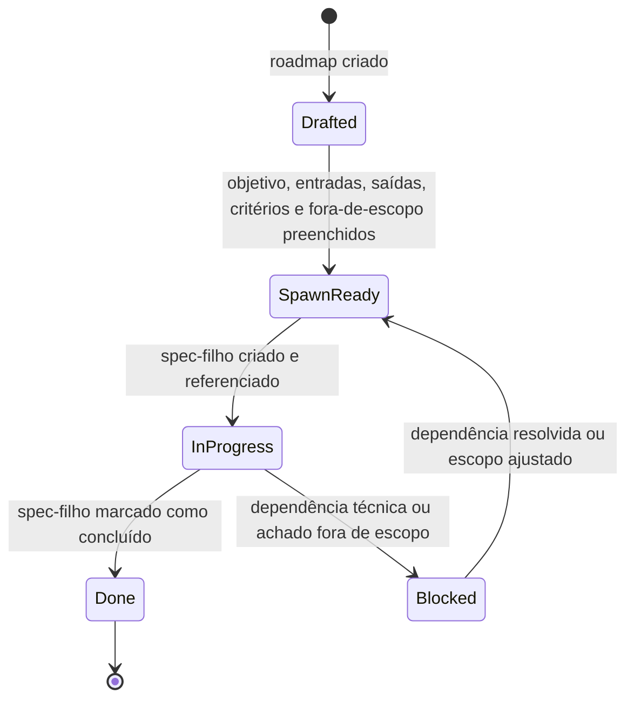
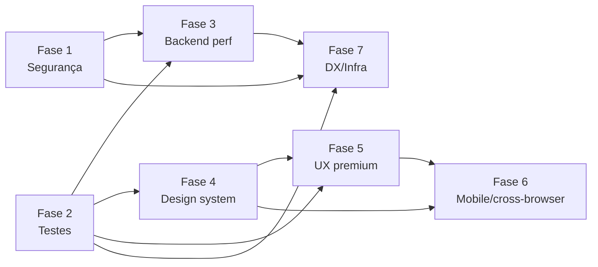

# Design Document

> Auditoria Geral do Privello — design do roadmap mestre por fases.

## Overview

Este documento descreve o **design do roadmap mestre** definido no `requirements.md` deste spec. O "sistema" sob design **não é software executável**: é um documento de governança que organiza a auditoria do Privello em 7 fases independentes, cada uma promovível a um spec-filho com requirements/design/tasks próprios.

O design responde a três perguntas:

1. **Como cada fase é estruturada** para que vire um spec-filho sem nova rodada de descoberta (spawn-readiness).
2. **Como as fases se relacionam** entre si — dependências técnicas, ordem recomendada, áreas de código tocadas, e o que acontece quando achados extrapolam o escopo.
3. **Como manter o roadmap sincronizado com o estado real do código** — em particular, com a regra do `AGENTS.md` que obriga consulta a `node_modules/next/dist/docs/` antes de qualquer assunção sobre APIs do Next 16.

Decisões de design importantes, com a respectiva justificativa:

- **Não definir tarefas de implementação aqui**. O escopo do master spec termina nos critérios por fase. Tarefas reais nascem nos specs-filhos. Isso evita retrabalho quando o estado do código avança entre o roadmap e a execução de uma fase.
- **Tratar os 5 specs arquivados em `.kiro/specs/_archive/` como referência histórica, não como fonte de verdade**. O `ARCHITECTURE_AUDIT.md` foi escrito quando o projeto era Next.js 15 e antes de várias correções já entregues (HMAC do webhook MP, headers de segurança básicos, validação de upload, services iniciais). Cada spec-filho **revalida o item arquivado contra o código atual** antes de aceitá-lo como tarefa.
- **Centralizar a `AGENTS_Rule` (consultar `node_modules/next/dist/docs/`)** em uma seção transversal e citá-la nas fases que dependem de APIs do Next.js (Fases 3 e 5, em particular Cache Components e View Transitions).
- **Pular a seção de Correctness Properties**. Property-based testing não é apropriado para o sistema deste spec — ver justificativa na Testing Strategy.

### Estado de partida (insumos do código)

Síntese cruzada entre `requirements.md`, `ARCHITECTURE.md`, `ARCHITECTURE_AUDIT.md`, `REFACTOR_PLAN.md` e `prisma/schema.prisma`. Itens marcados ✅ já estão resolvidos no código atual e **não** podem aparecer como tarefas em specs-filhos sem revalidação:

- ✅ Webhook MercadoPago com verificação HMAC-SHA256 (`src/app/api/mp/webhook/route.ts`).
- ✅ Headers básicos em `next.config.ts`: X-Frame-Options, X-Content-Type-Options, Referrer-Policy, Permissions-Policy.
- ✅ Validação de Content-Length, MIME e tamanho por categoria em `/api/upload`.
- ✅ Camada `src/lib/services/` iniciada (`subscription`, `profile`, `city`, `media`).
- ✅ Índices adicionados em `Profile` (`planTier+planExpiresAt`, `isOnline+cityId`, `featuredUntil`) e em `Subscription` (`userId+status+expiresAt`).
- 🔲 CSP, HSTS, Zod, rate limit, testes, View Transitions, Cache Components, redução de `force-dynamic`, primitivos faltantes (Dropdown, focus trap), aplicação consistente de tokens, `loading.tsx`/`error.tsx` para a maioria das ~78 rotas, fidelidade aos mockups em `design/`, CI, documentação de variáveis de ambiente.

---

## Architecture

### Modelo conceitual

O master spec é uma **máquina de estados** com unidades chamadas Phase. Cada Phase atravessa o ciclo:



- **Drafted**: a fase existe no roadmap mas algum campo obrigatório está vago. Não pode virar spec-filho.
- **SpawnReady**: todos os campos do contrato (ver Components and Interfaces) estão preenchidos sem ambiguidade. É o gatilho de promoção.
- **InProgress**: existe um `.kiro/specs/{phase-id}/` ativo, referenciando este master spec.
- **Done**: o spec-filho foi concluído. O master spec é atualizado com link e timestamp.
- **Blocked**: surgiu um achado fora de escopo (ver Error Handling) ou uma dependência precisa ser resatisfeita.

### Grafo de dependências entre fases

As 7 fases não são todas paralelas. A ordem recomendada decorre de dependências técnicas:



Justificativas das arestas:

- **Fase 2 → Fase 3, Fase 4, Fase 5**: refactors de query (N+1 em `getProfileBySlug`), troca de sort em memória por SQL, eliminação de cores hex literais e de switches duplicados precisam de rede de proteção (Vitest + fast-check) para não regredir comportamento.
- **Fase 1 → Fase 3**: rate limiting (Fase 1) influencia métricas de antes/depois de queries (Fase 3); endpoints de cron precisam estar com header secret antes de qualquer otimização que altere semântica.
- **Fase 4 → Fase 5 e Fase 6**: tokens completos (`warning`, `danger`, `blue`) e primitivos (Dropdown, focus trap) são pré-requisito para padronizar `loading.tsx`/`error.tsx`, EmptyState e bottom-sheets.
- **Fase 1, Fase 2, Fase 3 → Fase 7**: a CI da Fase 7 só faz sentido cobrir scripts e checagens já existentes. Roda lint, typecheck e os testes da Fase 2.

A Fase 6 depende fortemente de Fase 4 e Fase 5 (mockups e primitivos consolidados antes da validação cross-browser).

### Princípios de governança

1. **Independência por fase**: um spec-filho deve poder rodar com seu próprio time/contexto sem precisar consultar outras fases ativas, salvo dependências declaradas.
2. **Bounded scope**: cada fase declara explicitamente seu fora de escopo; o que extrapolar volta para o master spec, não é absorvido silenciosamente.
3. **Revalidação obrigatória**: nenhum item dos specs arquivados entra como tarefa sem ser confrontado com o código atual.
4. **AGENTS_Rule transversal**: qualquer decisão que envolva APIs do Next 16 (cache, transitions, route handlers, server actions, middleware) exige consulta a `node_modules/next/dist/docs/` registrada como evidência no spec-filho.
5. **Pt-BR**: documentação de fases e specs-filhos em pt-BR para consistência com o restante do repositório.

---

## Components and Interfaces

O master spec é decomposto em quatro "componentes" lógicos. Eles não são código — são **seções estruturadas** que conjuntamente formam o roadmap.

### 1. Phase Card (interface contratual de uma fase)

Cada fase do `requirements.md` deve poder ser lida como um Phase Card. Esse é o contrato mínimo para spawn-readiness.

| Campo                | Obrigatório | Descrição |
|----------------------|-------------|-----------|
| `id`                 | sim         | Identificador estável (`fase-N-slug`). Imutável após Drafted. |
| `title`              | sim         | Título humano em pt-BR. |
| `objective`          | sim         | Frase única descrevendo o resultado esperado da fase. |
| `inputs`             | sim         | Áreas de código, arquivos, fases predecessoras concluídas. |
| `outputs`            | sim         | Artefatos esperados (config, código, docs, métricas). |
| `acceptance`         | sim         | Lista de critérios em EARS herdada do `requirements.md`. |
| `out_of_scope`       | sim         | Itens que não devem ser absorvidos pela fase. |
| `historical_refs`    | opcional    | Caminhos para specs arquivados que motivaram a fase. |
| `agents_rule_areas`  | condicional | Lista de APIs do Next que serão tocadas (obriga consulta a docs). Obrigatório quando `inputs` referencia rotas, server actions, middleware, cache ou transitions. |
| `child_spec_path`    | preenchido em InProgress | `.kiro/specs/{id}/`. |
| `state`              | sim         | `Drafted` \| `SpawnReady` \| `InProgress` \| `Done` \| `Blocked`. |

Os 7 cartões previstos (mapeados 1-para-1 com Requirements 2 a 8 do `requirements.md`):

1. **fase-1-seguranca** — endurecer `/api/dev/*`, padronizar segredo de cron via header, whitelist de `images.remotePatterns`, Zod em Server Actions e API Routes, rate limit declarado, `AUTH_URL` em produção, avaliar CSP/HSTS.
2. **fase-2-testes** — Vitest + fast-check, convenções `*.test.ts` e `*.pbt.ts`, foco em `src/lib/` (módulos puros), round-trips para parsers/serializers, integração na CI da Fase 7.
3. **fase-3-backend** — corrigir N+1 em `getProfileBySlug`, classificar 43 rotas com `force-dynamic`, mover sorts para SQL, concluir migração `queries.ts` → `services/`, métricas antes/depois.
4. **fase-4-design-system** — completar tokens `warning/danger/blue`, eliminar hex literais, entregar Dropdown e focus trap consistentes com Modal/Switch, lint anti-regressão, consolidar implementações duplicadas (Switch, upload, modais).
5. **fase-5-ux** — inventário de `loading.tsx`/`error.tsx`, View Transitions (com AGENTS_Rule), padrão de UI otimista, `prefers-reduced-motion`, EmptyState reutilizável.
6. **fase-6-mobile-cross-browser** — matriz Safari iOS / Chrome Android / Safari/Firefox/Edge desktop, alvo mínimo 44×44, teclado virtual, bottom-sheets, diff visual com os 11 PNGs de `design/`.
7. **fase-7-dx-infra** — CI 3-estágios (lint, typecheck, testes), revisão de `docker-compose.yml`, doc única de variáveis de ambiente, eliminar duplicação `queries.ts` ↔ `services/*`, plano de redução de `any`, ADRs e changelog.

### 2. Spawn-Readiness Gate

Função lógica `isSpawnReady(phase) → boolean` aplicada manualmente durante a revisão do master spec. Falha se qualquer campo obrigatório do Phase Card estiver vazio, ambíguo ou contradito por outra parte do master spec. Quando `agents_rule_areas` estiver presente, exige menção explícita do dever de consulta no spec-filho.

Pseudocódigo de referência (apenas para clareza, não é código de produção):

```ts
function isSpawnReady(p: PhaseCard): boolean {
  if (!p.id || !p.title || !p.objective) return false;
  if (!nonEmpty(p.inputs) || !nonEmpty(p.outputs)) return false;
  if (!nonEmpty(p.acceptance) || !nonEmpty(p.out_of_scope)) return false;
  if (touchesNextApis(p) && !nonEmpty(p.agents_rule_areas)) return false;
  if (hasUnresolvedDependencies(p)) return false;
  return true;
}
```

### 3. Child Spec Bridge

Contrato que liga master spec ↔ spec-filho. Quando uma fase é promovida, o spec-filho:

- Cria o diretório `.kiro/specs/{phase-id}/` com `.config.kiro`, `requirements.md`, `design.md`, `tasks.md`.
- No início do `requirements.md` do filho, declara um cabeçalho de proveniência:
  - Caminho absoluto deste master spec.
  - `phase.id` correspondente.
  - Lista dos critérios herdados do `requirements.md` mestre.
- Cada item herdado de specs arquivados aparece como uma seção "Revalidação" com três estados:
  - `Confirmado` — ainda válido contra o código atual.
  - `Resolvido` — já tratado; remove da lista de tarefas.
  - `Reescopado` — descrição atualizada para refletir o estado real.
- Achados fora de escopo descobertos durante o spec-filho são registrados em uma seção dedicada "Achados fora de escopo" e propostos como nova entrada/atualização do master spec, **não** absorvidos.

### 4. AGENTS_Rule Hook

Cláusula transversal que aparece em todas as fases que tocam Next.js. Exige:

- Antes de adotar qualquer API mencionada em `agents_rule_areas`, registrar no spec-filho:
  - O caminho consultado em `node_modules/next/dist/docs/`.
  - Trecho relevante (1-2 linhas) que justifica a decisão.
- A consulta deve preceder qualquer prototipação. Itens-alvo prováveis: Cache Components (`use cache`, `cacheLife`, `cacheTag`), View Transitions, route segment config, server actions, middleware/proxy, `images.remotePatterns`, `headers()`/`cookies()` em RSCs.

---

## Data Models

Como o spec é um documento, "modelos de dados" aqui significam **schemas conceituais para os artefatos textuais**. Servem como guia para revisão e como base para um eventual lint do documento (ver Testing Strategy).

### Phase

```ts
type PhaseState =
  | "Drafted"
  | "SpawnReady"
  | "InProgress"
  | "Blocked"
  | "Done";

interface Phase {
  id: `fase-${1|2|3|4|5|6|7}-${string}`;
  title: string;                    // pt-BR
  objective: string;                // 1-2 frases
  inputs: PhaseInput[];             // arquivos, áreas, fases predecessoras
  outputs: PhaseOutput[];           // artefatos esperados
  acceptance: AcceptanceCriterion[]; // EARS, herdado de requirements.md
  outOfScope: string[];
  historicalRefs?: string[];        // caminhos para .kiro/specs/_archive/*
  agentsRuleAreas?: NextApiArea[];  // obrigatório se inputs tocarem Next APIs
  dependsOn: Phase["id"][];         // fases que precisam estar Done
  state: PhaseState;
  childSpecPath?: string;           // ".kiro/specs/{id}"
  doneAt?: string;                  // ISO-8601 quando Done
}

type PhaseInput =
  | { kind: "file"; path: string }
  | { kind: "area"; description: string }
  | { kind: "phase"; id: Phase["id"] };

type PhaseOutput =
  | { kind: "code"; description: string }
  | { kind: "config"; description: string }
  | { kind: "doc"; description: string }
  | { kind: "metric"; description: string }; // ex.: "queries por request antes/depois"

interface AcceptanceCriterion {
  ref: `${number}.${number}`;       // ex.: "2.5"
  text: string;                      // o EARS literal
}

type NextApiArea =
  | "cache-components"
  | "view-transitions"
  | "route-segment-config"
  | "server-actions"
  | "middleware-proxy"
  | "images-config"
  | "headers"
  | "metadata";
```

### ArchivedSpecRef

Cada referência ao `_archive/` traz contexto suficiente para revalidação:

```ts
interface ArchivedSpecRef {
  path: `.kiro/specs/_archive/${string}`;
  scope: "security" | "testing" | "backend" | "design-system" | "ux" | "mobile" | "dx";
  motivatesPhases: Phase["id"][];
}
```

Mapeamento esperado (evidência de que o master spec absorve as 5 fontes históricas):

| Spec arquivado                 | Motiva                              |
|--------------------------------|-------------------------------------|
| `backend-performance-phase5`   | `fase-2-testes`, `fase-3-backend`   |
| `design-system`                | `fase-4-design-system`              |
| `ux-premium-phase4`            | `fase-5-ux`                         |
| `ux-premium-polish`            | `fase-5-ux`, `fase-6-mobile-cross-browser` |
| `final-polish-phase`           | `fase-5-ux`, `fase-6-mobile-cross-browser`, `fase-7-dx-infra` |

### OutOfScopeFinding

Estrutura usada **dentro de specs-filhos** quando algo extrapola a fase, mas precisa voltar ao master spec:

```ts
interface OutOfScopeFinding {
  discoveredIn: Phase["id"];        // spec-filho onde foi achado
  description: string;
  proposedTarget: Phase["id"] | "novo-spec-filho";
  evidence: string;                  // path:line ou link
}
```

### Esquema textual do master spec

O `requirements.md` deste spec já segue o esquema. As validações implícitas:

- Cada Requirement (2..8) corresponde a uma `Phase`.
- O Requirement 1 governa `Phase`/`PhaseState` (estrutura/governança).
- O Requirement 9 codifica o `Spawn-Readiness Gate`.

---

## Error Handling

Como o sistema sob design é organizacional, "erros" são situações em que o roadmap deixa de ser confiável. Este design define um pequeno conjunto de procedimentos de recuperação.

### E1. Fase em estado inconsistente (campo obrigatório vazio)

**Sintoma:** revisor identifica que uma fase declarada SpawnReady tem `inputs`, `outputs` ou `out_of_scope` vagos.

**Tratamento:** rebaixar a fase para `Drafted`, listar os campos faltantes em comentário no `requirements.md`, e bloquear a criação do spec-filho até completar. O Spawn-Readiness Gate é a única porta de entrada para a transição.

### E2. Item arquivado já resolvido no código

**Sintoma:** durante a redação de um spec-filho, descobre-se que um item herdado dos `.kiro/specs/_archive/*` já foi entregue (ex.: HMAC do webhook, índices de Subscription).

**Tratamento:** o spec-filho marca o item como `Resolvido` na seção de Revalidação, com link para o commit/arquivo que comprova. **Não** vira tarefa. O master spec não precisa ser alterado; o histórico fica no spec-filho.

### E3. Item arquivado mudou de natureza

**Sintoma:** o item ainda é um problema, mas em outro lugar do código (ex.: `force-dynamic` foi removido em algumas rotas, mas surgiu em outras).

**Tratamento:** `Reescopado`. O texto do EARS herdado é mantido, mas o spec-filho descreve o alvo atual. Se o reescopo mudar o critério de aceite do master spec, abrir update do master spec antes de prosseguir.

### E4. Achado fora de escopo

**Sintoma:** durante o spec-filho de uma fase, surge problema relevante que claramente pertence a outra fase ou a nenhuma fase prevista.

**Tratamento:** registrar como `OutOfScopeFinding` no spec-filho e propor uma das duas saídas:

1. Adicionar a outra fase existente — gera commit no master spec atualizando `inputs`/`acceptance` da fase alvo.
2. Criar nova fase ou subfase — gera commit no master spec criando `Phase` com `id` estável (`fase-N-slug`).

Em nenhum caso o spec-filho absorve silenciosamente o achado.

### E5. Quebra da AGENTS_Rule

**Sintoma:** spec-filho propõe uso de API do Next 16 sem citar consulta a `node_modules/next/dist/docs/`.

**Tratamento:** revisor rejeita o spec-filho até que a consulta seja registrada. Esta é a única regra do master spec aplicada como bloqueio duro, porque o contexto do projeto (`AGENTS.md`) afirma explicitamente que **esta versão do Next.js tem breaking changes em relação ao conhecimento prévio**.

### E6. Dependência circular ou regressão entre fases

**Sintoma:** alteração em uma fase concluída quebra premissa de outra fase em andamento.

**Tratamento:** mover a fase afetada para `Blocked` no master spec, abrir nota no spec-filho da fase concluída, e tratar como `OutOfScopeFinding` para a fase originária da regressão.

---

## Testing Strategy

### Por que **não há** propriedades de correção (PBT) neste spec

Property-based testing é apropriado quando há funções puras, parsers/serializers, transformações de dados, algoritmos ou lógica de negócio com espaço de entradas grande e propriedades universais ("para todo X, P(X)"). O sistema deste spec é um **documento estruturado de governança**: 7 fases declaradas com campos textuais, dependências e estados. Não há entradas variáveis significativas, não há função sob teste, não há propriedade universal mais útil que uma checagem de schema.

Aplicar PBT aqui produziria, na melhor hipótese, validação de schema disfarçada (ex.: "para toda fase, tem `id`, `objective`, `acceptance`"), o que é melhor expresso como um lint declarativo. Por isso, esta seção substitui PBT por **revisão estruturada e checks textuais**, conforme orientação do workflow ("If PBT is NOT applicable, omit the Correctness Properties section").

PBT volta a ser apropriado **dentro dos specs-filhos**:

- **Fase 2** estabelece a infraestrutura (Vitest + fast-check) e exige round-trips para `discover-params`, `booking-slots`, `time-utils`, `money`, `whatsapp-booking`.
- **Fase 3** consome a Fase 2 para validar paridade de resultados ao mover sorts e refatorar queries.
- **Fase 4** pode usar property-based em parsing de tokens, mas a maior parte das verificações é por lint/snapshot.

### O que validar no master spec

Validação manual em revisão de PR contra o `requirements.md`. Cada item abaixo é um check binário:

1. **Cobertura de fases**: o `requirements.md` declara exatamente as 7 fases previstas com os identificadores estáveis listados em Components and Interfaces.
2. **Cobertura de origens**: cada um dos 5 specs em `.kiro/specs/_archive/` está mapeado para pelo menos uma fase no quadro `ArchivedSpecRef`.
3. **Spawn-readiness explícita**: para cada fase, todos os campos do Phase Card estão preenchidos sem ambiguidade. Se algum estiver vago, a fase **não** está SpawnReady, mesmo que apareça no roadmap.
4. **Não-absorção silenciosa**: o `requirements.md` declara explicitamente o protocolo de `OutOfScopeFinding` (Requirement 9.3).
5. **AGENTS_Rule presente**: requirements 2.x, 4.x e 5.x mencionam a obrigação de consulta a `node_modules/next/dist/docs/` para qualquer adoção de Cache Components, View Transitions ou alteração em `images.remotePatterns`.
6. **Itens já resolvidos não viram tarefa**: a lista da seção "Estado de partida" deste design é confrontada com o `requirements.md`. Itens marcados ✅ não podem aparecer como critério de aceite "a entregar".
7. **Idioma**: pt-BR consistente em `requirements.md` e neste `design.md`.

### Lint declarativo opcional (recomendado para Fase 7)

Quando a Fase 7 entregar a CI, vale criar um pequeno script de lint do roadmap (Node, sem dependências exóticas) que faça:

- Parse do `requirements.md` extraindo ids `fase-N-slug` por título de Requirement.
- Verificação de cobertura das 7 fases.
- Detecção de menções a APIs do Next 16 sem o gancho `AGENTS_Rule`.
- Detecção de itens já resolvidos (lista ✅ deste design) listados como "a entregar" no `requirements.md`.

Este lint é **opcional para o master spec** e fica como sugestão de tarefa **dentro do spec-filho da Fase 7**, não aqui.

### Revisão dos specs-filhos (quando promovidos)

Para cada spec-filho derivado deste master spec, a revisão exige:

- Cabeçalho de proveniência apontando para este `requirements.md` e o `phase.id`.
- Seção "Revalidação" com cada item arquivado classificado em `Confirmado` / `Resolvido` / `Reescopado`.
- Para fases com `agentsRuleAreas`, registro de consulta a `node_modules/next/dist/docs/` antes da primeira tarefa.
- Se a fase é a Fase 2, configuração mínima de Vitest e fast-check com scripts npm (`test`, `test:watch`, `test:run`).
- Se a fase é a Fase 3, métricas antes/depois (tempo de resposta em dev **ou** queries por requisição) anexadas a cada otimização.
- Se a fase é a Fase 7, integração explícita dos testes da Fase 2 na pipeline de CI.

### Cobertura de testes "do projeto" (escopo das fases, não do master spec)

Para evitar confusão com o que pertence a este spec vs. ao código do Privello: o roadmap define **onde** cada tipo de teste deve aparecer; a implementação efetiva mora nos specs-filhos.

| Tipo de teste                | Spec-filho responsável |
|------------------------------|------------------------|
| Property-based (fast-check)  | Fase 2 (instala) → Fase 3 (consome) |
| Unit test (Vitest)           | Fase 2 |
| Integration test (Vitest + Prisma de teste, opcional) | Fase 2/3 (escopo a definir no spec-filho) |
| End-to-end (Playwright)      | Fora do escopo desta auditoria; ampliação fica para fase futura, conforme Requirement 3.7 |
| Snapshot/visual regression   | Fase 6 (cross-browser) |
| Lint anti-regressão (cores hex, font-size arbitrário) | Fase 4 |
| CI (lint + typecheck + tests)| Fase 7 |

### Saída deste spec

O master spec é considerado pronto quando:

- Os 7 checks de validação acima passam para o `requirements.md`.
- Este `design.md` está alinhado com o `requirements.md` (mesmas 7 fases, mesmo Spawn-Readiness Gate, mesmo protocolo de `OutOfScopeFinding`).
- A regra do `AGENTS.md` está ancorada como pré-condição para fases que tocam Next.js.

A partir daí, cada fase pode ser promovida individualmente a spec-filho conforme prioridade, respeitando o grafo de dependências em **Architecture**.
