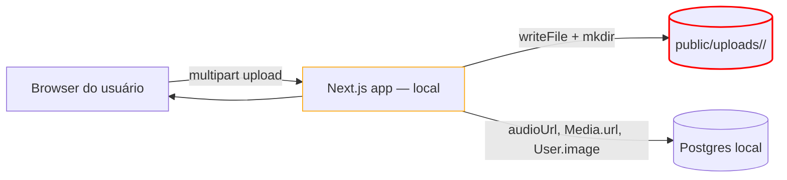
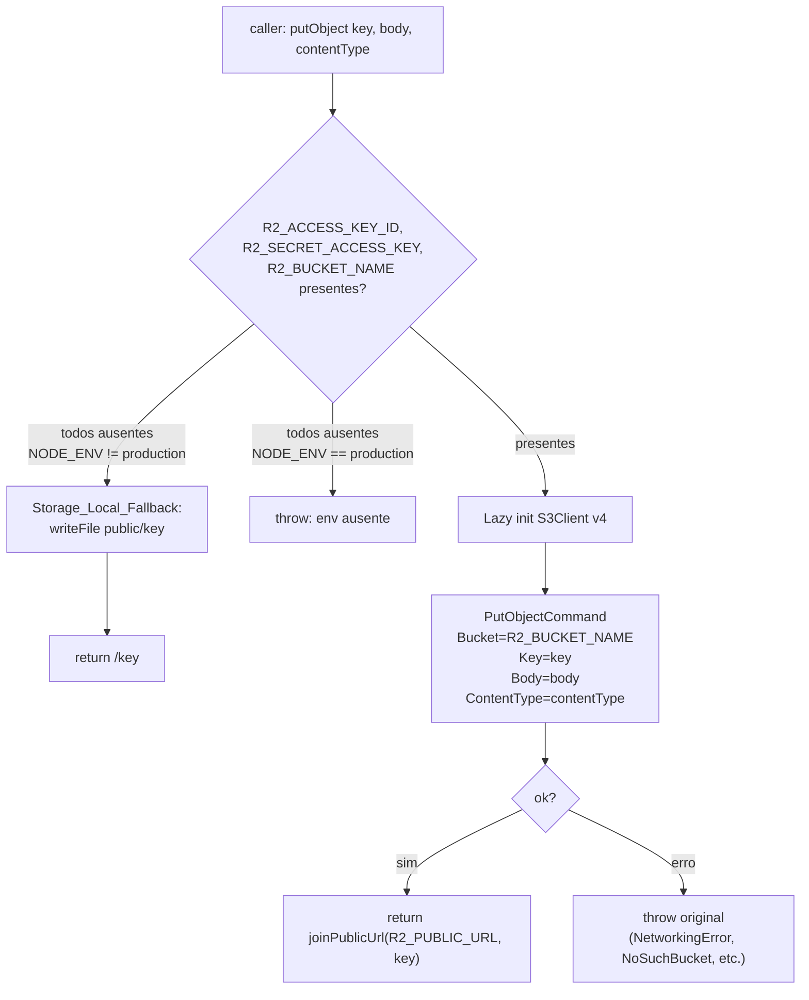
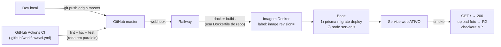
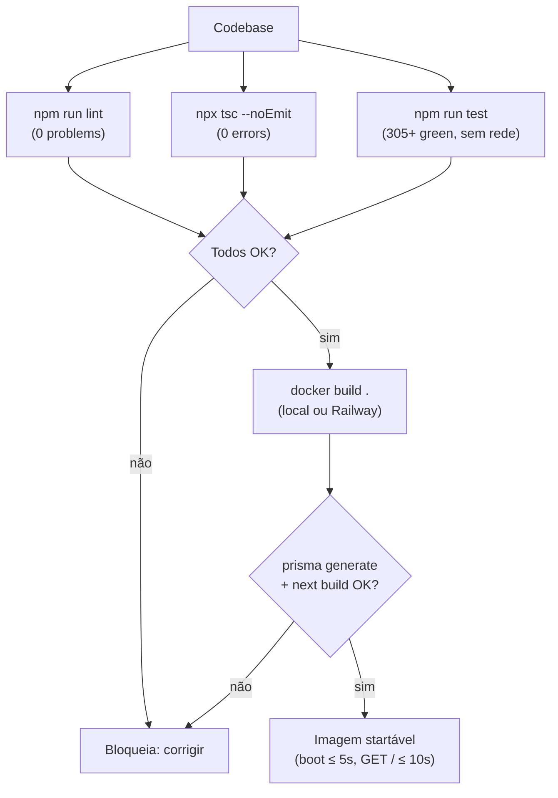

# Design Document

> **Spec:** Migração de infraestrutura para produção (`migracao-infra-producao`)
> **Workflow:** `requirements-first` / `feature`
> **Created:** 2026-05-17

---

## Overview

Este design endereça os 12 requirements da `requirements.md` com **uma única
abstração nova** — `src/lib/storage.ts` (Storage_Module) — e refactors mecânicos
nos 5 `Upload_Endpoints` que hoje escrevem em `public/uploads/` ou
`public/verification/`. Tudo o mais (Dockerfile, schedulers Railway, docs de
deploy, edits de `.env.example`) é configuração e documentação operacional.

A entrega é **estritamente de infraestrutura**: nenhuma feature nova, nenhum
schema Prisma alterado, contratos HTTP/Server Action preservados ao byte.

### Princípios do design

1. **Uma e apenas uma abstração nova.** Todos os pontos que escrevem mídia
   passam pelo Storage_Module. Trocar de R2 para S3, Backblaze B2 ou Vercel
   Blob deve ser uma edição de um único arquivo.
2. **Refactor mecânico nos call-sites.** Cada um dos 5 `Upload_Endpoints`
   substitui o par `mkdir + writeFile` por `await putObject(...)`, mantendo
   ordem de validações, status codes, e shape de retorno. Validações
   continuam **antes** do `putObject` (NFR-SEC-4).
3. **Storage_Local_Fallback preserva o fluxo de dev.** Sem credenciais R2 em
   dev, o módulo escreve em `public/<scope>/<owner>/<file>` e devolve URL
   relativa — exatamente o comportamento atual. Testes unitários e seeds
   locais continuam rodando sem rede.
4. **Validar no host, build no container.** Lint/tsc/test rodam no laptop e
   na CI antes do `docker build`. O Dockerfile só é executado se o host
   passar nas portas de qualidade. `prisma generate` dentro do Docker é
   bloqueante mesmo se o host estiver verde (Requirement 8.7).
5. **Schema Prisma congelado.** Esta migração não altera nenhuma coluna —
   `Profile.audioUrl`, `Media.url`, `User.image`, `VerificationCase.*`
   continuam recebendo strings; só muda quem compõe a string.

### Decisões travadas e racional

| Decisão | Escolha | Racional |
|---|---|---|
| Hosting | Railway | Vercel AUP é incompatível com o nicho do produto. Railway aceita conteúdo legal adult-adjacent (decisão herdada da requirements.md). |
| Storage | Cloudflare R2 (S3-compatible) | Zero egress fee; requisito decisivo para um produto de mídia (NFR-COST-1). |
| SDK | `@aws-sdk/client-s3` v3 | API S3-compatible canônica; automaticamente opt-out do bundling Next.js (`serverExternalPackages` lista o pacote por default). Pin a versão específica em `package.json`. |
| Multipart upload? | **Não** nesta fase | Limites de tamanho (8 MB imagem, 200 MB vídeo, 150 MB verification, 20 MB áudio) cabem em `PutObjectCommand` simples. Multipart fica como melhoria futura. |
| `req.formData()` mantido? | **Sim** | A consulta a `01-app/01-getting-started/15-route-handlers.md` confirma que Route Handlers usam Web `Request`. `formData()` carrega tudo em memória, mas (a) o pré-check de `Content-Length` já rejeita acima do teto, (b) limites por tamanho continuam validados no handler antes do `putObject`. Streaming via `req.body` é melhoria futura, fora do escopo. |
| Output Next.js | `output: "standalone"` | Reduz drasticamente o tamanho da imagem Docker; consultado em `node_modules/next/dist/docs/01-app/03-api-reference/05-config/01-next-config-js/output.md`. **Caveat copiado do guia:** `.next/standalone` NÃO copia `public/` nem `.next/static/` — o Dockerfile precisa copiá-los manualmente para o `runner`. |
| Imagem Docker | `node:20-alpine` em `runner` | Alinha com `engines.node >= 20` declarado em `package.json`. Alpine pequena, popular, com Prisma engine compatível (`linux-musl-arm64-openssl-3.0.x` / `linux-musl-openssl-3.0.x` — incluído no `prisma generate`). |
| Crons | Railway scheduled services chamando endpoints HTTP via header `Authorization: Bearer $CRON_SECRET` | Mesmo helper `verifyCronSecret` já existente em `src/lib/security/cron-auth.ts`. Janela de transição query-string fecha em 2026-06-15; schedulers usam header de saída (Requirement 9.3). |
| Presigned URL para `verification/*` | **NÃO implementar nesta fase** — usar URL pública como fallback temporário | Requirement 4.4 explicita: fallback aceito desde que registrado como **blocker** em `docs/deploy-railway.md` antes do go-live. Implementação de presigned é trabalho separado. Esta fase escreve em `verification/<profileId>/...` no mesmo bucket, e o blocker fica documentado. |
| Bucket privado para `verification/*`? | **NÃO nesta fase** — bucket único | Mesma razão do item anterior. Migração para bucket separado privado + Worker/presigned é o trabalho do go-live blocker. NFR-SEC-2 reflete isso ("decisão final na fase Design"). |
| Cleanup de órfãos no R2? | **Nunca** | REQ-3.4 / Requirement 3.4 explicitam retenção permanente. Espelha exatamente o comportamento atual em disco, onde `DELETE /api/upload-audio` apenas seta `audioUrl = null` sem apagar o arquivo. |
| Migração de bytes existentes em `public/uploads/` | **Nenhuma** | Banco de produção é virgem. Seeds locais não são migrados (Non-Goal 9). |
| Região Railway | **US-East** | Compatível com latência aceitável para usuários BR e com a maioria das regiões R2 (Cloudflare é multi-region edge — escolha de R2 location-hint é separada e fica no documento de deploy). Tunning de região é melhoria futura. |
| Logging de uploads | Linha estruturada `{ ts, endpoint, key, ownerId, contentType, size, ok\|error }` em todos os 5 sites | NFR-OBS-1 / NFR-OBS-2: nunca logar bytes nem credenciais; só metadado. Mesmo formato do `console.warn` de rate-limit já em uso. |

### AGENTS_Rule — consultas realizadas

A regra `c:\Users\edulanzarin\Documents\Dev\privello\AGENTS.md` exige consulta
a `node_modules/next/dist/docs/` antes de qualquer decisão técnica que envolva
APIs do Next.js. As consultas relevantes a este design:

1. **`output: "standalone"`** — consultado
   `node_modules/next/dist/docs/01-app/03-api-reference/05-config/01-next-config-js/output.md`.
   Confirmado: ativa `.next/standalone/server.js` minimal; `public/` e
   `.next/static/` precisam de cópia manual no Dockerfile (caveat citado
   verbatim no guia). Comentário in-file ficará no `next.config.ts` quando
   a flag for adicionada (Requirement 8.1).
2. **`images.remotePatterns`** — consultado
   `node_modules/next/dist/shared/lib/image-config.d.ts:24` para a forma
   canônica `{ protocol, hostname, port?, pathname?, search? }`. A consulta
   já está documentada in-file em `next.config.ts` (datada 2026-03-14) e o
   contrato não muda nesta fase — apenas adicionamos uma entrada nova
   condicional ao `R2_PUBLIC_URL`.
3. **Route Handlers / streaming uploads** — consultado
   `node_modules/next/dist/docs/01-app/01-getting-started/15-route-handlers.md`.
   Decisão: manter `req.formData()` (Web API) sem migrar para streaming.
   Justificativa: validações de `Content-Length` + tamanho preservadas; sem
   regressão funcional. Streaming verdadeiro exigiria reformatar parsers
   multipart, fora do escopo.
4. **`proxyClientMaxBodySize`** — consultado
   `node_modules/next/dist/docs/01-app/03-api-reference/05-config/01-next-config-js/proxyClientMaxBodySize.md`.
   Não aplicável: o Privello_App não usa Next.js Proxy. O guard de body
   é o pré-check `Content-Length` em cada handler de upload, mantido como
   está.
5. **`serverExternalPackages`** — consultado
   `node_modules/next/dist/docs/01-app/03-api-reference/05-config/01-next-config-js/serverExternalPackages.md`.
   Confirmado: `@aws-sdk/client-s3` está na lista padrão de pacotes
   automaticamente opt-out do bundling. Nenhuma config extra necessária.

### Out-of-scope confirmado para esta fase

Mesmos itens da `requirements.md > §3 Non-Goals` (lista não-reaberta). Adições
descobertas durante o design:

- **Implementação de Presigned_URL no Storage_Module.** Trabalho separado,
  pré-go-live, registrado como blocker em `docs/deploy-railway.md`
  (Requirement 4.4 + 10.1).
- **Bucket privado dedicado para `verification/*`.** Mesmo trabalho separado.
- **Multipart upload via S3.** Limites atuais (max 200 MB) cabem em
  `PutObjectCommand` simples. Migração para multipart fica para iteração
  futura se uploads de vídeo passarem a falhar por timeout.
- **Retry automático em `putObject` falho.** NFR-DUR-2 explicita: caller
  decide retentar. Sem retry no módulo.
- **`output.md` caveat sobre `outputFileTracingIncludes`.** O Privello_App
  não tem casos especiais de tracing (`sharp`, `aws-crt` etc.) que o guia
  cita; nenhuma config extra é necessária.

---

## Architecture

### Visão de alto nível (antes vs depois)

**Antes (estado atual — bloqueante para produção):**



> O filesystem em `public/uploads/` é destruído em qualquer reinício de
> container/réplica num runtime serverless. Bloqueante de produção.

**Depois (alvo desta migração):**

```mermaid
flowchart LR
    Client[Browser do usuário]
    DNS["Cloudflare DNS + CDN<br/>privello.com.br"]
    Web["Railway service: web<br/>(Dockerfile, output: standalone)"]
    Cron1["Railway service: cron-expire-plans<br/>0 6 * * * UTC"]
    Cron2["Railway service: cron-reset-hot<br/>0 7 * * * UTC"]
    PG[("Railway Postgres add-on<br/>backup diário")]
    Storage["src/lib/storage.ts<br/>(Storage_Module)"]
    R2["Cloudflare R2 bucket<br/>uploads/, audio/, verification/"]
    R2URL["R2_PUBLIC_URL<br/>(pub-id.r2.dev ou cdn.privello.com.br)"]
    MP["Mercado Pago<br/>webhook → /api/mp/webhook"]

    Client -->|HTTPS| DNS
    DNS -->|reverse proxy| Web
    Client -->|GET imagem/áudio/vídeo| R2URL
    Web -->|"5 upload sites → putObject"| Storage
    Storage -->|"PutObject (S3 v4 sig)"| R2
    Web -->|Prisma Client| PG
    Cron1 -->|"Authorization: Bearer $CRON_SECRET"| Web
    Cron2 -->|"Authorization: Bearer $CRON_SECRET"| Web
    MP -->|webhook POST| Web
    R2URL -.|public read| R2

    style Storage stroke:#0a8,stroke-width:2px
    style R2 stroke:#0a8
    style Web stroke:#0a8
```

### Storage_Module — fluxo interno



### Pipeline de deploy



### Camadas de qualidade (porta antes do build)



---

## Components and Interfaces

### 1. `src/lib/storage.ts` — Storage_Module (novo)

**Responsabilidade:** abstrair o cliente S3 contra o Cloudflare R2; expor uma
API mínima e estável; implementar Storage_Local_Fallback transparente em dev
sem credenciais.

**API pública:**

```ts
// src/lib/storage.ts

/**
 * Persiste `body` em `key` no R2_Bucket (ou em disco via fallback).
 * Retorna a URL pública composta (formato depende do modo).
 *
 * - Em produção sem R2_*: lança erro descritivo com nome da envvar faltante.
 * - Em dev sem R2_*: escreve em `public/<key>` e retorna `/<key>` (Storage_Local_Fallback).
 * - Em qualquer ambiente com R2_*: chama PutObjectCommand; erros do SDK
 *   propagam intactos.
 *
 * @param key Object_Key, ex.: "uploads/<profileId>/<file>", "verification/<profileId>/<file>".
 * @param body Bytes do arquivo (Buffer ou Uint8Array).
 * @param contentType MIME (ex.: "image/jpeg").
 * @returns URL pública string (absoluta com R2_PUBLIC_URL ou relativa "/...").
 */
export async function putObject(
  key: string,
  body: Buffer | Uint8Array,
  contentType: string,
): Promise<string>;

/**
 * Remove `key` do R2_Bucket (ou no-op em fallback local — o módulo NÃO apaga
 * arquivos do disco em dev por questão de segurança contra path traversal,
 * apesar de a chamada não falhar).
 *
 * Erros do SDK propagam intactos.
 */
export async function deleteObject(key: string): Promise<void>;

/**
 * Compõe a URL pública sem barra duplicada, independente de R2_PUBLIC_URL
 * terminar ou não com "/". Exposta para testes; consumida internamente por
 * putObject.
 */
export function joinPublicUrl(base: string, key: string): string;

/**
 * `true` quando todas as 3 envvars do par mínimo (R2_ACCESS_KEY_ID,
 * R2_SECRET_ACCESS_KEY, R2_BUCKET_NAME) estão completamente ausentes.
 * Em produção, este modo lança em putObject/deleteObject. Em dev, ativa
 * Storage_Local_Fallback. Exposta para testes.
 */
export function isLocalFallbackMode(env?: NodeJS.ProcessEnv): boolean;
```

**Implementação — esboço:**

```ts
import { S3Client, PutObjectCommand, DeleteObjectCommand } from "@aws-sdk/client-s3";
import { writeFile, mkdir } from "node:fs/promises";
import { dirname, join } from "node:path";

const R2_PUBLIC_URL = process.env.R2_PUBLIC_URL?.replace(/\/+$/, "") ?? "";
const R2_BUCKET = process.env.R2_BUCKET_NAME ?? "";
const R2_ACCOUNT_ID = process.env.R2_ACCOUNT_ID ?? "";
const R2_KEY = process.env.R2_ACCESS_KEY_ID ?? "";
const R2_SECRET = process.env.R2_SECRET_ACCESS_KEY ?? "";

let _client: S3Client | null = null;
function client(): S3Client {
  if (_client) return _client;
  _client = new S3Client({
    region: "auto", // R2 default
    endpoint: `https://${R2_ACCOUNT_ID}.r2.cloudflarestorage.com`,
    credentials: { accessKeyId: R2_KEY, secretAccessKey: R2_SECRET },
    // signatureVersion v4 é default no AWS SDK v3 — NFR-SEC-3 atendido.
  });
  return _client;
}

export function isLocalFallbackMode(env: NodeJS.ProcessEnv = process.env): boolean {
  const allMissing =
    !env.R2_ACCESS_KEY_ID &&
    !env.R2_SECRET_ACCESS_KEY &&
    !env.R2_BUCKET_NAME;
  return allMissing && env.NODE_ENV !== "production";
}

function assertProductionEnvOrThrow(): void {
  if (process.env.NODE_ENV !== "production") return;
  const missing: string[] = [];
  if (!R2_KEY) missing.push("R2_ACCESS_KEY_ID");
  if (!R2_SECRET) missing.push("R2_SECRET_ACCESS_KEY");
  if (!R2_BUCKET) missing.push("R2_BUCKET_NAME");
  if (missing.length > 0) {
    throw new Error(`Storage_Module: envvar(s) ausente(s) em produção: ${missing.join(", ")}`);
  }
}

export function joinPublicUrl(base: string, key: string): string {
  const trimmedBase = base.replace(/\/+$/, "");
  const trimmedKey = key.replace(/^\/+/, "");
  return `${trimmedBase}/${trimmedKey}`;
}

export async function putObject(
  key: string,
  body: Buffer | Uint8Array,
  contentType: string,
): Promise<string> {
  if (isLocalFallbackMode()) {
    const filePath = join(process.cwd(), "public", key);
    await mkdir(dirname(filePath), { recursive: true });
    await writeFile(filePath, body);
    return `/${key.replace(/^\/+/, "")}`;
  }
  assertProductionEnvOrThrow();
  await client().send(
    new PutObjectCommand({
      Bucket: R2_BUCKET,
      Key: key,
      Body: body,
      ContentType: contentType,
    }),
  );
  return joinPublicUrl(R2_PUBLIC_URL, key);
}

export async function deleteObject(key: string): Promise<void> {
  if (isLocalFallbackMode()) return; // no-op em dev
  assertProductionEnvOrThrow();
  await client().send(new DeleteObjectCommand({ Bucket: R2_BUCKET, Key: key }));
}
```

**Notas de design:**

- **Lazy init do S3Client** — evita instanciar SDK em `import time`, o que
  permite que testes que rodam com fallback nunca toquem o SDK.
- **`region: "auto"`** — recomendação Cloudflare R2 (S3-compatible).
- **`endpoint`** — formato `https://<R2_ACCOUNT_ID>.r2.cloudflarestorage.com`
  é o canônico do R2. Documentado em `deploy-railway.md`.
- **`replace(/\/+$/, "")` em `R2_PUBLIC_URL`** — atende Requirement 1.6
  (sem barra duplicada).
- **Validação só de presença na inicialização** — Requirement 1.4.1: o
  `assertProductionEnvOrThrow` é chamado dentro de `putObject`/`deleteObject`,
  não no top-level do módulo, para que `import` continue idempotente em
  testes que mockam.
- **Storage_Local_Fallback é completo-ausente-only** — Requirement 1.5: as
  3 envvars `R2_ACCESS_KEY_ID/SECRET/BUCKET` precisam estar TODAS ausentes.
  `R2_ACCOUNT_ID` e `R2_PUBLIC_URL` não participam da decisão (são
  necessárias para R2 funcionar mas não diferenciam fallback de erro de
  config).
- **Não há retry automático** — NFR-DUR-2.
- **Idempotência S3 PUT** — Requirement 1.10: `PutObjectCommand` em chave
  existente sobrescreve sem erro (contrato S3 padrão, herdado).
- **Testes unitários** — `src/lib/storage.test.ts` cobre os 4 cenários
  exigidos por Requirement 1.9, todos sem mock do SDK (usa `tmpdir` para
  fallback e mocka `process.env` para os caminhos de erro).

### 2. `src/app/api/upload/route.ts` — refactor

**Mudanças:**

- Remover imports `writeFile, mkdir` de `fs/promises` e `join` de `path`.
- Adicionar `import { putObject } from "@/lib/storage"`.
- Substituir o trecho `mkdir + writeFile` (linhas ~125–135 do arquivo atual)
  por:

```ts
const key = `uploads/${profile.id}/${filename}`;
let url: string;
try {
  url = await putObject(key, buffer, file.type);
} catch (err) {
  console.warn({
    ts: Date.now(),
    endpoint: "upload",
    key,
    ownerId: profile.id,
    contentType: file.type,
    size: file.size,
    error: err instanceof Error ? err.message : String(err),
  });
  return NextResponse.json({ error: "Falha ao enviar arquivo." }, { status: 500 });
}
console.info({
  ts: Date.now(),
  endpoint: "upload",
  key,
  ownerId: profile.id,
  contentType: file.type,
  size: file.size,
  ok: true,
});
```

- Manter **toda** a validação anterior ao bloco acima: auth, rate limit,
  prisma findUnique, formData parse, MIME, tamanho, Content-Length.
- Manter o branch `if (mediaType === "REEL" || purpose === "story")` →
  `return { ok: true, url }`.
- Manter o fluxo de `prisma.media.create` para imagem/vídeo normais
  (Requirement 2.5, 2.6).
- Atualizar o JSDoc do arquivo: substituir o aviso "uploads em filesystem
  local não funcionam" por "uploads passam pelo Storage_Module → R2 em
  produção, fallback local em dev".

### 3. `src/app/api/upload-audio/route.ts` — refactor

**Mudanças:**

- Mesmo padrão do item 2: import `putObject`, remover fs/path, substituir o
  bloco `mkdir + writeFile`. Object_Key: `audio/<profileId>/audio-<ts>.<ext>`.
- Logging estruturado com `endpoint: "upload-audio"`.
- Em erro de `putObject`: HTTP 500 com `{ error: "Falha ao enviar áudio." }`
  (Requirement 3.5).
- O handler `DELETE` permanece **inalterado**: continua só setando
  `audioUrl = null` em DB. Sem chamar `deleteObject` (Requirement 3.4 —
  retenção permanente intencional).

### 4. `src/app/api/upload/verification/route.ts` — refactor

**Mudanças:**

- Mesmo padrão. Object_Key: `verification/<profileId>/<ts>-<rand>.<ext>`.
- Logging estruturado com `endpoint: "upload-verification"`.
- Em erro de `putObject`: HTTP 500 com `{ error: "Falha ao enviar documento." }`
  (Requirement 4.5).
- **Falha do logger**: o `console.warn` é envolto em try/catch. Se ele
  lançar, o handler ainda retorna 500 (Requirement 4.6).

```ts
try {
  console.warn({ /* structured */ });
} catch {
  // logger indisponível; preservar o 500 ao cliente.
}
return NextResponse.json({ error: "Falha ao enviar documento." }, { status: 500 });
```

- Persigned URL: **NÃO implementado nesta fase** (Requirement 4.4 →
  fallback aceito, blocker em `docs/deploy-railway.md`).

### 5. `src/app/_actions/auth.ts > registerProviderAction` — refactor

**Mudanças:**

- Remover o `import("fs/promises")` e `import("path")` dinâmicos do bloco
  `try` interno.
- Adicionar no topo: `import { putObject } from "@/lib/storage"`.
- Substituir todo o bloco `try { writeFile + mkdir + prisma.media.create }
  catch {}` por:

```ts
try {
  const ext = ({ "image/jpeg": "jpg", "image/png": "png", "image/webp": "webp" } as const)[
    photoFile.type
  ] ?? "jpg";
  const filename = `${Date.now()}.${ext}`;
  const key = `uploads/${profile.id}/${filename}`;
  const bytes = await photoFile.arrayBuffer();
  const url = await putObject(key, Buffer.from(bytes), photoFile.type);
  await prisma.media.create({
    data: { profileId: profile.id, url, isPublic: true, sortOrder: 0, isCover: true },
  });
} catch (err) {
  console.warn({
    ts: Date.now(),
    endpoint: "register-provider-photo",
    key: `uploads/${profile.id}/<photo>`,
    ownerId: profile.id,
    contentType: photoFile.type,
    size: photoFile.size,
    error: err instanceof Error ? err.message : String(err),
  });
  // Non-fatal: account is created, photo can be added later (Requirement 5.2).
}
```

- O `await signIn("credentials", ...)` ao final permanece **fora** do
  try/catch — Requirement 5.4 garante que o auto-login executa mesmo após
  falha do upload.

### 6. `src/app/_actions/client-profile.ts > uploadClientAvatarAction` — refactor

**Mudanças:**

- Mesmo padrão. Object_Key: `uploads/<userId>/<ts>-<rand>.<ext>` (note:
  `userId`, não `profileId` — clientes não têm `Profile`).
- Envolver `putObject` em try/catch e retornar `{ error: "Falha ao enviar avatar." }`
  em qualquer exception (Requirement 6.4).
- `prisma.user.update({ image: url })` permanece após o `putObject` bem-sucedido.

### 7. `next.config.ts` — duas edições

**Edição A (Requirement 7) — adicionar entrada de R2 em `images.remotePatterns`:**

Inserir, antes da entrada do `picsum.photos`, um spread condicional ao
`R2_PUBLIC_URL`:

```ts
const r2PublicHostname = (() => {
  const raw = process.env.R2_PUBLIC_URL;
  if (!raw) return null;
  try {
    return new URL(raw).hostname;
  } catch {
    return null;
  }
})();

const remotePatterns: RemotePattern[] = [
  ...(process.env.PRODUCTION_HOSTNAME
    ? [{ protocol: "https" as const, hostname: process.env.PRODUCTION_HOSTNAME, pathname: "/uploads/**" }]
    : []),
  ...(r2PublicHostname
    ? [{ protocol: "https" as const, hostname: r2PublicHostname, pathname: "/**" }]
    : []),
  { protocol: "https", hostname: "picsum.photos", pathname: "/**" },
  // ... demais entradas existentes inalteradas
];
```

- **Sem entradas curinga** (`hostname: "**"`) — Requirement 7.4.
- **Sem entrada quando `R2_PUBLIC_URL` ausente em build** — Requirement 7.2.
- **Demais entradas preservadas** — Requirement 7.3.
- **Hostname extraído via `URL`** — robusto a `pub-<id>.r2.dev` ou
  `cdn.privello.com.br` (Requirement 7.1).

**Edição B (Requirement 8.1) — adicionar `output: "standalone"`:**

```ts
const nextConfig: NextConfig = {
  // ... fields atuais ...
  // AGENTS_Rule (area: next-config / output) — consulta em 2026-05-17:
  //   - node_modules/next/dist/docs/01-app/03-api-reference/05-config/01-next-config-js/output.md
  //     ("output: 'standalone' produz .next/standalone/server.js mínimo
  //     sem copiar public/ e .next/static/ — Dockerfile precisa copiá-los
  //     manualmente para o runner.")
  output: "standalone",
  images: { remotePatterns },
  // ...
};
```

### 8. `Dockerfile` (novo, raiz)

**Estrutura — multi-stage:**

```dockerfile
# syntax=docker/dockerfile:1.7
ARG NODE_VERSION=20-alpine

# ── deps ──────────────────────────────────────────────────────────────────
FROM node:${NODE_VERSION} AS deps
WORKDIR /app
RUN apk add --no-cache libc6-compat openssl
COPY package.json package-lock.json ./
COPY prisma/schema.prisma prisma/schema.prisma
RUN npm ci --omit=dev

# ── builder ───────────────────────────────────────────────────────────────
FROM node:${NODE_VERSION} AS builder
WORKDIR /app
RUN apk add --no-cache libc6-compat openssl
COPY package.json package-lock.json ./
COPY prisma prisma
RUN npm ci
COPY . .
RUN npx prisma generate
ENV NEXT_TELEMETRY_DISABLED=1
RUN npm run build

# ── runner ────────────────────────────────────────────────────────────────
FROM node:${NODE_VERSION} AS runner
WORKDIR /app
RUN apk add --no-cache libc6-compat openssl
ENV NODE_ENV=production
ENV NEXT_TELEMETRY_DISABLED=1
ENV PORT=3000
ENV HOSTNAME=0.0.0.0
RUN addgroup --system --gid 1001 nodejs && adduser --system --uid 1001 nextjs

# Copia o output standalone (caveat docs/output.md: copiar public/ e .next/static/ manualmente).
COPY --from=builder --chown=nextjs:nodejs /app/.next/standalone ./
COPY --from=builder --chown=nextjs:nodejs /app/.next/static ./.next/static
COPY --from=builder --chown=nextjs:nodejs /app/public ./public

# Prisma client + schema + migrations precisam estar disponíveis no runner
# para `prisma migrate deploy` no boot (Requirement 8.3).
COPY --from=builder --chown=nextjs:nodejs /app/node_modules/.prisma ./node_modules/.prisma
COPY --from=builder --chown=nextjs:nodejs /app/node_modules/@prisma ./node_modules/@prisma
COPY --from=builder --chown=nextjs:nodejs /app/node_modules/prisma ./node_modules/prisma
COPY --from=builder --chown=nextjs:nodejs /app/prisma ./prisma

USER nextjs
EXPOSE 3000
LABEL org.opencontainers.image.revision=${GIT_SHA:-unknown}

# `prisma migrate deploy` antes de iniciar o server.
CMD ["sh", "-c", "node node_modules/prisma/build/index.js migrate deploy && node server.js"]
```

**Notas:**

- **3 estágios** — Requirement 8.2 (deps, builder, runner). `deps` é
  declarado por simetria/cache (apesar de `builder` reinstalar com dev
  deps — alternativa é hoistear `node_modules` de `deps` mas Prisma generate
  pede dev deps presentes; a estrutura aqui prioriza correção sobre cache
  máximo).
- **Alpine + libc6-compat + openssl** — Prisma engine `linux-musl-openssl-3.0.x`
  exige openssl no runtime (binário copiado por `prisma generate`).
- **`prisma migrate deploy` no `CMD`** — Requirement 8.3. `deploy` é
  idempotente: aplica migrações pendentes e termina; depois `node server.js`
  inicia o Next.
- **`LABEL org.opencontainers.image.revision`** — NFR-RB-2. Railway pode
  injetar `GIT_SHA` via ARG no build.
- **Usuário não-root `nextjs:1001`** — boa prática.
- **Caveat copy** — `.next/standalone` não inclui `public/` nem
  `.next/static/` (citado in-file ligando ao guia consultado). Cópia
  manual no runner.

### 9. `.dockerignore` (novo, raiz)

```
node_modules
.next
!.next/standalone
.env
.env.*
!.env.example
.git
.gitignore
coverage
playwright-report
test-results
.kiro
docs/legacy
design
public/uploads
public/verification
.vscode
.claude
.agents
*.log
```

- Cobre todos os itens listados em Requirement 8.4.
- `.env.example` é mantido (necessário para devs lerem placeholders no
  contexto da imagem).
- `public/uploads` e `public/verification` excluídos: bytes locais de dev
  não vão para a imagem de produção (NFR-COMPAT-1: banco zerado, sem bytes
  legados).

### 10. Schedulers Railway (Requirement 9 — documentação operacional)

Definição em `docs/deploy-railway.md` (não há código no repo para isto;
o painel Railway é configurado manualmente).

| Service name | Cron schedule (UTC) | Equivalente BRT (UTC-3) | Comando |
|---|---|---|---|
| `cron-expire-plans` | `0 6 * * *` | 03:00 BRT | `curl -fsS -H "Authorization: Bearer $CRON_SECRET" $PRODUCTION_BASE_URL/api/cron/expire-plans` |
| `cron-reset-hot` | `0 7 * * *` | 04:00 BRT | `curl -fsS -H "Authorization: Bearer $CRON_SECRET" $PRODUCTION_BASE_URL/api/cron/reset-hot` |

- Header `Authorization: Bearer $CRON_SECRET` — consumido por
  `verifyCronSecret` em `src/lib/security/cron-auth.ts` (sem alteração).
- **Não usar** `?secret=` em query string — janela de transição encerra em
  `2026-06-15T00:00:00Z`. Documentar no playbook.
- Comando de teste manual antes do go-live:
  `curl -H "Authorization: Bearer $CRON_SECRET" https://<dominio>/api/cron/expire-plans`
  esperando HTTP 200.

### 11. `docs/deploy-railway.md` (novo)

Estrutura mínima (Requirement 10.1):

1. **Pré-requisitos** — contas Cloudflare, Railway, Registro.br;
   credenciais Mercado Pago.
2. **Provisionamento R2** — criar bucket, gerar API tokens, anotar
   `R2_ACCOUNT_ID`, `R2_ACCESS_KEY_ID`, `R2_SECRET_ACCESS_KEY`,
   `R2_BUCKET_NAME`, `R2_PUBLIC_URL`. **Blocker pré-go-live**: implementar
   Presigned_URL + bucket privado para `verification/*` (Requirement 4.4 +
   NFR-SEC-2).
3. **Provisionamento Railway** — criar projeto, conectar repo, adicionar
   Postgres add-on, configurar envvars, habilitar Dockerfile build.
4. **Configuração de domínio** — `.com.br` no Registro.br → nameservers
   Cloudflare → registro A/CNAME para Railway.
5. **Configuração de cron** — provisionar os 2 schedulers do item 10
   acima.
6. **Atualização do `Webhook_MP_URL`** — apontar webhook MP para
   `https://<dominio>/api/mp/webhook`.
7. **Rollback_Plan** — passo-a-passo (NFR-RB-1):
   - Painel Railway → Deployments → Promote anterior verde.
   - Postgres → Restore from backup ≤ 24h.
   - R2 → não tocar (objetos preservados).
   - Cloudflare DNS → reapontar se domínio corrompido.
8. **Smoke checks pós-deploy** — criar conta provider seed, upload de
   foto, abrir checkout MP, validar `/api/cidades` etc.
9. **Pendências pré-go-live** (blockers documentados):
   - Migrar `verification/*` para Presigned_URL + bucket privado.
   - Validar CSP Report-Only por ≥7 dias antes de virar enforcement
     (herança de `fase-1-seguranca`).
   - Validar `npm audit`.

### 12. Removal/move de `docs/deploy-vercel.md` (Requirement 10.2)

**Decisão final:** mover para `docs/legacy/deploy-vercel.md`.

Racional: a pasta `docs/legacy/` já existe (`ARCHITECTURE.md`,
`REFACTOR_PLAN.md`, etc.) e preserva histórico sem confundir devs novos.
Documentar a decisão no `CHANGELOG.md > Changed` com rationale de 1 linha:
"Vercel deploy guide moved to legacy; substituído por `docs/deploy-railway.md`
após escolha de Railway como host de produção."

### 13. `.env.example` e `docs/env.md` — adições (Requirement 11)

**`.env.example`** — adicionar bloco logo após o bloco "Imagens", antes do
bloco "Database":

```dotenv
# -----------------------------------------------------------------------------
# Storage (Cloudflare R2 — produção)
# -----------------------------------------------------------------------------

# Em DEV: pode deixar TODAS as 5 vazias — o Storage_Module ativa
# Storage_Local_Fallback e escreve em public/uploads/, public/audio/,
# public/verification/. Em PROD: as 3 marcadas (KEY_ID, SECRET, BUCKET) são
# obrigatórias; sem elas, o boot da app falha no primeiro upload.
# Ver `src/lib/storage.ts` e `docs/deploy-railway.md > Provisionamento R2`.

# Cloudflare account ID. Compõe o endpoint S3:
#   https://${R2_ACCOUNT_ID}.r2.cloudflarestorage.com
R2_ACCOUNT_ID=

# Credenciais R2 (geradas no painel Cloudflare R2 > Manage R2 API Tokens).
R2_ACCESS_KEY_ID=
R2_SECRET_ACCESS_KEY=

# Nome do bucket R2 (criado no painel Cloudflare).
R2_BUCKET_NAME=

# URL pública base do bucket. Exemplos:
#   https://pub-<id>.r2.dev          (URL gratuita do R2)
#   https://cdn.privello.com.br      (CDN próprio na frente do bucket)
# O Storage_Module compõe `${R2_PUBLIC_URL}/<key>` sem barra duplicada.
R2_PUBLIC_URL=
```

**`docs/env.md`** — adicionar 5 linhas na tabela canônica:

| Variável | Descrição | Exemplo | Ambiente |
|---|---|---|---|
| `R2_ACCOUNT_ID` | Cloudflare account ID que hospeda o R2_Bucket. Compõe o endpoint S3 do SDK. | `7a1...c9f` | prod |
| `R2_ACCESS_KEY_ID` | Access Key ID emitido pelo painel R2 → Manage R2 API Tokens. | `<hex 32 chars>` | prod |
| `R2_SECRET_ACCESS_KEY` | Secret Access Key correspondente. **Encrypted**. | `<hex 64 chars>` | prod |
| `R2_BUCKET_NAME` | Nome do bucket R2 que recebe os uploads. | `privello-prod` | prod |
| `R2_PUBLIC_URL` | URL pública base composta com a Object_Key. Sem barra final. | `https://pub-abc.r2.dev` | prod |

E nota na seção §"Notas" sobre Storage_Local_Fallback: "ausência completa de
`R2_ACCESS_KEY_ID`/`R2_SECRET_ACCESS_KEY`/`R2_BUCKET_NAME` em dev ativa
`Storage_Local_Fallback` que escreve em `public/<scope>/<owner>/<file>`. Em
produção, ausência lança erro descritivo."

### 14. `CHANGELOG.md` — entrada nova (Requirement 10.3, 12.5)

Em `[Unreleased] > Added`:

- **Storage_Module**: `src/lib/storage.ts` encapsulando S3 client contra
  Cloudflare R2; expõe `putObject`, `deleteObject`, `joinPublicUrl`,
  `isLocalFallbackMode`. Storage_Local_Fallback ativo em dev.
- **Dockerfile multi-stage** + `.dockerignore` na raiz; `output: "standalone"`
  ativado em `next.config.ts`.
- **`docs/deploy-railway.md`** documento canônico de deploy em produção.
- **5 envvars novas**: `R2_ACCOUNT_ID`, `R2_ACCESS_KEY_ID`,
  `R2_SECRET_ACCESS_KEY`, `R2_BUCKET_NAME`, `R2_PUBLIC_URL` em
  `.env.example` e `docs/env.md`.

Em `[Unreleased] > Changed`:

- **5 sites de upload** migrados de `mkdir + writeFile` para
  `Storage_Module`: `/api/upload`, `/api/upload-audio`, `/api/upload/verification`,
  `registerProviderAction`, `uploadClientAvatarAction`.
- **`next.config.ts > images.remotePatterns`**: nova entrada condicional
  ao `R2_PUBLIC_URL`.
- **Hospedagem-alvo de produção**: Vercel → Railway. `docs/deploy-vercel.md`
  movido para `docs/legacy/deploy-vercel.md` (preservar histórico).

Em `[Unreleased] > Removed`: nenhum item formal (move para `legacy/`, não
remove).

---

## Data Models

**Nenhuma alteração em `prisma/schema.prisma`.** Esta migração é estritamente
de runtime/storage; o schema permanece congelado (Restrição permanente da
`requirements.md > §4`).

### Strings persistidas em DB — comparativo

| Campo | Antes (`/uploads/...`) | Depois — produção (`https://...r2.dev/uploads/...`) | Depois — dev fallback (`/uploads/...`) |
|---|---|---|---|
| `Profile.audioUrl` | `/uploads/<profileId>/audio-<ts>.<ext>` | `https://${R2_PUBLIC_URL}/audio/<profileId>/audio-<ts>.<ext>` | `/audio/<profileId>/audio-<ts>.<ext>` |
| `Media.url` | `/uploads/<profileId>/<ts>-<rand>.<ext>` | `https://${R2_PUBLIC_URL}/uploads/<profileId>/<ts>-<rand>.<ext>` | `/uploads/<profileId>/<ts>-<rand>.<ext>` |
| `User.image` | `/uploads/<userId>/<ts>-<rand>.<ext>` | `https://${R2_PUBLIC_URL}/uploads/<userId>/<ts>-<rand>.<ext>` | `/uploads/<userId>/<ts>-<rand>.<ext>` |
| `VerificationCase.documentFrontUrl` `documentBackUrl` `selfieUrl` `videoUrl` | `/verification/<profileId>/<ts>-<rand>.<ext>` | `https://${R2_PUBLIC_URL}/verification/<profileId>/<ts>-<rand>.<ext>` | `/verification/<profileId>/<ts>-<rand>.<ext>` |

> **Atenção:** o prefixo do path do filesystem antigo era `uploads/<profileId>/audio-...`
> (todos os arquivos do provider iam para `uploads/`). O design adota `audio/<profileId>/...`
> como Object_Key canônica para alinhar com o Glossário. **Em dev fallback**, isso
> significa que o arquivo passa a viver em `public/audio/...` em vez de `public/uploads/...`.
> Isto é um **breaking change controlado**: dev seeds antigos em `public/uploads/audio-*`
> continuam servindo (legacy data), mas novos uploads em dev escrevem no novo path. Banco
> de produção zerado, sem bytes legados — sem impacto em prod.

### Object_Key canônica

```
<scope>/<owner_id>/<filename>
```

| Scope | Owner | Filename pattern | Origem |
|---|---|---|---|
| `uploads` | `profileId` ou `userId` | `<ts>-<rand>.<ext>` ou `<ts>.<ext>` | `/api/upload`, `registerProviderAction`, `uploadClientAvatarAction` |
| `audio` | `profileId` | `audio-<ts>.<ext>` | `/api/upload-audio` |
| `verification` | `profileId` | `<ts>-<rand>.<ext>` | `/api/upload/verification` |

- **Sem validação de formato no Storage_Module** — Requirement 1.7.
  Responsabilidade da chave canônica é do caller.
- **Sem path traversal** — callers só compõem chaves a partir de
  `profile.id`/`session.user.id` (CUIDs do Prisma) e
  `Date.now() + random()`. Strings controladas; nenhum input de usuário
  participa da Object_Key.

### Configuração do bucket R2 (operacional, fora do código)

| Setting | Valor desta fase | Pré-go-live (blocker) |
|---|---|---|
| Bucket único | sim, `${R2_BUCKET_NAME}` | manter `${R2_BUCKET_NAME}` para `uploads/*` e `audio/*`; criar `${R2_BUCKET_NAME}-verification` privado para `verification/*` |
| Public access | **enabled** (todos os scopes) | apenas `uploads/*` e `audio/*` continuam públicos |
| Egress | zero (Cloudflare R2 default) | mesmo |
| Region hint | EU ou US — escolha no provisionamento (registrar em `deploy-railway.md`) | mesmo |
| CORS | configurado para aceitar GET/HEAD do `PRODUCTION_HOSTNAME` | manter |

---

## Correctness Properties

*A property is a characteristic or behavior that should hold true across all
valid executions of a system — essentially, a formal statement about what the
system should do. Properties serve as the bridge between human-readable
specifications and machine-verifiable correctness guarantees.*

PBT applicability: este spec é majoritariamente infra (Dockerfile, docs,
configuração Railway, edits em `.env.example`), mas o **Storage_Module** e a
extração de hostname para `images.remotePatterns` apresentam superfícies
puras com universos de input grandes que se beneficiam de PBT. As 6
propriedades abaixo cobrem o núcleo testável; o restante do spec é coberto
por example tests, smoke checks e revisão estática (ver Testing Strategy).

### Property 1: `joinPublicUrl` é composição idempotente sem barra duplicada

*For any* string `base` representando uma URL HTTPS bem-formada e *any*
string `key` não-vazia, `joinPublicUrl(base, key)` SHALL produzir uma URL
em que (a) há exatamente uma barra `"/"` entre o tronco da `base` (sem
trailing slash) e o tronco da `key` (sem leading slash), (b) não há
ocorrência de `"//"` exceto a sequência `"://"` do esquema, e (c) a função
é idempotente sob trimming: `joinPublicUrl(base, key) === joinPublicUrl(base.replace(/\/+$/,""), key.replace(/^\/+/,""))`.

**Validates: Requirements 1.6**

(also covers NFR-RB-3 — base trocável sem rebuild.)

### Property 2: Erro descritivo em produção sem credenciais

*For any* subset não-vazio `S` do conjunto `{R2_ACCESS_KEY_ID, R2_SECRET_ACCESS_KEY, R2_BUCKET_NAME}`
representando as envvars ausentes (e correspondentemente, as restantes
preenchidas com strings não-vazias), com `NODE_ENV === "production"`, a
chamada a `putObject(key, body, contentType)` SHALL lançar um `Error` cuja
mensagem contém exatamente os nomes das envvars em `S` (e nenhum dos nomes
das envvars preenchidas).

**Validates: Requirements 1.4, 1.4.1**

### Property 3: Ativação de `Storage_Local_Fallback`

*For any* combinação de presença/ausência das envvars
`{R2_ACCESS_KEY_ID, R2_SECRET_ACCESS_KEY, R2_BUCKET_NAME}` (8 combinações
totais) e *any* valor de `NODE_ENV` em
`{undefined, "test", "development", "production"}`, a função
`isLocalFallbackMode(env)` SHALL retornar `true` se e somente se as 3
envvars estão simultaneamente ausentes (vazias ou indefinidas) E
`NODE_ENV !== "production"`. Em qualquer outra combinação (presença
parcial, presença total mesmo com credencial vazia em uma das duas chaves,
ou produção), `isLocalFallbackMode` SHALL retornar `false`.

**Validates: Requirements 1.5**

### Property 4: Fallback local — round-trip de bytes e idempotência S3 PUT

*For any* `Object_Key` no formato `<scope>/<owner>/<filename>` com `scope`
em `{"uploads", "audio", "verification"}`, `owner` matchando regex
`[a-z0-9]{8,30}` (CUID-like), `filename` matchando
`[a-z0-9._-]{1,80}` e *any* dois `body` em `Buffer` com 0 ≤ tamanho ≤ 1024
bytes, em `Storage_Local_Fallback` (todas envvars R2 ausentes,
`NODE_ENV !== "production"`):

1. `await putObject(key, b1, contentType)` SHALL retornar a URL relativa
   `"/" + key` (sem barra duplicada).
2. O arquivo em `public/<key>` SHALL conter exatamente os bytes de `b1`.
3. `await putObject(key, b2, contentType)` em seguida SHALL retornar a
   mesma URL relativa, e o arquivo em `public/<key>` SHALL conter
   exatamente os bytes de `b2` (sobrescrita).

**Validates: Requirements 1.5, 1.7, 1.10**

(also covers NFR-COMPAT-3 — testes sem rede via fallback.)

### Property 5: Extração de hostname para `images.remotePatterns`

*For any* string `raw`:

1. SE `raw` é uma URL HTTPS bem-formada (parseável por `new URL(raw)` com
   `protocol === "https:"`) ENTÃO `extractR2Hostname(raw)` SHALL retornar
   exatamente o `hostname` canônico extraído pela API `URL` (lowercase,
   sem port, sem path).
2. SE `raw` é uma string vazia, `undefined`, ou não parseável como URL
   pelo construtor `URL` ENTÃO `extractR2Hostname(raw)` SHALL retornar
   `null`.

E em ambos os casos, o resultado retornado NÃO contém o caractere `"*"` —
nenhuma entrada curinga em `images.remotePatterns` é ativada por esta
extração.

**Validates: Requirements 7.1, 7.2, 7.3, 7.4**

### Property 6: Validação de MIME/tamanho precede `putObject`

*For any* upload site no conjunto
`{"/api/upload", "/api/upload-audio", "/api/upload/verification", "registerProviderAction", "uploadClientAvatarAction"}`
e *any* `File` gerado tal que (a) o MIME do arquivo NÃO está na lista
permitida do site, OU (b) o tamanho do arquivo excede o limite máximo do
site, dado um chamador autenticado e demais validações OK:

1. O upload site SHALL retornar uma resposta de erro HTTP 4xx (400 ou 413)
   ou um shape `{ error: ... }` (em Server Actions).
2. A função `putObject` SHALL ser chamada exatamente 0 vezes.

**Validates: Requirements 2.2, 3.2, 4.2, 6.2**

(also covers NFR-SEC-4 — validação preserva ordem de checks; e os pontos
implícitos de validação em 5.1.)

---

## Error Handling

### Estratégia geral

| Camada | Comportamento em falha | Origem da decisão |
|---|---|---|
| `Storage_Module > putObject` (R2 mode) | Propaga erro original do SDK S3 sem mascarar (mensagem, code, name preservados). Não retenta. | Req 1.8, NFR-DUR-2, NFR-OBS-3 |
| `Storage_Module > putObject` (fallback) | Propaga erro original de `fs/promises.writeFile` (ex.: `ENOENT`, `EACCES`). Não retenta. | Req 1.8 (analogia) |
| `Storage_Module > assertProductionEnvOrThrow` | Lança `Error` síncrono com mensagem listando as envvars ausentes. | Req 1.4 |
| `/api/upload` | Try/catch em `putObject`; em erro: log estruturado + HTTP 500 `{ error: "Falha ao enviar arquivo." }` | Req 2.4 |
| `/api/upload-audio` | Mesma estrutura; mensagem: "Falha ao enviar áudio." | Req 3.5 |
| `/api/upload/verification` | Mesma estrutura; mensagem: "Falha ao enviar documento." | Req 4.5 |
| `/api/upload/verification` (logger) | Try/catch envolvendo o log; mesmo se logger lançar, retorna 500 ao cliente. | Req 4.6 |
| `registerProviderAction` | Try/catch absorve falha de `putObject` (não-fatal); cadastro completa sem `Media` inicial; `signIn` ainda executa. | Req 5.2, 5.4 |
| `uploadClientAvatarAction` | Try/catch absorve qualquer exception; retorna `{ error: "Falha ao enviar avatar." }` sem propagar. | Req 6.4 |
| `next.config.ts > extractR2Hostname` | URL inválida em build → retorna `null` → `remotePatterns` não recebe entrada R2 nesse build. Sem throw. | Req 7.2 |
| Dockerfile boot — `prisma migrate deploy` falha | Container exit code não-zero; Railway marca deploy como `crashed`; rollback manual via UI. | Req 8.3, NFR-RB-1 |
| Dockerfile build — `prisma generate` falha | `docker build` falha; deploy bloqueado mesmo com host-side TS/lint OK. | Req 8.7 |
| Cron Railway — endpoint retorna 401 (CRON_SECRET errado) | Falha do scheduler logada no painel; investigação manual; cron não dispara efeito até correção. | Req 9.2 |

### Mensagens de erro padronizadas

Todas as mensagens HTTP 500 retornadas pelos handlers são strings curtas em
pt-BR sem detalhes internos do erro do SDK (NFR-OBS-2). O detalhe
diagnóstico fica no log estruturado server-side.

```ts
// Padrão de log de erro (todos os 5 sites)
console.warn({
  ts: Date.now(),
  endpoint: "<upload | upload-audio | upload-verification | register-provider-photo | client-avatar>",
  key: "<scope>/<owner>/<filename>",
  ownerId: "<profileId | userId>",
  contentType: file.type,
  size: file.size,
  error: err instanceof Error ? err.message : String(err),
  // NFR-OBS-2: NUNCA logar accessKeyId, secretAccessKey, nem body bytes.
});
```

### Logging não-mascara

Erros do SDK S3 (`NoSuchBucket`, `AccessDenied`, `NetworkingError`,
`SignatureDoesNotMatch`, etc.) são logados com a mensagem original do SDK
para diagnóstico. NFR-OBS-3 exige que essa propagação não introduza wrapper
com mensagem genérica.

### Failure modes documentados

| Modo de falha | Sintoma observável | Mitigação |
|---|---|---|
| R2 indisponível (NetworkingError) | HTTP 500 nos 3 route handlers; cadastro provider completa sem foto inicial | Cliente retenta o upload; admin verifica painel Cloudflare |
| Credenciais R2 inválidas (AccessDenied) | HTTP 500 + log com mensagem do SDK; nenhum upload completa | Operador rotaciona credenciais via Cloudflare R2 → atualiza envvars no Railway → redeploy |
| `R2_PUBLIC_URL` errado | Uploads completam (R2 aceita PUT) mas URL persistida em DB não resolve no browser; usuário vê imagem quebrada | Operador corrige `R2_PUBLIC_URL` no Railway → redeploy. NFR-RB-3 garante que rebuild não é necessário (URL composta em runtime). |
| Bucket cheio (cota R2) | HTTP 500 com `EntityTooLarge` ou `QuotaExceeded` no log | Operador upgrade plano R2 ou expurga bucket |
| `prisma migrate deploy` no boot falha (migration ruim) | Container crashes ao subir; Railway marca deploy como `failed` | Promote anterior verde; Postgres restore se schema corrompido (NFR-RB-1) |
| Cron `expire-plans` falha (DB lock, etc.) | Status do scheduler vermelho no painel Railway; planos não expiram aquele dia | Investigar logs, dispar manualmente via `curl -H "Authorization: Bearer $CRON_SECRET"` |
| Logger indisponível em `verification/*` | `console.warn` lança; handler ainda retorna 500 (Req 4.6) | Investigar runtime; comportamento defensivo do handler já cobre. |

---

## Testing Strategy

### Abordagem dual

| Tipo | Onde | O que cobre |
|---|---|---|
| **Property tests** (`*.pbt.ts`) | `src/lib/storage.pbt.ts`, `src/lib/r2-hostname.pbt.ts` (extraído de `next.config.ts` para função pura testável) | Properties 1–6 acima — universos grandes de input em funções puras (`joinPublicUrl`, `isLocalFallbackMode`, `extractR2Hostname`) e fluxo de fallback (`putObject`). |
| **Unit tests** (`*.test.ts`) | `src/lib/storage.test.ts`; testes existentes de `_actions/auth`, `_actions/client-profile`, `api/upload/*` | Examples canônicos: erro do SDK propagado intacto (1.8), `DELETE /api/upload-audio` não chama `deleteObject` (3.4), logger lançando ainda retorna 500 (4.6), shape de retorno de cada upload site, etc. |
| **Integration / smoke** (manual ou `*.smoke.ts`) | `docker.md`, `deploy-railway.md` | `docker build .` sucede em laptop dev; `node server.js` boot ≤ 5s; `GET /` retorna 200; `npm audit` sem CVEs; manual smoke pós-deploy (criar provider seed, upload de foto, checkar URL no R2, abrir checkout MP). |
| **Lint / static** (`eslint.config.mjs`, grep no CI) | Ad-hoc | Confirmar ausência de `mkdir`/`writeFile` nos 5 sites pós-refactor (Req 2.7, 3.6, 4.7, 5.5, 6.5); presença das 5 envvars em `.env.example` e `docs/env.md` (Req 11). |

### Configuração de PBT (fast-check + Vitest)

- **Library**: `fast-check` 4.8.0 + `@fast-check/vitest` 0.4.1, já instalados.
  Não introduzir biblioteca nova.
- **Iterações por property**: mínimo **100** (default do `@fast-check/vitest`),
  conforme convenção do repo (`testing-conventions.md > §2`).
- **Tag de cada property test** (em comentário, formato canônico):
  ```ts
  // Feature: migracao-infra-producao, Property 1: joinPublicUrl é composição idempotente sem barra duplicada
  // Validates: Requirements 1.6, NFR-RB-3
  test.prop({ ... })("Property 1: joinPublicUrl é idempotente e sem barras duplicadas", ...);
  ```
- **Sem rede, sem banco**: todas as properties rodam contra `Storage_Local_Fallback`
  (filesystem em `tmpdir` durante teste) e funções puras. Mantém o contrato
  declarado em `testing-conventions.md > §8` (NFR-COMPAT-3).
- **Co-localização**: `src/lib/storage.pbt.ts` ao lado de `src/lib/storage.ts`.
  `src/lib/r2-hostname.pbt.ts` ao lado de `src/lib/r2-hostname.ts` (módulo
  novo extraído de `next.config.ts` para tornar `extractR2Hostname` testável).
- **Persistência de contraexemplos**: seguir
  `testing-conventions.md > §3` (Inline para casos pequenos, dedicado para
  conjuntos de regressões).

### Geradores propostos

| Gerador | Forma | Uso |
|---|---|---|
| `fc.webUrl({ withQueryParameters: false, withFragments: false })` (filtrado para `https://`) | URLs HTTPS válidas | Property 1 (base), Property 5 (raw válido) |
| `fc.string({ minLength: 1, maxLength: 80 }).filter(s => !s.includes("\0"))` | Strings de filename | Property 4 |
| `fc.constantFrom("uploads", "audio", "verification")` | Scope canônico | Property 4 |
| `fc.string({ minLength: 8, maxLength: 30, charSet: ... })` matchando CUID | Owner ID | Property 4 |
| `fc.uint8Array({ minLength: 0, maxLength: 1024 })` | Body bytes | Property 4 |
| `fc.subarray(["R2_ACCESS_KEY_ID", "R2_SECRET_ACCESS_KEY", "R2_BUCKET_NAME"])` | Subset de envvars ausentes | Properties 2, 3 |
| `fc.constantFrom(undefined, "test", "development", "production")` | NODE_ENV | Property 3 |
| Tabela de MIMEs/tamanhos por site (fixture) cruzada com `fc.constantFrom([...invalid_mimes])` e `fc.integer({ min: limit+1, max: limit*2 })` | Inputs inválidos | Property 6 |

### Cobertura de Requirements ↔ Tests

| Req / NFR | Tipo de teste | Localização |
|---|---|---|
| 1.1 (putObject persiste + retorna URL) | EXAMPLE (mock S3) + Property 4 (fallback) | `storage.test.ts` + `storage.pbt.ts` |
| 1.2 (deleteObject) | EXAMPLE (mock S3) | `storage.test.ts` |
| 1.3 (lê env em init) | EXAMPLE | `storage.test.ts` |
| 1.4 + 1.4.1 (erro descritivo em prod) | Property 2 | `storage.pbt.ts` |
| 1.5 + 1.7 (fallback ativa, sub-paths) | Properties 3 + 4 | `storage.pbt.ts` |
| 1.6 (composição URL) | Property 1 | `storage.pbt.ts` |
| 1.8 (propagação de erro SDK) | EXAMPLE (mock rejeita) | `storage.test.ts` |
| 1.9 (cobertura de testes) | meta — coberto pelos testes acima | — |
| 1.10 (idempotência PUT) | Property 4 | `storage.pbt.ts` |
| 2.x – 6.x (refactor de upload sites) | EXAMPLE por path + Property 6 | testes existentes adaptados + novo arquivo de teste compartilhado por endpoint |
| 7.1–7.4 (next.config) | Property 5 + EXAMPLE | `r2-hostname.pbt.ts` + `next.config.test.ts` (novo, opcional) |
| 8.1 (output: standalone) | EXAMPLE (snapshot de `next.config.ts`) | revisão estática |
| 8.2–8.4 (Dockerfile, .dockerignore) | LINT (grep CI) | CI step |
| 8.5–8.6 (boot ≤ 5s, host-side gates) | SMOKE manual + CI | `docker.md` / `deploy-railway.md` |
| 8.7 (prisma generate no build) | INTEGRATION (`docker build .` em CI) | CI step |
| 9.x (crons) | SMOKE manual (`curl` doc) | `deploy-railway.md` |
| 10.x (deploy doc) | SMOKE (presença de seções via grep no CI) | CI step |
| 11.x (.env.example, docs/env.md) | SMOKE (grep) | CI step |
| 12.x (smoke checks finais) | SMOKE manual + CI | CI step + handoff |
| NFR-DUR-1, COST-*, RB-1, RB-3 | doc / SMOKE | `deploy-railway.md` |
| NFR-DUR-2 (sem retry) | EXAMPLE (mock counta chamadas) | `storage.test.ts` |
| NFR-OBS-1 (logging por upload) | EXAMPLE (spy no console) | testes por endpoint |
| NFR-OBS-2 (sem credencial em log) | EXAMPLE (spy + assert) | `storage.test.ts` |
| NFR-OBS-3 (mensagem original do SDK) | EXAMPLE | `storage.test.ts` |
| NFR-SEC-1 (credenciais só em env) | revisão estática + grep | CI step |
| NFR-SEC-2 (público vs privado) | doc / SMOKE | `deploy-railway.md` |
| NFR-SEC-3 (SigV4) | EXAMPLE (inspecionar S3Client config) | `storage.test.ts` |
| NFR-SEC-4 (validação antes de putObject) | Property 6 | testes por endpoint |
| NFR-SEC-5 (MP_WEBHOOK_SECRET) | herdado, sem mudança | — |
| NFR-COMPAT-1 (URLs em DB preservadas) | EXAMPLE (round-trip por endpoint) | testes por endpoint |
| NFR-COMPAT-2 (contratos preservados) | EXAMPLES por endpoint | testes existentes |
| NFR-COMPAT-3 (testes sem rede) | herdado: testes não tocam rede; PBTs usam fallback | conf vitest |

### Exemplos canônicos (skeleton)

```ts
// src/lib/storage.pbt.ts
import { test } from "@fast-check/vitest";
import * as fc from "fast-check";
import { describe, expect, beforeEach, vi } from "vitest";
import { joinPublicUrl, isLocalFallbackMode, putObject } from "@/lib/storage";

describe("Storage_Module — Property 1: joinPublicUrl idempotente sem barra duplicada", () => {
  // Feature: migracao-infra-producao, Property 1: joinPublicUrl é composição idempotente sem barra duplicada
  // Validates: Requirements 1.6, NFR-RB-3
  test.prop({
    base: fc.webUrl({ withQueryParameters: false, withFragments: false }).filter(u => u.startsWith("https://")),
    extraSlashes: fc.integer({ min: 0, max: 5 }),
    key: fc.string({ minLength: 1, maxLength: 80 }).filter(s => !s.includes("\0") && !s.includes("//")),
    leadingSlashes: fc.integer({ min: 0, max: 5 }),
  })("composição é idempotente e produz exatamente um separador", ({ base, extraSlashes, key, leadingSlashes }) => {
    const baseWithSlashes = base + "/".repeat(extraSlashes);
    const keyWithSlashes = "/".repeat(leadingSlashes) + key;
    const out = joinPublicUrl(baseWithSlashes, keyWithSlashes);
    // (a) começa com base sem barras finais
    expect(out.startsWith(base.replace(/\/+$/, ""))).toBe(true);
    // (b) sem "//" exceto no esquema
    const withoutScheme = out.replace(/^https:\/\//, "");
    expect(withoutScheme.includes("//")).toBe(false);
    // (c) idempotente
    expect(out).toBe(joinPublicUrl(base.replace(/\/+$/, ""), key.replace(/^\/+/, "")));
  });
});
```

```ts
// src/lib/storage.pbt.ts (cont.)
describe("Storage_Module — Property 3: Storage_Local_Fallback ativação", () => {
  // Feature: migracao-infra-producao, Property 3: Ativação de Storage_Local_Fallback
  // Validates: Requirements 1.5
  test.prop({
    keyPresent: fc.boolean(),
    secretPresent: fc.boolean(),
    bucketPresent: fc.boolean(),
    nodeEnv: fc.constantFrom(undefined, "test", "development", "production"),
  })("isLocalFallbackMode ↔ todas ausentes && NODE_ENV !== production",
    ({ keyPresent, secretPresent, bucketPresent, nodeEnv }) => {
      const env = {
        ...(keyPresent ? { R2_ACCESS_KEY_ID: "k" } : {}),
        ...(secretPresent ? { R2_SECRET_ACCESS_KEY: "s" } : {}),
        ...(bucketPresent ? { R2_BUCKET_NAME: "b" } : {}),
        ...(nodeEnv !== undefined ? { NODE_ENV: nodeEnv } : {}),
      };
      const allMissing = !keyPresent && !secretPresent && !bucketPresent;
      const expected = allMissing && nodeEnv !== "production";
      expect(isLocalFallbackMode(env)).toBe(expected);
    });
});
```

### Performance smoke check (Requirement 12.4 + NFR-PERF-2)

Manual, documentado em `deploy-railway.md > Smoke checks pós-deploy`:

```bash
# 1) Build
docker build -t privello:smoke .

# 2) Boot
time docker run --rm -p 3000:3000 \
  -e DATABASE_URL=$LOCAL_DB \
  -e AUTH_SECRET=$(openssl rand -base64 32) \
  privello:smoke

# Esperado: container UP em ≤ 5s; `GET /` em ≤ 10s.
# Storage_Local_Fallback ativa por padrão (R2_* não setadas).
```

### Iterações de PBT

100 iterações por property é o piso. O fast-check do projeto usa `verbose: 2`
(`vitest.setup.ts`), então contraexemplos minimizados aparecem no relatório.
Persistência de regressões segue
`testing-conventions.md > §3 > Caminho A` (inline) para casos pequenos.

---

## Review and Approval

- `requirements.md` ✅ existe (`requirements-first` workflow)
- Schema Prisma não alterado ✅ (Restrição permanente §4)
- 5 upload sites identificados e mapeados ✅
- AGENTS_Rule consultado para `output: "standalone"`, `images.remotePatterns`,
  Route Handlers, `serverExternalPackages`, `proxyClientMaxBodySize` ✅
- 6 properties cobrindo o núcleo testável (Storage_Module + extração de
  hostname + ordem de validação) ✅
- Decisões de design explícitas com rationale ✅
- Sem features novas, sem dependência nova além de `@aws-sdk/client-s3` (já
  na lista de auto opt-out do Next.js) ✅
- Testing strategy alinhada com `testing-conventions.md > §8` (sem rede,
  sem banco; PBT via fallback) ✅
