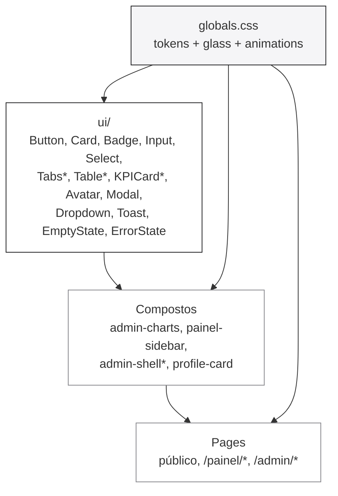
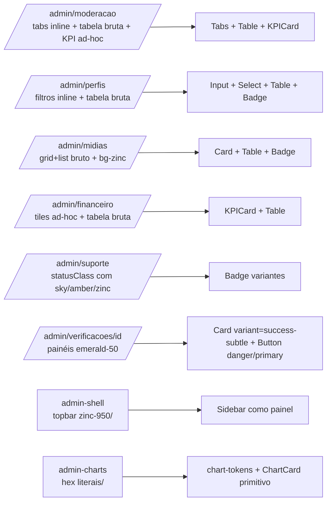
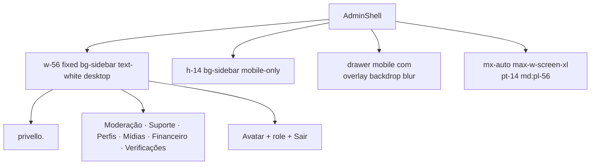

# Design Document: Redesign macOS System (design language do Privello)

## Overview

O Privello já está em produção (Railway, `https://privello-production.up.railway.app`) e tem um design system **parcial** vivendo em `src/app/globals.css` + `src/components/ui/*`. O incômodo agora não é falta de tokens — é falta de **enforcement**: várias seções (em especial `/admin/*`) reimplementam estilos paralelos com paleta Tailwind crua (`bg-amber-100`, `text-emerald-600`, `bg-zinc-50`, `border-zinc-800`), que destoam do light-mode cream + coral do resto da app.

Este redesign tem três objetivos, em ordem:

1. **Refinar o design system** existente preenchendo lacunas que estão forçando autoria ad-hoc nas páginas (variantes de badge para status, recipe de dashboard card, recipe de tabela densa, paleta para charts, sidebar admin igual à do painel, tabs/segmented control).
2. **Aplicar o sistema** em todas as páginas com drift, começando pelo pior infrator (`/admin/*`), depois `/painel/*` e por fim revisão em páginas públicas.
3. **Documentar** o design language em `docs/design-system.md` para travar drift futuro: tokens canônicos, regras de uso, anti-patterns.

A direção visual está travada pelo dono do produto: macOS Sonoma como inspiração, **light mode primário** (cream `#f5f5f7` / ink `#1d1d1f`), **coral `#ff375f`** como accent único, **Inter como família única** (já é o caso — `--font-sans` e `--font-serif` apontam para Inter). Glass sutil (não Vision-Pro). Microanimações com easing Sonoma `cubic-bezier(0.16, 1, 0.3, 1)`.

Estimativa honesta de execução: **4-7 dias úteis**, em batches por sessão (ver Plano por Fases ao final).

## Princípios do Design Language

Cinco princípios que orientam toda decisão visual e de componente:

1. **Calma sobre densidade.** Light mode cream, sombras de 0.5–1px, bordas hairline (`0.5px`/`1px`). Tipografia com `letter-spacing: -0.011em` (corpo) / `-0.022em` (display). Nunca empilhar bordas espessas.
2. **Coral é parcimonioso.** Coral `#ff375f` é accent de ação primária, marca (logo), e sinal de afeto/destaque (favoritos, boost). Não é cor de status — para isso há `success`, `warning`, `danger`, `blue`, `accent-purple`. Status nunca usa coral.
3. **Glass discreto, não cinematográfico.** `.glass` (sticky header) e `.glass-card` (cards) usam superfície branca quase opaca + 0.5px border + sombra dupla muito suave. Não usar `backdrop-blur` agressivo, não usar gradientes coloridos nem reflexos (sem Vision-Pro).
4. **Movimento serve à hierarquia.** `cubic-bezier(0.16, 1, 0.3, 1)` em durações 150–300ms. View Transitions API já está ativa para navegação. `prefers-reduced-motion: reduce` neutraliza tudo (regra global já presente). Hover só anima o que é interativo.
5. **Inter é a única família.** `font-sans` e `font-serif` ambos apontam para Inter (decisão travada com o usuário). `font-feature-settings: "kern" 1, "liga" 1` ativos no `body`.

## Auditoria: Existente vs Gaps

### O que já está bom (manter)

| Camada                            | Estado                                                                                                                                  | Observação                                                                                                  |
| --------------------------------- | --------------------------------------------------------------------------------------------------------------------------------------- | ----------------------------------------------------------------------------------------------------------- |
| Tokens de cor                     | `--privello-cream`, `--privello-ink`, `--privello-muted`, `--privello-line`, `--privello-coral`, `--privello-blue`, `--privello-green`, `--privello-warning`, `--privello-danger`, `--privello-accent-purple` etc. em `:root` | Mapeados em `@theme inline` para Tailwind (`bg-coral`, `text-success`, `border-line`, etc.).               |
| Type scale                        | 12 passos, 10–64px (`text-2xs` → `text-8xl`)                                                                                            | Cobertura suficiente. Não inflar.                                                                           |
| Tipografia                        | Inter (Google Fonts) carregada em `src/app/layout.tsx` com `--font-inter` e weights 300–800                                             | Decisão travada: Inter em tudo (inclusive onde antes era "serif").                                          |
| Glass classes                     | `.glass`, `.glass-card`, `.glass-dark`                                                                                                  | Já usadas em `Card variant="glass"` e header sticky. Manter.                                                |
| Animações                         | `animate-fade-in`, `animate-scale-in`, `cubic-bezier(0.16, 1, 0.3, 1)`                                                                  | OK. View Transitions com `vt-fade`, `vt-slide-x`, `vt-slide-y` + `prefers-reduced-motion` global já existe. |
| Scrollbar                         | webkit scrollbar custom 8px estilo macOS                                                                                                | Manter.                                                                                                     |
| Primitivos UI                     | 17 arquivos `.tsx` em `src/components/ui/` (avatar, badge, button, card, dropdown, empty-state, error-state, input, loading-skeleton, modal, select, stat-card, switch, textarea, toast, toggle-chip)                                          | Base sólida. Faltam alguns componentes (ver gaps).                                                          |
| Painel sidebar                    | `src/components/painel/painel-sidebar.tsx` em `bg-sidebar` (`#1d1d1f`) com nav, badges, status do plano, mobile drawer                   | Padrão de referência para o sidebar admin (que hoje é só topbar).                                           |
| Header público                    | `src/components/layout/site-header.tsx` minimalista, hairline `border-black/[0.08]`, sticky, h-11                                       | Casa com o design language.                                                                                 |

### Gaps reais (preencher)

| Gap                                       | Sintoma                                                                                                                  | Onde dói                                                                                                                                            | Ação                                                                                                                                                        |
| ----------------------------------------- | ------------------------------------------------------------------------------------------------------------------------ | --------------------------------------------------------------------------------------------------------------------------------------------------- | ----------------------------------------------------------------------------------------------------------------------------------------------------------- |
| **Sem `Tabs` / `SegmentedControl`**       | `/admin/moderacao` reimplementa "tabs" com `<Link>` estilizado inline                                                    | `src/app/admin/moderacao/page.tsx` linhas com `TABS.map(...)`                                                                                       | Criar `src/components/ui/tabs.tsx` com variantes `pills` (default) e `underline` para sub-nav.                                                              |
| **Sem `Table` primitivo**                 | Cada admin/page reescreve `<table className="w-full text-left text-sm">` com classes próprias e cores cruas (`bg-zinc-50`) | `/admin/perfis`, `/admin/midias`, `/admin/financeiro`, `/admin/suporte`, `/admin/verificacoes/[id]`                                                  | Criar `src/components/ui/table.tsx` (`Table`, `THead`, `TR`, `TH`, `TD`) com hover, zebra opcional, sort indicator slot.                                    |
| **Sem `KPICard` (dashboard tile)**        | `/admin/moderacao` e `/admin/financeiro` reimplementam o tile "label + value + sub" com `rounded border bg-white shadow-sm` | Linhas `kpis.map(...)` em moderacao; tiles em `/admin/financeiro`                                                                                   | `src/components/ui/kpi-card.tsx` (extensão de `StatCard`, com slot de `alert` e `delta`).                                                                   |
| **Badge de status sem variantes**         | `STATUS_COLORS` hardcoded com `bg-sky-100`, `bg-amber-100`, `bg-emerald-100`, `bg-zinc-200` em cada page                    | `/admin/moderacao`, `/admin/perfis`, `/admin/suporte`, `/admin/verificacoes/[id]`                                                                   | Adicionar variantes ao `Badge`: `info` (azul), `pending` (warning), `approved` (success), `rejected` (muted/dark), `premium` (accent-purple).                |
| **Charts sem paleta do sistema**          | `admin-charts.tsx` usa cores literais: `#1a1a1a`, `#e05c5c`, `#7c6af7`, `#e5e5e3`                                          | `src/components/admin/admin-charts.tsx`                                                                                                             | Criar `src/lib/chart-tokens.ts` com `CHART_COLORS` (foreground, coral, blue, accent-purple, success, warning) e `CHART_GRID_STROKE`. Refazer `ChartCard` como primitivo `Card` com header. |
| **Admin shell ≠ painel shell**            | Admin é topbar escura horizontal (h-12) sem sidebar; painel é sidebar lateral escura w-56                                  | `src/components/admin/admin-shell.tsx` vs `src/components/painel/painel-sidebar.tsx`                                                                | Refatorar `AdminShell` para usar **sidebar lateral** com mesmo template do painel: bg `--privello-sidebar`, w-56, mobile drawer, footer com avatar/role.    |
| **Forms inline com classes cruas**        | `<input className="rounded-md border border-black/10 px-2.5 py-1.5 text-xs ...">` repetido em todo admin                  | `/admin/perfis`, `/admin/midias`, `/admin/moderacao`                                                                                                | Tornar uso obrigatório de `Input`, `Select`, `Textarea` (já existem). Lint anti-pattern: ESLint custom rule que sinaliza `<input>` cru fora de `ui/`.       |
| **Botões reimplementados inline**         | `bg-foreground px-3 py-1.5 text-xs font-bold text-white` (admin moderacao "Buscar"); `bg-foreground px-3 py-1.5 text-xs ...` (perfis "Filtrar") | `/admin/perfis`, `/admin/moderacao`                                                                                                                 | Trocar por `<Button size="sm" variant="primary"\|"secondary">`.                                                                                              |
| **Bordas duras em vez de hairline**       | `rounded border border-line` (sem raio explícito → 4px) em vez do `glass-card` rounded-2xl com sombra dupla                | Toda KPI e tabela do admin                                                                                                                          | Padronizar containers em `Card variant="solid"` (rounded-2xl, hairline `border-black/[0.06]`, dupla sombra). Manter `rounded` 4px só em chips/inputs.       |
| **Sem documento de referência**           | Nada em `docs/` descreve quando usar `coral` vs `blue`, ou variantes de Card                                              | —                                                                                                                                                   | Criar `docs/design-system.md` (princípios, tokens, guia por componente, anti-patterns, exemplos de uso correto/errado).                                     |

### Quantificando o drift

Greps confirmam (executados em `src/app/admin/**/*.tsx`):

- **8 ocorrências** de `bg-{zinc,amber,sky,emerald,fuchsia,indigo}-*` em status badges (5 arquivos).
- **3 ocorrências** de `border-zinc-800` / `bg-zinc-950` no shell admin (topbar escura horizontal).
- **5 ocorrências** de `bg-emerald-{50,200,600,700}` em painéis de aprovação verificação (`/admin/verificacoes/[id]`).
- Recharts inline com hex literais em 4 séries (`admin-charts.tsx`).

Todos serão migrados para tokens.

## Decisões Travadas

Estas decisões já foram confirmadas com o usuário e **não voltam à mesa**:

| Decisão                | Valor                                                                | Por quê                                                                                          |
| ---------------------- | -------------------------------------------------------------------- | ------------------------------------------------------------------------------------------------ |
| Modo                   | **Light mode único.** Sem dark mode.                                 | Usuário: "traz mais confiança". Reduz superfície de estilos pela metade.                         |
| Família tipográfica    | **Inter exclusiva.** `--font-sans` e `--font-serif` apontam Inter.   | Já é o caso. Usuário confirmou que quer Inter em tudo (não trocar para serif em headlines).      |
| Accent único           | **Coral `#ff375f`** (vermelho).                                      | Marca. Usuário confirmou explicitamente.                                                         |
| Glass                  | **Glass sutil**, não Vision-Pro. Branco quase opaco + 0.5px border. | macOS Sonoma, não visionOS.                                                                      |
| Inspiração             | **macOS Sonoma.**                                                    | Travado.                                                                                         |
| Animação easing        | `cubic-bezier(0.16, 1, 0.3, 1)`                                      | Já em uso, casa com Sonoma.                                                                      |
| Idioma                 | **pt-BR** em código, comentários, docs e UI.                         | Convenção do repo (`AGENTS.md`).                                                                 |
| Library de charts      | **recharts `^3.8.1`** (já instalada).                                | Trocar seria escopo fora.                                                                        |
| Library de PBT         | **fast-check `4.8.0` + `@fast-check/vitest 0.4.1`**.                  | Já em uso (ADR-0002). Vai cobrir as Correctness Properties deste design.                          |

## Architecture

### Diagrama de camadas (UI)



`*` = a criar / refatorar.

**Regra de mão única**: páginas só consomem primitivos e recipes; recipes só consomem primitivos e tokens; primitivos só consomem tokens. Páginas **não** importam classes Tailwind cruas de paleta (zinc/amber/sky/emerald) — só tokens (`bg-coral`, `text-success`, `border-line`).

### Mapa de drift → migração



## Components and Interfaces

Foco aqui: o que **muda** ou **nasce**. Componentes que já estão OK (`Avatar`, `Modal`, `Toast`, `Dropdown`, `EmptyState`, `Switch`, `ToggleChip`) seguem inalterados.

### 1. Tokens — adições em `globals.css`

```css
:root {
  /* Existentes mantidos. Adições para charts e estados-superfície: */
  --privello-success-soft:  rgba(48, 209, 88, 0.10);   /* fundo de banner success */
  --privello-warning-soft:  rgba(255, 149, 0, 0.10);
  --privello-danger-soft:   rgba(255, 59, 48, 0.10);
  --privello-info-soft:     rgba(10, 132, 255, 0.10);
  --privello-purple-soft:   rgba(88, 86, 214, 0.10);

  /* Stroke de grid em charts (mais sutil que --privello-line) */
  --privello-chart-grid:    rgba(0, 0, 0, 0.06);

  /* Sombras nomeadas (usadas por Card, KPICard, glass-card) */
  --shadow-hairline: 0 0.5px 1px rgba(0, 0, 0, 0.04);
  --shadow-sm:       0 0.5px 1px rgba(0, 0, 0, 0.04), 0 4px 16px rgba(0, 0, 0, 0.04);
  --shadow-md:       0 1px 2px rgba(0, 0, 0, 0.05), 0 8px 24px rgba(0, 0, 0, 0.06);
}

@theme inline {
  /* Mapear novos tokens para utilitários Tailwind */
  --color-success-soft: var(--privello-success-soft);
  --color-warning-soft: var(--privello-warning-soft);
  --color-danger-soft:  var(--privello-danger-soft);
  --color-info-soft:    var(--privello-info-soft);
  --color-purple-soft:  var(--privello-purple-soft);
  --color-chart-grid:   var(--privello-chart-grid);
}
```

Type scale, font-sans/serif, classes glass e animações **não mudam**.

### 2. `Tabs` (novo) — `src/components/ui/tabs.tsx`

**Propósito**: substituir tabs inline (`/admin/moderacao` e qualquer página que precise de filtros ou seções).

**Interface**:

```tsx
type TabItem = { key: string; label: string; href?: string; badge?: number };

type TabsProps = {
  items: TabItem[];
  activeKey: string;
  variant?: "pills" | "underline";
  size?: "sm" | "md";
  onChange?: (key: string) => void; // se omitido E item.href setado → renderiza <Link>
  className?: string;
};

export function Tabs(props: TabsProps): JSX.Element;
```

**Variantes**:

- `pills` (default): pílulas arredondadas; ativo `bg-foreground text-white`, inativo `text-muted hover:bg-black/[0.04]`.
- `underline`: linha de 2px coral abaixo do ativo, sem fundo.

**Acessibilidade**: roles `tablist`/`tab` quando `onChange` (modo controlado client). Quando navegação por URL (`href`), são `<Link>` com `aria-current="page"`.

### 3. `Table` (novo) — `src/components/ui/table.tsx`

**Propósito**: encerrar a reescrita de `<table>` em cada admin page.

**Interface**:

```tsx
type TableProps = {
  children: React.ReactNode;
  /** Largura mínima horizontal antes de scroll (padrão 640) */
  minWidth?: number;
  className?: string;
};

export function Table(props: TableProps): JSX.Element;            // <div overflow-x-auto> + <table>
export function THead(props: { children: ReactNode }): JSX.Element;
export function TR(props: HTMLAttributes<HTMLTableRowElement> & {
  hover?: boolean;        // default true: hover:bg-line/20
}): JSX.Element;
export function TH(props: ThHTMLAttributes<HTMLTableCellElement> & {
  align?: "left" | "right" | "center";
}): JSX.Element;
export function TD(props: TdHTMLAttributes<HTMLTableCellElement> & {
  align?: "left" | "right" | "center";
  numeric?: boolean;       // tabular-nums + text-right
}): JSX.Element;
```

**Estilo travado**:

- Wrapper: `Card variant="solid" padding="none"` (rounded-2xl, hairline, sombra suave).
- `<thead>`: `border-b border-line`, `text-2xs font-semibold uppercase tracking-wider text-muted`.
- `<tbody> tr`: `border-b border-line last:border-0 hover:bg-line/20 transition`.
- Padding célula: `px-3 py-2.5` (head) / `px-3 py-2` (body).

### 4. `KPICard` (novo) — `src/components/ui/kpi-card.tsx`

Extensão de `StatCard` com mais slots (alert state, delta, link CTA).

```tsx
type KPICardProps = {
  label: string;
  value: string | number;
  icon?: LucideIcon;
  subtitle?: string;
  alert?: boolean;             // borda warning + ícone warning (substitui border-amber-300 hardcoded)
  delta?: { value: string; direction: "up" | "down" | "flat" };
  href?: string;               // wrap em <Link>
  className?: string;
};

export function KPICard(props: KPICardProps): JSX.Element;
```

**Estilo travado**:

- Container: `Card variant="solid" padding="md"` (não `rounded border` cru).
- Label: `text-2xs font-semibold uppercase tracking-wider text-muted`.
- Valor: `text-2xl font-semibold tabular-nums tracking-tight`.
- Alert: `border-warning/40 bg-warning-soft` + ícone `text-warning`.

### 5. `Badge` — adicionar variantes de status

Variantes atuais: `default | coral | success | warning | muted | dark`.

Adicionar:

```tsx
type BadgeVariant =
  | "default"
  | "coral"
  | "success"
  | "warning"
  | "muted"
  | "dark"
  | "info"        // bg-info-soft text-blue        ← novo
  | "danger"      // bg-danger-soft text-danger    ← novo
  | "premium";    // bg-purple-soft text-accent-purple ← novo
```

Mapeamento canônico para status do domínio (a documentar):

| Status                                    | Variante  |
| ----------------------------------------- | --------- |
| `NOVO`, `OPEN`                            | `info`    |
| `REVISAO`, `IN_PROGRESS`, `pending`       | `warning` |
| `APROVADO`, `verificado`                  | `success` |
| `REJEITADO`, `CLOSED`, `cancelled`        | `muted`   |
| `BANIDO`, `SUSPENSO`                      | `danger`  |
| Plano `PREMIUM`                           | `premium` |
| Plano `DESTAQUE` (Plus)                   | `coral`   |
| Plano `ESSENCIAL` (Basic)                 | `info`    |

### 6. `Card` — adicionar variantes de superfície

Variantes atuais: `default | glass | solid | dark`.

Adicionar (todas hairline `border-black/[0.06]` + sombra suave, fundo tinto):

```tsx
variant: "default" | "glass" | "solid" | "dark"
       | "success-subtle"   // bg-success-soft + border-success/30
       | "warning-subtle"   // bg-warning-soft + border-warning/30
       | "danger-subtle"    // bg-danger-soft  + border-danger/30
```

Resolve diretamente os painéis "Aprovar verificação" / "Rejeitar verificação" em `/admin/verificacoes/[id]` que hoje usam `bg-emerald-50 border-emerald-200`.

### 7. `AdminShell` — refatorar para layout sidebar

**Estado atual**: `src/components/admin/admin-shell.tsx` é uma **topbar escura horizontal** (`bg-zinc-950 text-white`, h-12) com nav inline. Diverge totalmente do `/painel`, que tem **sidebar lateral fixa** (`bg-sidebar`, w-56) com mobile drawer.

**Estado-alvo**: `AdminShell` adota o template visual do painel.

```tsx
type AdminShellProps = {
  children: React.ReactNode;
  /** Item de nav ativo (auto-detectado por usePathname se omitido) */
  activeHref?: string;
};

export function AdminShell(props: AdminShellProps): JSX.Element;
```

**Layout** (idêntico ao `PainelSidebar`, mas com `NAV_ADMIN`):



**Decisão**: extrair o esqueleto compartilhado do `PainelSidebar` em `src/components/layout/dark-sidebar-shell.tsx` (renderiza props `nav`, `footer`, `logoHref`). Tanto `PainelSidebar` quanto `AdminShell` consomem.

```tsx
// src/components/layout/dark-sidebar-shell.tsx
type DarkSidebarShellProps = {
  logoHref: string;
  nav: NavItem[];           // tipo já presente no painel
  pathname: string;
  footer: React.ReactNode;  // avatar + role + logout
  children: React.ReactNode;
  /** padding-left do conteúdo desktop. Default 56 (md:pl-56) */
  contentClassName?: string;
};
```

### 8. `chart-tokens.ts` (novo) — `src/lib/chart-tokens.ts`

Encerra hex literais em recharts.

```ts
export const CHART_PALETTE = {
  primary:   "var(--privello-ink)",        // #1d1d1f
  coral:     "var(--privello-coral)",      // #ff375f
  blue:      "var(--privello-blue)",       // #0a84ff
  purple:    "var(--privello-accent-purple)", // #5856d6
  success:   "var(--privello-green)",      // #30d158
  warning:   "var(--privello-warning)",    // #ff9500
} as const;

export const CHART_GRID_STROKE = "var(--privello-chart-grid)";
export const CHART_TICK_FILL   = "var(--privello-muted)";
export const CHART_AREA_OPACITY = 0.08;

export const CHART_TOOLTIP_STYLE = {
  fontSize: 12,
  padding: "6px 10px",
  border: "0.5px solid var(--privello-line)",
  borderRadius: 8,
  background: "#ffffff",
  boxShadow: "var(--shadow-sm)",
} as const;
```

`admin-charts.tsx` passa a importar `CHART_PALETTE.primary`, `CHART_PALETTE.coral`, etc., em vez de `#1a1a1a`, `#e05c5c`, `#7c6af7`.

Recharts aceita variáveis CSS como `fill`/`stroke` em SVG nas versões modernas. Fallback hex se necessário (ver `node_modules/recharts/types/...` se houver atrito — mas em recharts 3.x é direto).

### 9. `ChartCard` (recipe) — extrair de `admin-charts.tsx`

Tornar primitivo simples reutilizável:

```tsx
type ChartCardProps = {
  title: string;
  height?: number;       // default 140
  children: React.ReactNode;  // ResponsiveContainer já dentro
  className?: string;
};
```

Estilo: `Card variant="solid" padding="md"` + título `text-xs font-medium text-muted mb-3`. Substitui o `<div className="rounded border border-line bg-white p-4 shadow-sm">` interno.

### 10. Pages — migrações

**`/admin/moderacao`** (`src/app/admin/moderacao/page.tsx`):

- KPIs ad-hoc → 6× `<KPICard>`.
- Tabs inline → `<Tabs variant="pills" size="sm">`.
- Tabela queue → `<Table>`/`<THead>`/`<TR>`/`<TH>`/`<TD>`.
- `STATUS_COLORS` hardcoded → `<Badge variant={statusToBadgeVariant(row.status)}>`.
- Botão "Buscar" → `<Button size="sm">`.
- `<input>` cru de busca → `<Input>` (já existe).

**`/admin/perfis`**:

- `PLAN_COLORS` hardcoded → `<Badge variant>` (premium/coral/info conforme tier).
- `<input>`/`<select>` crus → `<Input>`, `<Select>`.
- Botão "Filtrar" → `<Button>`.
- Tabela → `<Table>`.

**`/admin/midias`**:

- `bg-zinc-50` em `<thead>` → tokens via `<THead>`.
- `bg-zinc-100`/`bg-zinc-900` em placeholders de mídia → `bg-line` + `bg-foreground` (vídeo cover).
- Verified mark `text-emerald-600 ✓` → `<BadgeCheck className="h-3 w-3 text-success" />` (lucide ícone, mesmo padrão do header público).
- "Pública/Privada" inline → `<Badge variant="success" | "muted">` com ícone.
- Toggle grid/list → `<Tabs variant="pills">` ou `<ToggleChip>`.

**`/admin/financeiro`**:

- 3 tiles MRR → `<KPICard>`.
- 3 tiles plano → `<KPICard>` (variante `subtitle` com R$/mês).
- Tabela assinantes → `<Table>` + `<Badge variant="success">` em valor.

**`/admin/suporte`**:

- `statusClass` hardcoded → `<Badge variant>`.
- Lista tickets → `<Card variant="solid">` + `<Table>` ou cards-grid.

**`/admin/verificacoes/[id]`**:

- Painel "Aprovar" `bg-emerald-50 border-emerald-200` → `<Card variant="success-subtle">`.
- Painel "Rejeitar" → `<Card variant="danger-subtle">`.
- Botões `bg-emerald-600` → `<Button variant="primary">` (azul do sistema) ou nova variante `success` se quisermos verde — discutir antes de codar.

**`/painel/*`** (passada de revisão, drift menor):

- Auditar uso de tokens; PainelSidebar já está em padrão.
- Conferir que `/painel/financeiro`, `/painel/avaliacoes`, `/painel/midias` usam `Card`, `Badge`, `KPICard`, `Table`.

**Páginas públicas** (já OK em geral; revisão final):

- Home, perfil público, listagens, planos: garantir hairlines, tipografia, consistência de Card variants.

## Data Models

Sem novas entidades de domínio. Mudanças são puramente UI/tokens.

Tipos auxiliares de UI (não persistidos):

```ts
type StatusBadgeVariant = "info" | "warning" | "success" | "muted" | "danger" | "premium" | "coral";

type ChartPaletteKey = keyof typeof CHART_PALETTE;
```

## Correctness Properties

Estas propriedades são candidatas a property-based tests com `fast-check` ou exemplos/integração quando passarmos para `tasks.md`. Preferência: PBT em utilitários puros e contratos de classes; testes `examples`/integração para layout visual.

> **Nota design-first**: estas propriedades foram remapeadas para os IDs reais dos requirements derivados em `requirements.md` (Requirements 1–18).

### Property 1: Touch target ≥ 44×44 em todos os controles interativos

**Tipo**: example/integration test.

**Validates: Requirements 12.1, 12.2, 12.3, 12.4**

Para todo controle interativo renderizado (`Button` em qualquer `size`, `IconButton`, links de nav em `Tabs`, sidebar, bottom-nav, drawer mobile), `el.getBoundingClientRect()` retorna `width ≥ 44` e `height ≥ 44`. Verificação com `@testing-library/react` em jsdom. Justificativa: WCAG 2.5.5.

### Property 2: `statusToBadgeVariant` é função total no domínio de status conhecidos

**Tipo**: property test (fast-check).

**Validates: Requirements 3.1, 3.2, 3.3, 3.4, 3.5, 3.6, 3.7, 3.8, 3.9, 3.10**

Para todo `status ∈ {"NOVO","REVISAO","APROVADO","REJEITADO","OPEN","IN_PROGRESS","CLOSED","ESSENCIAL","DESTAQUE","PREMIUM"}`, `statusToBadgeVariant(status)` retorna um valor pertencente ao tipo `BadgeVariant`, e mapeia status equivalentes para a mesma variante (`"NOVO" === "OPEN"` → `"info"`; `"REVISAO" === "IN_PROGRESS"` → `"warning"`; etc.). Para qualquer string fora do domínio, retorna `"muted"` (fallback determinístico).

### Property 3: Contraste WCAG AA mínimo nos pares de tokens primários

**Tipo**: example test.

**Validates: Requirements 13.1, 13.2, 13.3, 13.4**

Util `contrastRatio(fg, bg)` aplicado aos pares:

- `text-foreground` (`#1d1d1f`) sobre `bg-background` (`#f5f5f7`) ≥ 4.5:1.
- `text-white` (`#ffffff`) sobre `bg-foreground` (`#1d1d1f`) ≥ 4.5:1.
- `text-coral` (`#ff375f`) sobre `bg-background` (`#f5f5f7`) ≥ 4.5:1 para texto ≥ 14px bold ou ≥ 18px.
- `text-muted` (`#86868b`) sobre `bg-background` (`#f5f5f7`) ≥ 3:1 — restrito a texto ≥ 18px (large text AA). Documentado em `docs/design-system.md`.

WCAG 1.4.3.

### Property 4: `prefers-reduced-motion: reduce` neutraliza animações

**Tipo**: example test (jsdom).

**Validates: Requirements 14.1, 14.2**

Quando `window.matchMedia("(prefers-reduced-motion: reduce)").matches === true`, para qualquer elemento com `.animate-fade-in`, `.animate-scale-in`, ou `view-transition-old/new(*)`, `getComputedStyle(el).animationDuration === "0.01ms"` (ou `"0s"` para view transitions). Verifica que o bloco final de `globals.css` está aplicado.

### Property 5: Build de className em Badge/Tabs/KPICard é determinístico

**Tipo**: property test (fast-check).

**Validates: Requirements 16.1, 16.2**

Para qualquer variante válida, `cn(buildClass(variant))` chamado N vezes retorna sempre a mesma string. Garante que `tailwind-merge` + `clsx` não introduzem ordem não-determinística e que classes condicionais consolidam idempotentemente.

### Property 6: `KPICard` com `alert={true}` aplica classes de warning sem quebrar shape

**Tipo**: example test.

**Validates: Requirements 6.3, 6.4**

Render `<KPICard alert />` → o nó raiz contém `border-warning` (ou `border-warning/40`) e o ícone (quando presente) contém `text-warning`. Render `<KPICard />` (alert=false) → contém `border-black/[0.06]` ou `border-line` e o ícone contém `text-muted`. As demais classes (rounded-2xl, padding, layout) permanecem idênticas.

### Property 7: ARIA roles do `Tabs` mantêm invariante de seleção única

**Tipo**: property test (fast-check).

**Validates: Requirements 4.2, 4.3, 4.4, 4.5**

Para qualquer array de tabs `items` com `length ≥ 1` e qualquer `activeKey` válido (presente em `items`), o componente renderizado satisfaz:

- Existe exatamente um nó com `role="tablist"`.
- Cada item renderiza um nó com `role="tab"`.
- Exatamente **um** desses nós tem `aria-selected="true"` (o de `key === activeKey`).
- Todos os outros têm `aria-selected="false"` ou ausência do atributo.

### Property 8: `Table` com TD `numeric` aplica `tabular-nums text-right`

**Tipo**: example test.

**Validates: Requirements 5.5, 5.6**

Render `<TD numeric>123</TD>` → as classes resolvidas contêm `tabular-nums` e `text-right`. Render `<TD>foo</TD>` → não contém `tabular-nums` nem `text-right`. Garante alinhamento numérico consistente em colunas de valores.

### Property 9: Tokens CSS resolvem para os valores definidos em `:root`

**Tipo**: integration test (jsdom + globals.css carregado).

**Validates: Requirements 1.1, 1.2, 1.4**

Para cada token canônico:

- `getComputedStyle(document.documentElement).getPropertyValue("--privello-coral").trim() === "#ff375f"`
- `... ("--privello-cream") === "#f5f5f7"`
- `... ("--privello-ink") === "#1d1d1f"`
- `... ("--privello-muted") === "#86868b"`
- `... ("--privello-line") === "#d2d2d7"`
- `... ("--privello-blue") === "#0a84ff"`
- `... ("--privello-green") === "#30d158"`

E os tokens novos (`--privello-success-soft`, `--privello-warning-soft`, etc.) também resolvem para valores não-vazios. Garante que nenhuma renomeação acidental quebra a base.

### Property 10: Nenhuma página fora de `src/components/ui/` ou `src/lib/chart-tokens.ts` usa classes Tailwind cruas de paleta

**Tipo**: static check (lint rule + grep no CI).

**Validates: Requirements 17.1, 17.2, 17.3, 17.4, 10.7**

Para todo arquivo em `src/app/**/*.tsx` e `src/components/**/*.tsx` (exceto `src/components/ui/**` e `src/lib/chart-tokens.ts`), nenhuma string contém match para a regex:

```
\b(bg|text|border|ring|from|to|via)-(zinc|amber|sky|emerald|fuchsia|indigo|rose|pink|purple|teal|lime|stone|slate|gray|neutral)-\d+\b
```

(`purple-` aparece hoje em `/admin/perfis` — entra na lista). Implementação: regra ESLint custom OU script de grep no CI script (mais simples). Falha de build se encontrar match.

### Resumo de gates

P1 + P3 + P4 + P10 são gates obrigatórios antes de fechar a Fase F. P2 + P5 + P7 viram tasks PBT explícitas em `tasks.md`. P6, P8, P9 viram example/integration tests.

## Error Handling

UI puro — não há erros novos de runtime. Garantias:

| Cenário                                                               | Resposta                                                                                                                       |
| --------------------------------------------------------------------- | ------------------------------------------------------------------------------------------------------------------------------ |
| Status fora do mapa em `statusToBadgeVariant`                         | Retorna `"muted"` (fallback seguro). PBT P2 cobre.                                                                            |
| `KPICard` sem `value`                                                  | TypeScript não permite (campo obrigatório).                                                                                    |
| `Table` em viewport estreito                                           | wrapper `overflow-x-auto` + `min-w-[Npx]` (props `minWidth`). `-webkit-overflow-scrolling: touch` herdado.                     |
| Recharts render sem dados                                              | Fallback `<EmptyState>` na recipe `ChartCard` quando `data.length === 0`.                                                      |
| Token CSS faltando (typo em variante)                                  | `var(--token, fallback)` em locais críticos; tipos TS limitam variants.                                                        |

## Testing Strategy

### Unit / componente

- Cada novo primitivo (`Tabs`, `Table`, `KPICard`) ganha um teste em `src/components/ui/<nome>.test.ts(x)` com `@testing-library/react`.
- Cobertura mínima: render, variantes, ARIA.

### Property-Based

- **Library**: `@fast-check/vitest 0.4.1` + `fast-check 4.8.0` (já em uso, ADR-0002).
- Propriedades P2, P5, P7 viram `*.pbt.ts` em `src/components/ui/`.

### Visual / integração

- Não há Storybook nem visual-regression hoje (e fica fora do escopo: usuário não pediu).
- Em vez disso: lint custom rule + grep no CI cobre P10 (sem cores cruas fora de `ui/` e `lib/chart-tokens.ts`).

### E2E (Playwright)

- Smoke nas páginas migradas: `/admin/moderacao`, `/admin/financeiro`, `/admin/perfis` carregam e renderizam KPIs e Tables sem erro de console.
- Não criar testes visuais (snapshots de screenshot) — frágeis. Prefere asserts de presença/ARIA.

### Sem regressão

- 358+ testes existentes continuam verdes.
- Rodar `npm run lint`, `npm run test`, e `next build` em cada batch.

## Performance Considerations

- **Sem nova dependência**: Inter já carregada, recharts já instalado, fast-check já em devDeps.
- `font-display: swap` herdado de `next/font/google` (Inter).
- Glass-card sem `backdrop-blur` em uso intensivo (mantém GPU calmo).
- Charts permanecem recharts; primitivos não encapsulam recharts (cada chart importa direto para tree-shake).

## Security Considerations

Nenhum impacto. Mudanças são CSS/componentes presentational. Nenhum dado sensível tocado, nenhum boundary auth alterado.

## Accessibility

Já parte do escopo:

- **WCAG 2.1 nível AA** como mínimo.
- **Touch targets ≥ 44×44** (P1) — checado em `Button size="sm"` (que hoje é `py-[5px] text-sm` — pode estar abaixo; auditoria explícita prevista na Fase A).
- **Focus rings**: revisar `:focus-visible` em todos os primitivos. Hoje `Button` não tem outline explícito. Adicionar `focus-visible:ring-2 focus-visible:ring-blue/40 focus-visible:ring-offset-2 focus-visible:ring-offset-background` por variante.
- **`prefers-reduced-motion`** já neutraliza animações globalmente (`globals.css` final).
- **Contraste AA** (P3) — token `text-muted` (`#86868b`) em `bg-background` (`#f5f5f7`) tem contraste **3.92:1** — abaixo de AA para texto pequeno (4.5). Decisão: **manter** somente para texto ≥ 18px (large text AA = 3:1) ou subtítulos descritivos; texto de corpo continua `text-foreground`. Documentar regra em `docs/design-system.md`.
- **`aria-current="page"`** em link de nav ativo (sidebar admin/painel).
- **Skip link** "Pular para conteúdo" no início de `body` — auditoria visual da Fase F.

## Out of Scope

Explicitamente **não** vamos fazer neste spec:

- ❌ **Dark mode.** Travado pelo usuário (light traz mais confiança).
- ❌ **Vision-Pro extreme glass** (gradientes coloridos, reflexos, blur agressivo).
- ❌ **Trocar tipografia.** Inter fica.
- ❌ **Trocar accent color.** Coral fica.
- ❌ **Storybook / visual regression / Chromatic.** Não pedido.
- ❌ **Refatorar recharts → outra lib.** Fora do escopo (escopo é tokens/uso, não substituição).
- ❌ **Mexer em `prisma/schema.prisma`, `node_modules`, `.env`.** Restrição do AGENTS.md.
- ❌ **Reescrever páginas públicas que estão OK.** Só passada de revisão.
- ❌ **Mudar arquitetura RSC / server actions / cache.** Apenas UI.
- ❌ **Internacionalização** (i18n). UI continua pt-BR.

## Dependencies

Todas já presentes em `package.json`:

- `next 16.2.6` — App Router, RSC, View Transitions.
- `react 19.2.4`, `react-dom 19.2.4`.
- `tailwindcss ^4` + `@tailwindcss/postcss ^4` — `@theme inline` em `globals.css`.
- `tailwind-merge ^3.6.0` + `clsx ^2.1.1` — usados via `cn()` em `src/lib/utils`.
- `lucide-react ^1.14.0` — ícones.
- `recharts ^3.8.1` — charts.
- `vitest 4.1.6` + `@vitest/coverage-v8 4.1.6` + `@testing-library/{react,dom,user-event}` — unit/integration.
- `fast-check 4.8.0` + `@fast-check/vitest 0.4.1` — PBTs.
- `@playwright/test ^1.60.0` — E2E.

Nenhuma dependência nova. Nenhum custo de bundle adicional.

## Plano por Fases

Execução em batches por sessão. Cada fase fecha com `npm run lint && npm run test` verdes e um commit-point natural.

### Fase A — Tokens + Primitivos (foundation)

**Duração estimada**: 1 dia.

- A1. Adicionar tokens novos em `globals.css` (`--privello-{success,warning,danger,info,purple}-soft`, `--privello-chart-grid`, `--shadow-*`) e mapear em `@theme inline`.
- A2. Estender `Badge` com variantes `info`, `danger`, `premium`. Atualizar testes (criar `badge.test.tsx`).
- A3. Estender `Card` com variantes `success-subtle`, `warning-subtle`, `danger-subtle`.
- A4. Criar `Tabs` (`src/components/ui/tabs.tsx`) + `tabs.test.tsx` + `tabs.pbt.ts` (P7).
- A5. Criar `Table` (`src/components/ui/table.tsx`) + `table.test.tsx`.
- A6. Criar `KPICard` (`src/components/ui/kpi-card.tsx`) + `kpi-card.test.tsx`.
- A7. Criar `src/lib/chart-tokens.ts` + `chart-tokens.test.ts`.
- A8. Criar util `statusToBadgeVariant` em `src/lib/ui/status.ts` + `status.pbt.ts` (P2, P5).
- A9. Adicionar focus rings em `Button`, `Input`, `Select`, `Tabs`, links de nav.
- A10. Auditoria touch target P1 (medir `Button size="sm"` etc.) e ajustar paddings se < 44.

### Fase B — Layouts + chrome (admin sidebar)

**Duração estimada**: 0.5 dia.

- B1. Extrair `DarkSidebarShell` em `src/components/layout/dark-sidebar-shell.tsx` a partir do `PainelSidebar`.
- B2. Refatorar `PainelSidebar` para usar `DarkSidebarShell`.
- B3. Refatorar `AdminShell` para usar `DarkSidebarShell` com `NAV_ADMIN`.
- B4. Atualizar todas as páginas `/admin/*` (não muda import: `<AdminShell>` continua, mas agora rende sidebar lateral).
- B5. Smoke E2E `/admin/moderacao` para confirmar que nav funciona em mobile drawer.

### Fase C — Admin pages (pior infrator)

**Duração estimada**: 1.5–2 dias. Esta é a maior.

- C1. `/admin/moderacao` → KPIs `<KPICard>`, Tabs, Table, Badge variantes, Button. Substituir `STATUS_COLORS` hardcoded.
- C2. `/admin/perfis` → Input/Select/Button/Table/Badge. Substituir `PLAN_COLORS`.
- C3. `/admin/midias` → Card/Table/Badge. Remover `bg-zinc-*`. Verified mark padronizado.
- C4. `/admin/financeiro` → KPICard/Table.
- C5. `/admin/suporte` → Badge variants para status. Card/Table.
- C6. `/admin/verificacoes/[id]` → `Card variant="success-subtle"` / `danger-subtle` para painéis de aprovar/rejeitar. Button variants.
- C7. `admin-charts.tsx` → consumir `chart-tokens.ts`. Trocar `<ChartCard>` interno para usar `Card variant="solid"`.

### Fase D — Painel pages (passada de revisão)

**Duração estimada**: 0.5–1 dia.

- D1. Auditar `/painel/*` página a página com grep de classes cruas.
- D2. Substituir KPIs ad-hoc por `KPICard`, tabelas por `Table`, badges por variantes corretas.
- D3. Verificar PainelSidebar pós refactor (Fase B) sem regressão visual.

### Fase E — Páginas públicas (revisão)

**Duração estimada**: 0.5 dia.

- E1. Home, perfil público, descobrir, planos, em-alta, em-destaque, novidades: grep por cores cruas, hairlines.
- E2. Garantir uso de `Card`, `Badge`, `Button` consistente.
- E3. Validar `prefers-reduced-motion` no banner de age-gate e nas transições.

### Fase F — Polimento + docs

**Duração estimada**: 0.5–1 dia.

- F1. Criar `docs/design-system.md` cobrindo princípios, tokens, guia por componente, anti-patterns, status→badge map, exemplos do/don't.
- F2. Lint custom rule (ou `eslint-plugin-tailwindcss` config) para banir cores cruas Tailwind fora de `src/components/ui/` e `src/lib/chart-tokens.ts` (P10).
- F3. Atualizar `CHANGELOG.md`.
- F4. Rodar `npm run lint && npm run test && npm run test:e2e:desktop && npm run build` final.
- F5. Verificar `coverage/coverage-summary.json` — não regredir.

### Resumo de fases

| Fase | Foco                          | Estimativa  | Saída concreta                                                                  |
| ---- | ----------------------------- | ----------- | ------------------------------------------------------------------------------- |
| A    | Tokens + primitivos novos     | 1 d         | `Tabs`, `Table`, `KPICard`, variantes Badge/Card, chart-tokens, focus rings.    |
| B    | Chrome admin (sidebar)        | 0.5 d       | `DarkSidebarShell` extraído; admin shell adota sidebar lateral.                 |
| C    | Migrar todas as `/admin/*`    | 1.5–2 d     | Zero classes cruas em admin. KPIs/Tables/Badges padronizadas.                   |
| D    | Revisão `/painel/*`           | 0.5–1 d     | Painel sem drift residual.                                                      |
| E    | Revisão páginas públicas      | 0.5 d       | Páginas públicas com hairlines/tokens consistentes.                             |
| F    | Docs + lint guard + build     | 0.5–1 d     | `docs/design-system.md`, lint guard, CI verde, CHANGELOG atualizado.            |

**Total honesto**: 4–7 dias úteis em batches por sessão. C é a fase mais extensa e pode ser quebrada em sub-batches por página se a sessão estourar.
